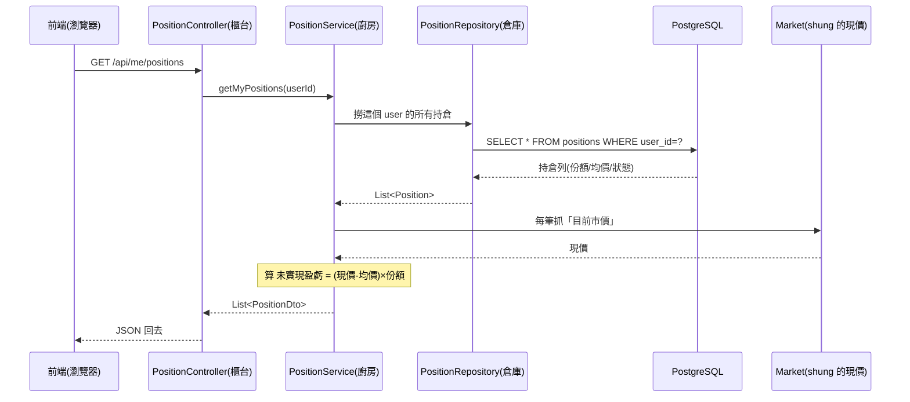
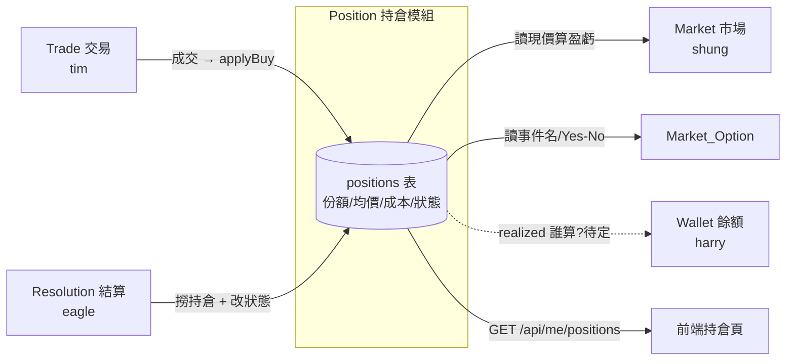

# 怎麼從零想一支 API — 以持倉(Position)為例

> **這份不是給你抄的答案。** 我的錢包 13 章文件是「終點」,走了好幾週發想才長成。你現在在「起點」,需要的是一份教你**怎麼想**的鷹架。
> 讀法:先讀 §1~§3 建立 sense,再照 §4 用「生命週期」想你自己的持倉,最後 §6 之後的 ❓ 是你的作業——想不出來我們再一起對。

**符號約定**
- ✅ = 我幫你示範 / 我們已一起想過,可以直接學
- ❓ = 留給你發想的引導問題,**答案要你自己填**(這才是學會「想」)
- ⚠️ = 對接地雷,沒對齊會在整合時爆

---

# 0 · 先講最重要的一句話

> **需求是根,畫面是放大鏡。** 先有「為什麼要有它」,才有「它長什麼樣」。

很多新手以為「想 API = 看畫面要顯示什麼」。錯。畫面只是需求的**一個出口**,而且你持倉**一半的能力根本沒有畫面**(等下你會看到)。所以我們從**需求**開始想,不從畫面。

---

# 1 · 心智模型:一支 API 到底長怎樣 ✅

用**餐廳點餐**比喻,先把骨架記住:

| 餐廳 | 程式 | 職責 |
|---|---|---|
| 點餐窗口 | **API endpoint**(網址) | 對外的那扇門 |
| 服務生/櫃台 | **Controller** | 收單、把單子轉成廚房看得懂的格式、出餐給客人 |
| 廚房/主廚 | **Service** ⭐ | **真正的邏輯在這**(算盈虧、加倉) |
| 倉庫/冰箱 | **Repository** | 去資料庫拿料 / 放料(產 SQL) |
| 食材 | **Entity** | 對應資料庫一張表的「資料長相」 |
| 菜單 vs 餐盤 | **DTO** | 進來的形狀(菜單)≠ 出去的形狀(餐盤) |

**一個請求怎麼穿過這幾層**(以「查我的持倉」為例):



**記住三件事:**
1. 邏輯只放 **Service**,Controller 不寫邏輯(它只負責 HTTP 進出)。
2. **Repository 只管拿料**,不做判斷。
3. **DTO 進出形狀不同**:進來可能只有 userId;出去要含算好的盈虧。

---

# 2 · 需求是根:同一個需求,出口可能不是畫面 ✅

發想鏈長這樣:

```
使用者需求(WHY)
   │
   ▼
能力(這系統「必須能做」什麼)
   │
   ├──→ 出口 A:畫面(前端觸發) ── 畫面幫你把需求「釘成精確欄位」
   └──→ 出口 B:隊友呼叫(Service 方法,沒有畫面)
   │
   ▼
欄位 / 契約(回傳長相、方法簽章)
```

**看持倉的三個能力——只有一個經過畫面:**

| 需求(WHY) | 出口 | 有畫面嗎 | 產出 |
|---|---|:--:|---|
| 使用者要看「我持有什麼、賺賠多少」 | 畫面(持倉頁) | ✅ | `GET /api/me/positions` |
| 交易成交後,持倉要正確反映 | **tim 呼叫** | ❌ | `applyBuy(...)` 方法 |
| 結算要撈某市場所有持倉 | **eagle 呼叫** | ❌ | `findOpenByMarket(...)` 方法 |

→ **如果你只盯著畫面想,後兩個你永遠想不到——而它們才是持倉真正的核心。** 這就是為什麼「需求是根」。

**給你記的一句話:** 有畫面時,畫面幫你把需求釘成欄位;**畫面還沒做時(像你現在 figma 還沒畫持倉頁),就回到「需求 + 資料本質」自己推欄位,再讓畫面來 match 你推的。**

---

# 3 · 你的模組本質:持倉是「投影(projection)」 ✅

這是你跟我最大的不同,先認清它,後面才不會照抄我的東西。

| | harry 的錢包(Wallet) | 你的持倉(Position) |
|---|---|---|
| 本質 | **事實來源**(source of truth) | **投影 / 衍生**(projection) |
| 它「產生」什麼真相 | 點數的增減(它說了算) | 幾乎不產生——**抓**別人的資料**算**出來 |
| 發想重點 | 並發、防重、不可變帳本 | **公式算對 + 資料來源對齊** |
| 資料來源 | 自己 | trade(tim)、market(shung)、wallet(harry) |

**你自己的欄位表已經抓到這個觀念了**(這點你做得很好):你把 `event`、`yes_no_status`、`wallet餘額`、`realized_pnl` 全部**刪掉**,改成「從 market / market_option / wallet / trade 抓」。**這就是投影的精神——不重存別人的真相,只存自己的、其餘用 FK 去抓。**

> **一句話定位:** 持倉只存「使用者買了什麼的結果」(份額、成本、狀態),其餘一律去借。

---

# 4 · 用生命週期想能力(這是持倉最自然的發想法)✅骨架 + ❓部分

一個持倉有它的一生:**開倉(生)→ 持倉中(活)→ 結算(死)→ 歷史(歸檔)**。每一站「算什麼、抓誰的資料」都不同。先看全景:

| 階段 | 誰觸發 | 抓誰的資料 | **要算什麼** | 讀/寫 |
|---|---|---|---|:--:|
| **開倉** | tim 成交 | trade(份額/成本/方向) | 均價 = 成本 ÷ 份額 | 寫(新增一筆) |
| **持倉中-加倉** | tim 成交 | trade | **加權平均成本**(重頭戲) | 寫(更新原筆) |
| **持倉中-查詢** | 前端 | **market 現價** | 未實現盈虧 = (現價−均價)×份額 | 讀 |
| **結算** | eagle | market 結果 | 已實現盈虧 = 派彩 − 成本 | 寫(改狀態) |
| **歷史** | 前端 | trade | 顯示最終已實現盈虧 | 讀 |

## 4.1 開倉 ✅

- **觸發**:使用者第一次買某市場某方向 → tim 在他的 `@Transactional` 裡呼叫你 `applyBuy(...)`。
- **做什麼**:查這個 (user, market) 有沒有持倉 → **沒有就新增一筆**。
- **算什麼**:第一次很簡單,`avg_cost = 本次成本 ÷ 本次份額`。
- **寫**:`INSERT positions`,`status = ACTIVE`,`created_at = now`。

## 4.2 持倉中 — 加倉 ✅(全文最該算對的地方)

使用者**又買同方向**:你欄位表寫的「同方向則更新,沒有則新增」就是這站。

**加權平均成本(weighted average cost)公式——背起來:**

```
新 shares   = 舊 shares + 本次 shares
新 amount   = 舊 amount + 本次成本        (總投入成本累加)
新 avg_cost = 新 amount ÷ 新 shares       (重算!不是兩個均價相加除2)
```

> ⚠️ 最常見的錯:把「舊均價」跟「新均價」**直接平均**。錯。要用**總成本 ÷ 總份額**。
> 例:先買 50 股 @0.60(花 30),再買 50 股 @0.80(花 40)→ 均價 = (30+40)÷(50+50)= **0.70**,不是 (0.6+0.8)/2=0.70(這題剛好一樣,但份額不同時就會錯,你自己試 50股+100股)。

❓ **引導問題給你:** 如果 tim 的 Trade **支援賣出**,「減倉/平倉」這站要怎麼算?賣出時 `avg_cost` 要不要動?(提示:賣出是減 `shares`,但「每股成本」不變——想想為什麼。)這題等你問過 tim「有沒有賣出」再回來填。

## 4.3 持倉中 — 查詢(未實現盈虧)✅

- **觸發**:前端開持倉頁 → `GET /api/me/positions`。
- **算什麼**:`unrealized_pnl = (目前市價 − avg_cost) × shares`。市價要去 **market(shung)** 抓。
- **讀**:純查詢,不寫。
- 這裡有個你表上的 bug,我們在 §5 專門講。

## 4.4 結算 ✅骨架 + ❓

- **觸發**:市場到期,管理員設結果 → **eagle 的結算流程**呼叫你 `findOpenByMarket(marketId)` 撈出所有持倉。
- **算什麼**:判斷贏方(結果 Yes → 持 yes 的贏),贏家 `payout = shares × 結算價`,`realized_pnl = payout − amount`。
- **寫**:`status` 從 `ACTIVE` → `SETTLED`,寫 `settled_at`。

❓ **引導問題給你:**
1. `realized_pnl`(已實現盈虧)到底**誰算**?你?還是 eagle / wallet?(你表上自己標了「⚠️ 可不做、抓 Wallet 或 Trade」——這是對的直覺,但要跟 eagle **講定**,不然兩邊重複算、對不起來。)
2. 「把持倉標成 SETTLED」這個動作,是 **eagle 直接改你的表**,還是**呼叫你一個方法**(像 `markResolved(...)`)?(提示:回想 §3——別人能不能直接改你的表?)

## 4.5 歷史 ✅

- 使用者看「已結算/已平倉」的紀錄。
- 你表上已決定:**歷史從 `trade` 查,不另開 `position_history` 表**——這決定很好(投影精神:歷史是 trade 的事實,你不重存)。

---

# 5 · 存 vs 算:你欄位表的審查結果 ✅(本文件最重要的一課)

你表上存了 `avg_cost`、`amount`、`unrealized_pnl`。前兩個對,**第三個錯**。為什麼?用一條原則判:

> **看這個值「被誰的事件驅動、多久變一次」。你 handle 得到、又不常變 → 存;被別人的高頻事件驅動 → 算。**

| 欄位 | 被誰的事件驅動 | 多久變 | 該存還是算 | 你現況 |
|---|---|---|:--:|:--:|
| `avg_cost` / `shares` | **使用者自己成交** | 偶爾(他下單才變) | **存** ✅ | 存 ✅ |
| `amount` | 同上(= shares×avg_cost) | 偶爾 | 存(良性冗餘) ✅ | 存 ✅ |
| `unrealized_pnl` | **市場價格**(別人交易也會動) | **每秒** | **算**(查詢時即時算) | 存 ❌ **要改** |

**為什麼 `unrealized_pnl` 存了會錯:** 它 = (現價−均價)×份額,現價隨**別人交易**時刻在變。你一旦存進欄位,市價每動一次,你就得回頭把**所有持有這個市場的人**的持倉列全部改寫,而且兩次改寫中間那個數字**永遠是過期的**。

**正解:** `unrealized_pnl` 不要當資料庫欄位,在 `GET /api/me/positions` 的 **Service 裡即時算**(抓現價當場算)回給前端。

> 漂亮的對比:`amount` 和 `unrealized_pnl` **都是衍生值**,但一個存得、一個存不得——差別就在**驅動事件的頻率**。懂這條,你就從「會抄公式」升級成「懂取捨」。

---

# 6 · 不變式(Invariants):任何時刻都要為真的規則 ❓你來想

**什麼是不變式**:一條「任何時刻都不能被違反」的規則。我的錢包有 10 條,例如 `I-1: balance >= 0`(永遠不能變負)、`I-2: balance == 所有異動金額加總`(可隨時對帳)。它們是 schema、Service、測試共同的準繩。

❓ **你的持倉有哪些不變式?自己填這張表**(我給你起頭,其餘你想):

| # | 不變式(候選) | 成立嗎?為什麼? |
|---|---|---|
| P-1 | `shares >= 0`(持倉份額不為負) | (你填:賣出賣到 0 之後呢?) |
| P-2 | `amount == shares × avg_cost`(成本等式) | (你填:加倉後這條還成立嗎?) |
| P-3 | 加倉後 `新amount == 舊amount + 本次成本` | (你填) |
| P-4 | 狀態單向:`ACTIVE → SETTLED/CLOSED` 不可回頭 | (你填:為什麼結算後不能變回 ACTIVE?) |
| P-5 | 投影一致性:持倉不該「比 trade 更新的真相」 | (你填:這對你「投影」身分代表什麼?) |
| P-? | (你自己加) | |

> 提示:想不變式的訣竅是問「**如果這條被違反,會發生什麼災難?**」——能講出災難的,就是該守的不變式。

---

# 7 · 對接清單:你跟誰借資料 / 誰呼叫你 ⚠️ + ❓

## 7.1 ⚠️ 型別對接地雷(這個現在就要全組喬,別拖)

你表上的型別跟我和規格書**對不起來**:

| | 你的表 | harry 錢包 + project-spec |
|---|---|---|
| `id` | **BIGINT** 自增 | **UUID** |
| `user_id` | **VARCHAR(50)** `jack123` | **UUID**(對應 users.id) |
| 市場/選項 id | BIGINT | UUID |

**為什麼是地雷**:所有模組的 FK 都關聯到 `user_id` / `market_id`。型別不一致 → FK 接不起來 → 整合直接爆。而且 `jack123` 看起來是「帳號名」不是「系統 id」。**這題不是你一個人能定的,要你、tim、eagle、harry 一起拍「UUID 還是 BIGINT」,而且越早越好。**

## 7.2 ❓ 對接清單(你來填)

照我錢包的做法,逐行寫清楚「跟誰、對接什麼、用什麼方法、誰負責」:

| 誰 | 你跟他對接什麼 | 方法 / 方向 | 誰負責 |
|---|---|---|---|
| **tim(Trade)** | 成交後更新持倉 | tim 在 `@Transactional` 內呼叫你 `applyBuy(...)` | (你填簽章) |
| **shung(Market)** | 抓「目前市價」算盈虧 | 你讀 market | (你填:讀欄位?還是呼叫方法?) |
| **eagle(Resolution)** | 結算撈持倉 + 改狀態 | (你填) | (你填) |
| **harry(Wallet)** | realized_pnl 誰算 | (你填,見 §4.4 ❓) | (你填) |
| **前端** | 持倉頁顯示 | `GET /api/me/positions` 回什麼欄位 | 你 |

❓ **硬規則引導:** 回想 §3,你能不能直接 `UPDATE` 別人的表(wallet / trade / market)?反過來,別人能不能直接 `UPDATE` 你的 `positions`?(提示:我的錢包有一條鐵律「只有 WalletService 能動 wallets 表」——你的持倉要不要有同樣的鐵律?)

---

# 8 · 分層:這支實際要寫哪些檔 ❓你來填

❓ 照 §1 的心智模型,把 `GET /api/me/positions` 這支**實際要寫的檔**列出來:

| 層 | 你要寫的檔 | 做什麼 |
|---|---|---|
| Controller | `PositionController` | (你填) |
| Service | `PositionService` | (你填:盈虧在這算) |
| Repository | `PositionRepository` | (你填) |
| Entity | `Position` | (你填:對應 positions 表) |
| DTO | `PositionResponse` | (你填:出去的形狀,含算好的 unrealized_pnl) |

❓ **引導:** 哪些能力**沒有** Controller?(提示:§2 那張表裡,tim/eagle 呼叫的那兩個——它們是「隊友觸發」,沒有 HTTP endpoint,只有 Service 方法。)

---

# 9 · 還沒拍板的關鍵決策(你的「待議」)❓

把這些列出來、一個個拍板,後面才不會白做:

| # | 決策 | 現況 | 誰拍板 |
|---|---|---|---|
| 1 | 成本要存欄位還是每次算 | ✅ 你已選「存 avg_cost+amount」(對) | 你 |
| 2 | `unrealized_pnl` 存還是算 | ⚠️ 你存了,**要改成算**(§5) | 你 |
| 3 | 賣出 / 平倉做不做 | ❓ 看 tim 的 Trade 支不支援 | 你 + tim |
| 4 | `realized_pnl` 你算還是別人算 | ❓ 你標「可不做」 | 你 + eagle |
| 5 | id 型別 UUID / BIGINT | ⚠️ 不一致,要喬 | 全組 |
| 6 | 多選項市場(option_id)現在做還延後 | ❓ | 你(建議延後,先做二元 Yes/No) |

---

# 10 · MVP 邊界 + 後續軌跡 ❓你來填

❓ 列出「**現在做什麼 / 刻意不做什麼**」。劃清邊界是專業度的標記(我錢包刻意不做 Event Sourcing、雙重記帳、多幣別…)。

- MVP 一定做:(你填,例:開倉、加倉、查持倉、結算改狀態)
- 刻意不做 / 之後再說:(你填,例:賣出?多選項?realized 計算?)

---

# 附錄 A · 持倉最小骨架(簽章先定下,內部之後填)

> 照我的習慣:正文不貼 code,骨架放附錄。簽章(signature)先和 tim/eagle 對齊,內部邏輯可以之後再填。

```java
// Entity — 對應 positions 表(型別待全組拍 UUID/BIGINT)
class Position {
    Long id;                  // 或 UUID(見 §7.1)
    UUID userId;              // 對齊 users.id
    UUID marketId;
    UUID optionId;
    BigDecimal shares;        // DECIMAL(18,6)
    BigDecimal avgCost;       // DECIMAL(18,6)  ← 存
    BigDecimal amount;        // = shares × avgCost  ← 存
    // 注意:沒有 unrealizedPnl 欄位!(§5,改成算)
    String status;           // ACTIVE / SETTLED / CLOSED
    Instant createdAt, updatedAt, settledAt;
}

// Service — 邏輯都在這
class PositionService {
    // 隊友觸發(tim),無 HTTP:
    void applyBuy(UUID userId, UUID marketId, UUID optionId,
                  BigDecimal shares, BigDecimal cost);   // 開倉/加倉:get-or-create + 加權均價
    // 隊友觸發(eagle):
    List<Position> findOpenByMarket(UUID marketId);      // 結算撈持倉
    void markResolved(/* 待 §4.4 ❓ 決定 */);             // 改狀態 → SETTLED
    // 前端觸發:
    List<PositionResponse> getMyPositions(UUID userId);  // 查持倉:即時算 unrealized_pnl
}
```

# 附錄 B · 投影資料來源圖(你的持倉跟誰借料)



---

**鷹架到這。** ✅ 的部分照著學,❓ 的部分是你的發想作業——卡住就來找 harry 一起對。
