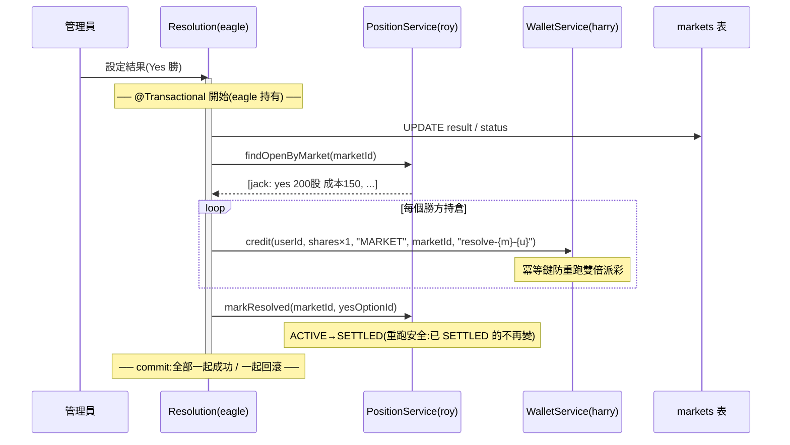
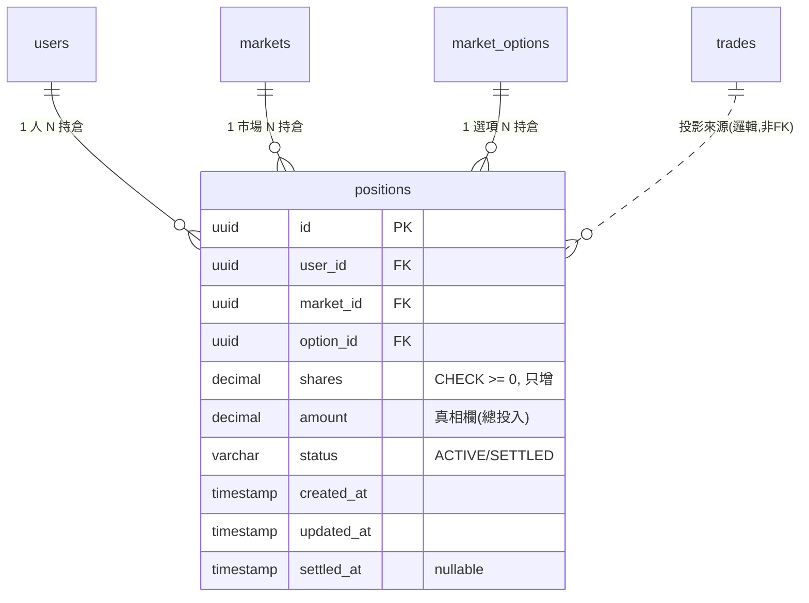
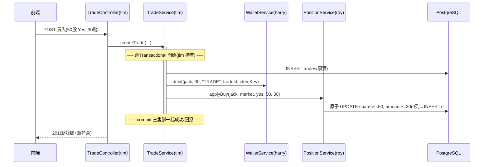

# Position（持倉）模組 — 完整設計文件

---

# 0 · TL;DR

- **持倉 = 交易(trade)事件流的物化讀模型(materialized read model)** — 它不產生真相，只把「你做了什麼交易」翻譯成「你現在怎樣」
- **🔒 兩個不可反悔前提：不做賣出(buy-only) + 每筆交易是獨立事件** → 狀態只剩 `ACTIVE → SETTLED`、核心不變式只剩 **2 條**
- **刻意物化成表（方案 A）**：明知純查詢(B)可行，仍為效能與結算查詢物化 — Manifold 的 `ContractMetric` 同款做法
- **對外 1 支 REST + 對內 3 支 Service**；讀取靠欄位 overload 收進 5 種場景
- **驗收一句話：100 筆並發加倉後，`positions` 與 `trades` 累加分毫不差（shares == Σ買入股、amount == Σ買入成本）**

---

# 0.5 · 速查表

| 術語 | 白話 |
|---|---|
| 投影(projection) | 從別人的資料「算出來的倒影」，自己不產生真相 |
| 物化(materialize) | 把算好的結果**存成表**，不用每次重算 |
| 讀模型(read model) | 專門為「查詢」設計的資料形狀（CQRS 概念） |
| 事實來源(source of truth) | 數字的原產地；持倉的事實來源是 `trades` |
| UPSERT | 有這列就 UPDATE、沒有就 INSERT |
| 加權平均成本(weighted average cost) | 總成本 ÷ 總股數（**不是**兩次均價相加除 2） |
| 未實現盈虧(unrealized PnL) | 還沒結算、隨市價浮動的帳面賺賠 |
| 已實現盈虧(realized PnL) | 結算後落袋（或落空）的最終賺賠 |
| 更新遺失(lost update) | 兩個並發寫互相覆蓋，其中一筆消失 |
| 原子更新(atomic update) | 一條 SQL 內完成「讀+算+寫」，資料庫自己排隊 |
| 冪等(idempotent) | 同一件事做兩次，結果跟做一次一樣 |
| 懶建立(lazy-create) | 不預先建，第一次用到才建 |

---

# 1 · 🔒 兩個不可反悔的前提

本文所有設計都從這兩條推出；**要動這兩條，整份重來**。

1. **不做賣出（buy-only）** — 使用者只能買入 / 加倉，沒有賣出、沒有平倉。
2. **每筆交易是獨立事件** — 每筆成交是獨立、不可變的事實；持倉是這些事件的**投影（累加）**。

**連帶簡化（全部自動成立，不用另外做）：**

| 連帶結果 | 為什麼 |
|---|---|
| `shares` 只增不減、永遠 ≥ 0 | 不賣 → 不會減、不會超賣 |
| 沒有 CLOSED 狀態 | 平倉才會 CLOSED → 狀態只剩 `ACTIVE → SETTLED` |
| 已實現盈虧只在**結算**發生 | 沒賣出 → 不會中途落袋 |
| 持倉 = `Σ買入`，純加法投影 | 沒有減項、沒有複雜計算 |
| 不踩 FIFO / LIFO 議題 | 成本基礎法的分歧只在「賣的時候賣哪批」，不賣就沒有 |
| 核心不變式只剩 2 條 | 見 §3 |

---

# 2 · 持倉本質 → 功能說明

## 為什麼要有持倉（4 Why）

```
Why 1: trades 不是已經記了所有交易嗎？
        → trades 記「你做了什麼」(事件)；沒人回答「你現在怎樣」(狀態)
Why 2: 為什麼不每次從 trades 現算？        ⭐ 關鍵
        → 可以算（見 §7.1 方案 B），但持倉頁每開一次、結算每跑一次
          都要全表聚合 → 把「算好的結果」存成表 = 物化快照
Why 3: 為什麼不讓 Trade 模組自己管？
        → 持倉被三方使用（交易寫入 / 結算讀取 / 前端查詢），
          集中一個 owner 才不會三處各算各的、對不起來
Why 4: 為什麼不放錢包？
        → 同一筆買入有兩隻腳：現金面(-30 點)歸錢包、庫存面(+50 股)歸持倉
        → 職責不同：錢包管「錢」，持倉管「貨」
```

## 一句話定位

> **持倉是「交易事件流的物化視圖」— 把分散的成交，摺疊成「使用者此刻在每個市場握有什麼、花了多少、能不能結算」的當前快照。它不產生真相；對不上時，以 trades 為準，且可整個重建。**

## 三位一體本質

| 角色 | 職責 | 沒有它會怎樣 |
|---|---|---|
| **庫存(holding)** | 現在握有多少份額 | 不知道「持有什麼」 |
| **成本基底(cost basis)** | 總投入（盈虧的基準線） | 算不出賺賠 |
| **未結算索賠權(open claim)** | 對未來結果的請求權 + 狀態 | 結算時不知道該付誰 |

→ 缺一就不是持倉。

## 業界對標

| 平台 / 來源 | 對 UcMarket 持倉的啟發 |
|---|---|
| **Manifold Markets**（全組對標平台） | **把持倉物化成 `ContractMetric`**：每人每市場一筆，含 `totalShares`（按選項分）、`invested`（投入）、`profit`、`payout`、`hasShares` — **跟本設計同構，可全抄** |
| **Polymarket** | 「Your position is simply your balance of tokens for a given market」— 持倉 = 你在該市場的份額餘額；贏方每股兌 $1 |
| **微軟 CQRS / Event Sourcing 模式** | event store 是 write model（單一真相）；read model 從事件產生物化視圖；「長期加總很貴 → 存加總快照(snapshot)」 |
| **券商系統** | 每筆成交(fill)即時更新 position 與 P&L；持倉含「持有量 + 平均成本」 |
| **成本基礎法(cost basis)** | 加權平均 = 三大方法之一（FIFO / LIFO / 加權平均），公式「總成本 ÷ 總股數」 |

→ **共識**：持倉物化、按（人 × 市場 × 選項）粒度、投入成本存著、盈虧算出來。

## 核心職責 vs 不該做的事

**✅ 核心職責**：
- 接收成交 → 累加持倉（庫存）
- 維護成本基底（amount）
- 回答查詢（含即時未實現盈虧）
- 供結算（撈持倉、標記已結算）

**❌ 不該做**：

| 不做的事 | 誰該做 |
|---|---|
| 算成交價、算份額 | Trade（tim）— 算好傳進來 |
| 扣款 / 入帳 / 派彩 | Wallet（harry） |
| 判定市場結果 | Resolution（eagle） |
| 算派彩金額(payout) | Resolution（eagle）用本模組給的 shares 算 |
| 存市場名 / Yes-No 標籤 / 餘額 | 抓 market / market_options / wallet |
| 存交易歷史 | trades 本身就是歷史，不重存 |

---

# 3 · 不變式（Invariants）

> **Invariant = 任何時刻都必須為真的規則。** 經過刻意刪減，核心只有 2 條 — 一條管「身分」、一條管「價值」。schema、Service、測試都以這 2 條為準。

## 兩條核心

### I-1 · 投影一致性：持倉 == 買入的累加 ⭐（身分）

```
shares == Σ 該 (user, market, option) 的買入份額
amount == Σ 該 (user, market, option) 的買入成本
```

- 持倉**沒有獨立真相** — 對不上時以 trades 為準，且可整個從 trades 重建
- **可寫對帳腳本隨時驗證**（這是本模組的「查帳」能力）
- 違反 = 持倉在亂編數字 = 不再是持倉

### I-2 · 加權平均成本（價值）

```
avg_cost == amount ÷ shares        （總成本 ÷ 總股數）
```

- **不是**兩次均價相加除 2（見 §7.3 數字證明）
- 違反 = 所有盈虧全錯 = 持倉失去存在意義（看賺賠）

## jack 範例驗證（貫穿全文的數字）

jack 在市場「BTC 2026 突破 200K？」：

| 動作 | shares | amount | avg_cost | 驗證 |
|---|--:|--:|--:|---|
| 買 50 股 Yes @ 0.60（花 30） | 50 | 30 | 0.60 | I-1：50==50、30==30 ✓ |
| 再買 150 股 Yes @ 0.80（花 120） | 200 | 150 | **0.75** | I-1：200==50+150 ✓；I-2：150÷200=0.75 ✓（簡單平均 0.70 ✗） |

## 防線（schema 一行搞定，不算「工作量」）

| 防線 | 一行 | 守什麼 |
|---|---|---|
| `CHECK (shares >= 0)` | DB 約束 | buy-only 下自動成立，當保險 |
| `UNIQUE (user_id, market_id, option_id)` | DB 約束 | 一人一市場一選項**最多一列**（加倉是 UPDATE 不是 INSERT） |
| FK → users / markets / market_options | DB 約束 | 關聯完整 |
| `DECIMAL` 定點型別 | DB 型別 | 金額不用 float / double |
| status ∈ {ACTIVE, SETTLED} | CHECK / enum | 只有兩態、單向 |

---

# 4 · 使用者流程（jack 的一生）

## 流程 1 · 第一次買入（開倉，懶建立）

```
jack 在市場頁買 50 股 Yes，花 30 點
   ↓ tim 的 Trade 成交（同一個 @Transactional 內）
   ├ trades 新增一筆（事實）
   ├ wallet.debit(jack, 30, ...)         ← 現金腳（harry）
   └ position.applyBuy(jack, market, yes, 50, 30)   ← 庫存腳（本模組）
        → positions 無此列 → INSERT (shares=50, amount=30, status=ACTIVE)
```
> **持倉不在註冊時建**（跟錢包不同）— 第一次買才建（lazy-create）。

## 流程 2 · 加倉

```
jack 又買 150 股 Yes，花 120 點
   ↓ 同流程 1，但 positions 已有列
   → UPDATE：shares 50→200、amount 30→150
   → avg_cost 顯示 0.75（= 150÷200，加權平均）
```

## 流程 3 · 看持倉頁（即時盈虧）

```
jack 打開「持倉」頁（此時市價 0.90）
   ↓ GET /api/me/positions
   → 讀 positions（200 股、成本 150）
   → 抓 market 現價 0.90
   → 當場算：市值 = 200×0.90 = 180；未實現 = 180−150 = +30（+20%）
   → 回 JSON；positions 表完全沒被寫入（純讀）
```
> 未實現盈虧**每次算、不存**（為什麼見 §7.2）。

## 流程 4 · 結算（定格）

```
管理員設結果 Yes 勝 → eagle 的結算（單一 @Transactional）
   ├ 判定勝方（eagle）
   ├ findOpenByMarket(market) → 拿到 jack: yes, 200 股, 成本 150
   ├ wallet.credit(jack, 200×1=200, "MARKET", marketId, "resolve-{m}-{jack}")   ← eagle 算 payout、harry 入帳
   └ markResolved(market, yesOptionId) → jack 的持倉 ACTIVE→SETTLED、settled_at=now
   ↓ jack 下次登入
   → 持倉頁該列顯示「已結算 · 已實現 +50」（= 200−150，查詢時導出）
```

---

# 5 · 能力與 API

## 5.1 能力總覽（2 寫 + 2 讀）

| # | 能力 | 類型 | 一句話 | 觸發者 |
|---|---|---|---|---|
| 1 | **加倉 / 開倉** `applyBuy` | 寫（對內） | 成交後累加持倉（UPSERT） | tim 成交時 |
| 2 | **結算標記** `markResolved` | 寫（對內） | `ACTIVE → SETTLED` 定格 | eagle 結算時 |
| 3 | **查持倉** `getMyPositions` | 讀（**對外 REST**） | 查某人持倉 + 即時盈虧 | 前端 |
| 4 | **結算撈** `findOpenByMarket` | 讀（對內） | 撈某市場持倉（raw，給 eagle 算 payout） | eagle 結算時 |

→ **對外端點只有 1 支**：`GET /api/me/positions`。其餘是隊友 Java 直接呼叫（同 JVM、共用交易），**沒有 HTTP**。

## 5.2 Day-1 簽章（先定下，內部之後填）

```java
void applyBuy(UUID userId, UUID marketId, UUID optionId,
              BigDecimal shares, BigDecimal cost);

List<Position> findOpenByMarket(UUID marketId);

void markResolved(UUID marketId, UUID winningOptionId);
// winningOptionId 為預留簽章：MVP 內部只標 SETTLED 用不到它；
// 未來若想把 realized 落庫，簽章不變、eagle 不用重接（他本來就知道勝方）

List<PositionResponse> getMyPositions(UUID userId,
                                      @Nullable UUID marketId,
                                      @Nullable PositionStatus status);
```

## 5.3 讀取 overload 圖（1 個概念 → N 個場景）

```
getMyPositions(userId [, marketId] [, status])      ◀━ 1 支方法,選填欄位 overload
    │
    │   帶入欄位              →  WHERE 條件               →  場景 / 呼叫者
    │   ────────────────────    ────────────────────────    ────────────────
    ├── (userId)                user_id=?                    前端 · 我的持倉頁
    ├── (userId, marketId)      user_id=? AND market_id=?    前端 · 市場詳情頁
    ├── (userId, status)        user_id=? AND status=?       前端 · 已結算紀錄
    └── (目標 userId)[admin]     user_id=?（授權不同）        管理員後台（延後）
            │
            └▶ 回傳 List<PositionResponse>（含市價、盈虧 — 算好給前端）

findOpenByMarket(marketId)                          ◀━ 另 1 支，不硬併
    └── WHERE market_id=? AND status='ACTIVE'
            └▶ 回傳 raw shares / amount（給 eagle 算 payout）
```

> **overload 的界線**：條件不同 → 合併成一支；**回傳語意不同 → 拆開**。
> `findOpenByMarket` 回 raw 數字（eagle 要算錢）、`getMyPositions` 回含盈虧的 DTO（前端要顯示）— 語意不同，所以是兩支。

## 5.4 回傳契約 `PositionResponse`（每列 = 一個持倉）

| 欄位 | JSON | Java | 來源 / 算法 |
|---|---|---|---|
| `marketTitle` | string | String | 讀 market（shung） |
| `option` | string | String | 讀 market_options（Yes / No / 選項名） |
| `shares` | string(數字) | BigDecimal | 本表 |
| `avgCost` | string | BigDecimal | **算**：amount ÷ shares |
| `amount` | string | BigDecimal | 本表（投入成本） |
| `currentPrice` | string | BigDecimal | 讀 market 現價（ACTIVE 才有） |
| `marketValue` | string | BigDecimal | **算**：shares × currentPrice |
| `unrealizedPnl` / `%` | string | BigDecimal | **算**：shares × currentPrice − amount |
| `realizedPnl` | string | BigDecimal | **算**（SETTLED 才有）：勝 shares×1−amount / 敗 −amount |
| `status` | string | enum | 本表：ACTIVE / SETTLED |

> 注意 `unrealizedPnl = shares × 現價 − amount` — **不經過 avg_cost、沒有除法**，零精度損失。
> 輸入只需登入者 userId（從 Session / JWT 拿，**不是前端傳**）。

## 5.5 各層產出檔

| 層 | 產出檔 | 為什麼 |
|---|---|---|
| Entity | `Position` | 對應 positions 表 |
| Repository | `PositionRepository` | 衍生查詢 ×3 + **1 句原子加倉 `@Modifying @Query`** |
| Service | `PositionService` | 4 個方法（本模組所有邏輯都在這） |
| Controller | `PositionController` | 1 支 `GET /api/me/positions` |
| DTO | `PositionResponse` | 出去的形狀（含算好的盈虧） |

→ 純內部能力（applyBuy / markResolved / findOpenByMarket）**無 Controller、無 Request DTO**。

---

# 6 · 對接清單（點名）

## 6.1 逐行對接

| 誰 | 對接什麼 | 方法 | 約定 |
|---|---|---|---|
| **tim**（Trade·買入） | 成交後更新持倉 | 在他成交的 `@Transactional` **內**呼叫 `applyBuy(userId, marketId, optionId, shares, cost)` | shares/cost 由 tim 算好傳入（持倉不算價格）；trade + wallet + position 同生死 |
| **eagle**（Resolution·撈） | 結算撈某市場持倉 | `findOpenByMarket(marketId)` | 回 raw shares/amount；payout 由 eagle 算（= 勝方 shares × 1） |
| **eagle**（Resolution·標） | 結算後定格持倉 | 在他結算的 `@Transactional` **內**呼叫 `markResolved(marketId, winningOptionId)` | 跟 wallet.credit 派彩**同一個交易**，一起成功或一起回滾 |
| **shung**（Market） | 抓現價 / 市場名 / 選項標籤 | 本模組**讀** market / market_options | ⚠️ 「現價」從哪讀（表欄位 or method）待跟 shung 確認 |
| **harry**（Wallet） | 無直接對接 | — | 派彩是 eagle → wallet；持倉不碰錢 |
| **前端** | 持倉頁 / 市場詳情頁 | `GET /api/me/positions` | 盈虧後端算好，前端不自己算 |

## 6.2 對接硬規則（5 條）

| # | 規則 | 為什麼 |
|---|---|---|
| 1 | **只有 `PositionService` 動 positions 表** | 投影邏輯（加權平均）集中一處，別人直寫必算錯 |
| 2 | **`applyBuy` 必在 tim 的 `@Transactional` 內** | trade 成立但持倉沒更新 = 投影壞掉（I-1 破） |
| 3 | **`markResolved` 必在 eagle 的結算交易內** | 防「錢派了、持倉沒標」或反之 |
| 4 | **持倉不算價格** — shares / cost 一律由呼叫端算好傳入 | 價格機制歸 Trade / Market，責任分離 |
| 5 | **型別對齊**：id 類 UUID、份額 `BigDecimal(18,6)`、金額 `BigDecimal(18,2)` | FK 對不上 = 整合直接炸（見 §10.3 待拍板） |

## 6.3 結算跨模組時序（單一交易 ⭐ 最容易出 bug 的地方）



> **冪等分工**：派彩（加值）**不天然冪等** → 靠 wallet 冪等鍵；改狀態**天然冪等**（SETTLED 再標還是 SETTLED）→ 本模組不需要冪等鍵。

---

# 7 · 設計決策的「為什麼」

## 7.1 為什麼物化成表（A），不用純查詢（B）⭐ 本模組最大決策

持倉的數字 100% 可從 trades 算出 → 理論上**可以不建表**，查詢時 `SUM(shares), SUM(amount) ... GROUP BY` 即可（方案 B）。

| 面向 | A 物化表 ✅ | B 純查詢 |
|---|---|---|
| 查持倉頁 | 讀現成列，O(持倉數) | 每次全聚合 trades |
| 結算撈持倉 | `WHERE market_id AND status` 直查 | 每次 GROUP BY |
| 寫入邏輯 | 要寫 applyBuy + 並發處理 | 不用寫 |
| 與 trades 不同步風險 | 有（靠 I-1 對帳）| 無（定義上一致） |
| 業界對標 | **Manifold `ContractMetric` 就是物化** | — |

**選 A 的理由（按權重）**：
1. **讀寫比懸殊**：持倉頁、市場詳情頁、排行榜都在讀；寫入只在成交那一刻 → 為讀優化划算（CQRS read model 的標準理由）
2. **結算需要快查**：「市場 X 的所有 ACTIVE 持倉」物化後是一個索引查詢
3. **對標平台同款**：Manifold 物化 `ContractMetric`（totalShares / invested / payout）
4. **作品集價值**：寫入路徑（UPSERT + 並發 + 跨模組交易）正是後端面試的考點 — 這部分 B 全省掉了，反而沒料

**誠實代價**：要維護「表 == trades 累加」（I-1）→ 用對帳腳本驗、極端時可重建。

> 面試一句話：「持倉本質是投影，我知道純查詢就能算；但評估讀寫比與結算查詢後**刻意物化**，並用對帳腳本守住投影一致性。」

## 7.2 存 vs 算的判準：看「驅動源是死是活」

| 欄位 | 驅動源 | 死活 | 決策 |
|---|---|---|:--:|
| `shares` / `amount` | 自己的成交（不可變事件） | 死（成交後不變） | **存** ✅ |
| `avg_cost` | = amount ÷ shares | 導出（一個除法） | **不存**，DTO 算 |
| `unrealized_pnl` | **市場現價**（別人交易就動） | **活**（每秒變） | **絕不存**（存了就是過期資料） |
| `realized_pnl` | 結算結果（定格後不變） | 死，但導出便宜（一個 join） | MVP 不存、查詢導出；要存的話 markResolved 簽章已預留 |

> 通則：**導出貴 + 驅動源死 → 存（amount）；導出便宜 → 算（avg_cost / realized）；驅動源活 → 絕不存（unrealized）。**

## 7.3 為什麼是加權平均、為什麼以 amount 為真

**加權平均**（jack 的數字證明）：
```
50 股 @0.60（花 30）＋ 150 股 @0.80（花 120）
✅ 加權:avg = (30+120) ÷ (50+150) = 150÷200 = 0.75
❌ 簡單平均:(0.60+0.80)÷2 = 0.70   ← 0.80 那批買得多,均價必須被拉高
```

**amount 為真、avg 為導出**（精度）：
- `amount` 是**加法**（無損）；`avg_cost` 是**除法**（除不盡會被截斷）
- 若反過來存 avg、用 `avg × shares` 回推 amount → 每次都從被截斷的數出發，**越加越歪**
- 所以：`shares`/`amount` 加法維護；`avg_cost` 要用時才除。兩者不一致時信 `amount`
- （Roy 原欄位表的 `avg_cost` 欄依此改為導出、`amount = shares × avg_cost` 的方向要反過來）

## 7.4 為什麼粒度是 (user, market, option) 一列一個選項

- 二元市場 = Yes 一列、No 一列；未來多選項市場 = N 列 — **同一個模型，零改動**
- Roy 原欄位表（`option_id` + 單一 `shares`）**已經是這個粒度，直接沿用** ✅
- ⚠️ `project-spec.md` §9 的 `yes_shares`/`no_shares` 雙欄是舊模型（撐不住多選項），**待跟主持人對齊改單欄**

## 7.5 為什麼持倉不需要自己的冪等鍵

`applyBuy` 由 tim 的成交觸發；成交本身已被 Trade / Wallet 的冪等機制擋重複 → **trade 不重複，applyBuy 就不會被重複呼叫**。投影的冪等性**繼承自來源事件**（寄生），自己不用再做一層。
（`markResolved` 則是**天然冪等**：狀態轉換重跑無害。）

## 7.6 為什麼加倉不用悲觀鎖（原子更新就夠）

加倉是**純累加**（buy-only 下沒有「餘額不足」這種會被拒絕的守衛）→ 不存在「先讀、判斷、再寫」的臨界區 → 一條原子 UPDATE 讓資料庫自己排隊即可：

```sql
UPDATE positions
SET shares = shares + :s, amount = amount + :c, updated_at = now()
WHERE user_id = :u AND market_id = :m AND option_id = :o;
-- 影響 0 列(第一次買該選項) → INSERT 開倉
```

**沒有原子更新會怎樣（lost update 演示）**：
```
T1  交易A 讀 shares=50
T2  交易B 讀 shares=50          ← 都讀到 50
T3  A 寫 50+150=200
T4  B 寫 50+100=150             ← A 的 150 股被蓋掉!
```
**並發測試**（亮點）：100 執行緒同時 applyBuy → 驗 `shares == Σ買入`（I-1）分毫不差。

> 邊角：兩筆「第一次買」同時 INSERT → UNIQUE 擋下一筆 → 捕捉後重試 UPDATE 即可（附錄 A）。

---

# 8 · Schema 與 Entity

## positions 表

| 欄位 | 型別 | 約束 | 說明 |
|---|---|---|---|
| `id` | UUID | PK | ⚠️ 型別待全組拍板（§10.3），建議 UUID |
| `user_id` | UUID | FK → users.id | |
| `market_id` | UUID | FK → markets.id | |
| `option_id` | UUID | FK → market_options.id | 一列一個選項 |
| `shares` | DECIMAL(18,6) | `CHECK >= 0` | 持有份額，只增 |
| `amount` | DECIMAL(18,2) | `CHECK >= 0` | 總投入成本 — **真相欄** |
| `status` | VARCHAR(16) | `CHECK IN ('ACTIVE','SETTLED')` | 單向 ACTIVE→SETTLED |
| `created_at` | TIMESTAMP | NOT NULL | 開倉時間 |
| `updated_at` | TIMESTAMP | NOT NULL | 最後加倉 / 結算時間 |
| `settled_at` | TIMESTAMP | NULL | 結算才寫 |

**唯一約束**：`UNIQUE (user_id, market_id, option_id)`
**索引**：`(user_id)` 查持倉、`(market_id, status)` 結算撈
**沒有的欄位（刻意）**：`avg_cost`（導出）、`unrealized_pnl`（驅動源活）、`realized_pnl`（查詢導出）

## ER 圖



> trades → positions 那條是**邏輯關係**（I-1 投影一致性），不是 DB FK — 持倉列由多筆 trade 累加而成，無法用單一外鍵表達；一致性靠對帳腳本驗。

## 買入流向（applyBuy 在 tim 交易內）



---

# 9 · 前端對應（契約反推畫面）

> 持倉頁還沒畫 — 正確做法不是等畫面，而是**從回傳契約反推畫面**，這張圖直接給 roy 當 figma 規格。

```
╔══════════════════════════════════════════════════════════════════╗
║  我的持倉          ◀━━ GET /api/me/positions                       ║
╠══════════════════════════════════════════════════════════════════╣
║  ┌ 總持倉市值 ┐ ┌ 總未實現盈虧 ┐      ← 前端對清單加總               ║
║  │   $195     │ │ +$25 (+14.7%)│        Σ marketValue / Σ unrealized║
║  └────────────┘ └──────────────┘                                   ║
║  [全部] [進行中] [已結算]    ◀━ overload:(userId, status)           ║
║  ────────────────────────────────────────────────────────────────  ║
║  市場        方向  持有   均價   現價   市值   未實現盈虧    狀態     ║
║  BTC>200K?   YES   200   0.75  0.90  $180  +$30(+20%)   進行中    ║
║  美國大選     NO    50    0.40  0.30  $15   −$5 (−25%)   進行中    ║
║  ETH>10K? ✓  YES   100   0.60   —     —    +$40 已實現   已結算    ║
╚══════════════════════════════════════════════════════════════════╝
     │          │     │     │     │     │       │           │
 marketTitle option shares avgCost current market unrealized  status
 (market)   (opt)  (本表) (算)  Price  Value   Pnl(算)     (本表)
```

| 後端 overload | 前端控件 |
|---|---|
| `(userId)` | 主頁整份清單 |
| `(userId, status)` | [全部 / 進行中 / 已結算] 篩選 tab |
| `(userId, marketId)` | 市場詳情頁「我在這市場的持倉」面板 |
| `findOpenByMarket` | **沒有畫面**（eagle 結算用） |

**顯示規則**：盈虧綠正紅負；**已結算列**現價 / 市值留白（已定格），改顯示已實現盈虧。

---

# 10 · MVP 範圍與升級軌跡

## 10.1 版本目標

| 版本 | 內容 | 定位 |
|---|---|---|
| MVP | positions 表 + 4 個 Service 方法 + 1 支 REST + jack 流程全通 | 必達 |
| 標準版 | 原子 UPDATE 加倉 + UNIQUE 衝突重試 + **100 筆並發測試** + 對帳腳本（I-1） | 實作重點（作品集亮點） |
| 行有餘力 | realized 落庫（簽章已預留）+ admin 查詢端點 + 排行榜彙總供應 | 未必做 |

## 10.2 故意不做（劃清邊界）

```
├ ❌ 賣出 / 平倉 / CLOSED 狀態        ← 🔒 前提排除,不可反悔
├ ❌ unrealized_pnl 落庫              ← 驅動源是活的,存了必過期
├ ❌ 自己的冪等鍵                     ← 投影冪等寄生於 trade
├ ❌ 悲觀鎖                           ← 純累加,原子 UPDATE 就夠
├ ❌ position_history 表              ← trades 就是歷史
├ ❌ Yes+No 對沖合併                  ← 各記各的,結算各自算
├ ❌ FIFO / LIFO 成本法               ← 不賣出,沒這議題
└ ❌ 排行榜計算                       ← eagle 的事,本模組只供資料
```

## 10.3 ⚠️ 待全組拍板（3 件，越早越好）

| # | 議題 | 建議 | 影響 |
|---|---|---|---|
| 1 | id / user_id 型別：UUID vs BIGINT/VARCHAR | **UUID**（與 project-spec、wallet、market 一致；FK 不對齊 = 整合炸） | 全組 |
| 2 | project-spec §9 positions 雙欄(yes/no_shares) → option_id 單欄 | 以本文 §8 為準，請主持人更新規格書 | 主持人 + roy |
| 3 | 「現價」從哪讀（market 表欄位 or MarketService 方法） | 跟 shung 定一個就好 | shung + roy |

## 10.4 升級軌跡（簽章不變原則）

| 升級項 | 加什麼 | 動到本模組什麼 | 影響組員 | 簽章 |
|---|---|---|:--:|:--:|
| naive → 原子 UPDATE | `@Modifying @Query` 一句 | applyBuy 內部 | ❌ 無感 | 不變 |
| 並發測試 | JUnit 100 執行緒 | 測試檔 | ❌ | 不變 |
| 對帳腳本 | `positions == Σtrades` 驗證 | script | ❌ | 不變 |
| realized 落庫 | markResolved 內 CASE 寫入 | 內部（winner 參數已預留） | ❌ | **不變** |
| 多選項市場 | **無**（粒度已支援） | 無 | ❌ | 不變 ⭐ |
| admin 查任意使用者 | Controller 加端點 | Controller | 前端 | 加新端點 |

---

# 11 · 面試 Q&A

### Q1：「持倉能從交易算出來，為什麼還要建表？」
> 「對，它本質是投影(projection)，純查詢就能算。但持倉是讀多寫少（持倉頁、結算、排行榜都在讀，寫只在成交瞬間），所以我刻意物化成讀模型(read model)，結算撈持倉變成一個索引查詢。對標平台 Manifold 也是物化成 ContractMetric。代價是要守『持倉 == 交易累加』的投影一致性，我用對帳腳本驗證，極端時可整個從 trades 重建。」

### Q2：「兩筆買入同時打同一個持倉怎麼辦？」
> 「加倉是純累加、沒有會被拒絕的守衛，所以不用鎖 — 一條原子 UPDATE `shares=shares+?` 讓資料庫排隊就好。我寫了 100 執行緒的並發測試證明份額分毫不差。如果是兩筆『第一次買入』同時 INSERT，UNIQUE 約束會擋下一筆，捕捉後重試 UPDATE。」

### Q3：「浮動盈虧為什麼不存欄位？」
> 「它的驅動源是市場現價 — 別人交易它就變。存了就是過期資料(stale)，還得在每次價格變動時改寫所有持倉列。所以查詢時即時算：shares × 現價 − amount，連除法都沒有、零精度損失。對比之下總投入 amount 的驅動源是自己的成交、成交後不變，所以存。判準是『驅動源是死是活』。」

### Q4：「平均成本怎麼算？賣出怎麼辦？」
> 「加權平均：總成本 ÷ 總股數，不是兩次均價相加除二。而且我以 amount（加法、無損）為真相欄，avg_cost 要用時才除，避免反覆除法的累積誤差。賣出在我們的範圍裡明確不做(buy-only)，所以 FIFO/LIFO 的成本法分歧不會踩到 — 這是刻意的範圍決策，砍掉一個功能消掉了一整串複雜度。」

### Q5：「結算時持倉標了、錢沒派怎麼辦？」
> 「不會發生 — 結算是單一交易：eagle 的 @Transactional 內依序派彩(wallet.credit)和標記持倉(markResolved)，一起成功或一起回滾。重跑安全靠分工：派彩是加值、不天然冪等，由 wallet 冪等鍵擋；標記是狀態轉換、天然冪等，重標無害。」

---

# 附錄 A · Code 骨架

## Entity

```java
@Entity
@Table(name = "positions",
       uniqueConstraints = @UniqueConstraint(columnNames = {"user_id","market_id","option_id"}))
public class Position {
    @Id @GeneratedValue(strategy = GenerationType.UUID)
    private UUID id;

    @Column(nullable = false) private UUID userId;
    @Column(nullable = false) private UUID marketId;
    @Column(nullable = false) private UUID optionId;

    @Column(nullable = false, precision = 18, scale = 6)
    private BigDecimal shares;          // 只增

    @Column(nullable = false, precision = 18, scale = 2)
    private BigDecimal amount;          // 真相欄(總投入)

    @Enumerated(EnumType.STRING)
    @Column(nullable = false, length = 16)
    private PositionStatus status;      // ACTIVE / SETTLED

    private Instant createdAt;
    private Instant updatedAt;
    private Instant settledAt;          // nullable
}
```

## Repository（衍生查詢 + 原子加倉）

```java
public interface PositionRepository extends JpaRepository<Position, UUID> {

    List<Position> findByUserId(UUID userId);                          // 持倉頁
    List<Position> findByUserIdAndMarketId(UUID userId, UUID marketId); // 市場詳情
    List<Position> findByMarketIdAndStatus(UUID marketId, PositionStatus s); // 結算撈

    // 標準版:原子加倉(免鎖,DB 序列化) — 回傳影響列數
    @Modifying
    @Query("""
        UPDATE Position p
        SET p.shares = p.shares + :s, p.amount = p.amount + :c, p.updatedAt = CURRENT_TIMESTAMP
        WHERE p.userId = :u AND p.marketId = :m AND p.optionId = :o
        """)
    int atomicAdd(UUID u, UUID m, UUID o, BigDecimal s, BigDecimal c);

    // 結算標記(天然冪等:已 SETTLED 的不再匹配)
    @Modifying
    @Query("""
        UPDATE Position p
        SET p.status = 'SETTLED', p.settledAt = CURRENT_TIMESTAMP
        WHERE p.marketId = :m AND p.status = 'ACTIVE'
        """)
    int settleByMarket(UUID m);
}
```

## Service

```java
@Service
public class PositionService {

    // ① 加倉/開倉 — 由 tim 在成交 @Transactional 內呼叫(本方法不自開交易)
    public void applyBuy(UUID userId, UUID marketId, UUID optionId,
                         BigDecimal shares, BigDecimal cost) {
        int updated = repo.atomicAdd(userId, marketId, optionId, shares, cost);
        if (updated == 0) {                       // 第一次買該選項 → 開倉
            try {
                repo.save(Position.open(userId, marketId, optionId, shares, cost));
            } catch (DataIntegrityViolationException e) {
                // 兩筆「第一次買」並發:UNIQUE 擋下 → 重試累加
                repo.atomicAdd(userId, marketId, optionId, shares, cost);
            }
        }
    }

    // ② 結算撈 — eagle 用來算 payout(raw 數字)
    public List<Position> findOpenByMarket(UUID marketId) {
        return repo.findByMarketIdAndStatus(marketId, PositionStatus.ACTIVE);
    }

    // ③ 結算標記 — 在 eagle 的結算交易內;winningOptionId 為預留簽章
    public void markResolved(UUID marketId, UUID winningOptionId) {
        repo.settleByMarket(marketId);
        // 升級點:未來想落庫 realized → 在此用 winningOptionId 寫 CASE,簽章不變
    }

    // ④ 查持倉 — 即時算盈虧(純讀,不寫表)
    public List<PositionResponse> getMyPositions(UUID userId, UUID marketId, PositionStatus status) {
        List<Position> rows = /* 按參數選衍生查詢(overload) */;
        return rows.stream().map(p -> {
            var market = marketService.get(p.getMarketId());        // 讀 shung:名稱/現價/結果
            var option = marketService.getOption(p.getOptionId());  // Yes/No 標籤

            BigDecimal avgCost = p.getAmount().divide(p.getShares(), 6, RoundingMode.HALF_UP);
            if (p.getStatus() == ACTIVE) {
                BigDecimal value = p.getShares().multiply(market.currentPrice(p.getOptionId()));
                BigDecimal unrealized = value.subtract(p.getAmount());  // 無除法,零誤差
                return PositionResponse.active(market.title(), option.label(),
                        p.getShares(), avgCost, p.getAmount(), value, unrealized);
            } else { // SETTLED:realized 查詢導出(勝:shares×1−amount;敗:−amount)
                boolean won = p.getOptionId().equals(market.winningOptionId());
                BigDecimal realized = (won ? p.getShares() : BigDecimal.ZERO).subtract(p.getAmount());
                return PositionResponse.settled(market.title(), option.label(),
                        p.getShares(), avgCost, p.getAmount(), realized);
            }
        }).toList();
    }
}
```

## Controller + DTO

```java
@RestController
public class PositionController {
    @GetMapping("/api/me/positions")
    public List<PositionResponse> myPositions(
            @AuthenticationPrincipal UUID userId,          // 從登入拿,非前端傳
            @RequestParam(required = false) UUID marketId,
            @RequestParam(required = false) PositionStatus status) {
        return positionService.getMyPositions(userId, marketId, status);
    }
}

public record PositionResponse(
    String marketTitle, String option,
    BigDecimal shares, BigDecimal avgCost, BigDecimal amount,
    BigDecimal currentPrice, BigDecimal marketValue,   // ACTIVE
    BigDecimal unrealizedPnl, BigDecimal unrealizedPct,
    BigDecimal realizedPnl,                            // SETTLED
    String status
) { /* active(...) / settled(...) 工廠方法 */ }
```

## 並發測試（標準版亮點）

```java
@Test
void 一百筆並發加倉_份額與成本分毫不差() throws Exception {
    // 100 執行緒同時 applyBuy(jack, market, yes, 1股, 0.70)
    // 驗 I-1:shares == 100、amount == 70.00
    // 再驗 I-2:avg == 0.70
}
```

# 附錄 B · 引用來源

- [Manifold Markets（GitHub 開源 monorepo）](https://github.com/manifoldmarkets/manifold/)、[Manifold API — ContractMetric](https://docs.manifold.markets/api)（物化持倉：totalShares / invested / profit / payout）
- [Microsoft Azure Architecture Center — CQRS Pattern](https://learn.microsoft.com/en-us/azure/architecture/patterns/cqrs)（read model / materialized view / 加總快照）
- [Microsoft Azure — Event Sourcing Pattern](https://learn.microsoft.com/en-us/azure/architecture/patterns/event-sourcing)
- [Polymarket Docs — Positions & Tokens](https://docs.polymarket.com/concepts/positions-tokens)、[How Polymarket Works](https://rocknblock.io/blog/how-polymarket-works-the-tech-behind-prediction-markets)（position = token 餘額、$1 擔保）
- [Bogleheads — Cost basis methods](https://www.bogleheads.org/wiki/Cost_basis_methods)、[Charles Schwab — Know Your Cost Basis](https://www.schwab.com/learn/story/save-on-taxes-know-your-cost-basis)（FIFO / LIFO / 加權平均）
- [Using Event Sourcing and CQRS to Build a High Performance Point Trading System](https://www.researchgate.net/publication/332585738_Using_Event_Sourcing_and_CQRS_to_Build_a_High_Performance_Point_Trading_System)

# 附錄 C · 發想過程在哪

本文是「結論」。**怎麼想出來的**（三把篩子、A/B 攻防、過度工程修正、15→2 條不變式的刪減過程）在配對文件：
`docs/教學/2026-06-09-發想需求的方法-持倉本質定案-給組員.md`

---

**設計定案。下一步：§10.3 三件事拍板 → 照附錄 A 動工。**
