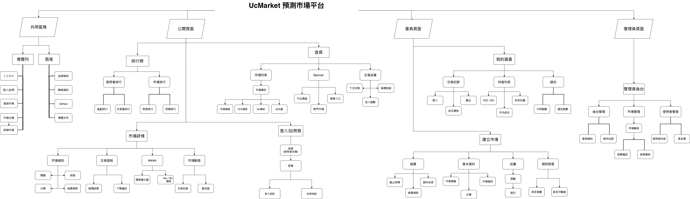

# UcMarket 工作計劃

> 文件定位：課程專題企劃與分工原稿。實際完成狀態、API、路由、技術版本與資料表以 `../current-implementation.md` 為準；本文的預定日期與功能描述不等同目前完成度。2026-07-14 起，第一階段自動化確定採 Java／Spring Boot，不導入 n8n。

## 4-1 題目與動機

### 題目

UcMarket 預測市場平台

### 動機

在台灣，只要提到「預測」與「中獎」的概念，許多人第一時間想到的可能就是大樂透、威力彩、刮刮樂等活動。尤其在過年期間，除了買樂透之外，刮刮樂更是許多人家中常見的娛樂。小時候過年時，家人圍在電視機前等待開獎，即使不一定真的抱著中頭獎的期待，但只要有中獎，就會感到非常開心。這種「等待結果揭曉」的期待感，也成為我們發想本專題的重要來源。

然而，我們也發現，一般常見的預測活動大多集中在樂透、刮刮樂或運動賽事預測，題材相對有限。長大後，我們每天接觸各種新聞、社群議題與時事事件，卻很難知道大多數人對某個事件結果的看法與信心程度。因此，我們希望透過 UcMarket 建立一個預測市場平台，讓使用者不只是等待結果，也能透過市場價格與交易行為，觀察群體對未來事件的判斷趨勢。

UcMarket 是一個以虛擬點數運作的預測市場平台。使用者可以瀏覽不同的未來事件市場，針對事件結果進行 Yes / No 預測交易，也可以建立自己的預測題目，經由系統規則檢查與管理員審核後上架。平台不涉及真實金流、賭博或加密貨幣交易，而是以模擬與學習為目的，呈現預測市場從題目建立、交易參與到結果結算的完整流程。

透過這個平台，我們希望讓使用者在參與預測的過程中，重新感受過年等待開獎時的期待與趣味，同時也能了解目前大家對某件事情的判斷方向。這也是 UcMarket 誕生的原因。

## 4-2 受眾客群分析

UcMarket 預測市場平台的主要受眾，是對時事、社群議題、未來事件結果感到好奇，並希望透過互動方式參與預測的使用者。平台以虛擬點數運作，不涉及真實金流，因此比起傳統下注或博弈活動，更適合作為模擬預測、資訊觀察與網站功能實作的學習型平台。

### 主要客群

#### 1. 對時事與熱門議題感興趣的使用者

這類使用者平常會關注新聞、社群討論、娛樂話題、科技趨勢或校園事件。他們可能想知道其他人對某個事件結果的看法，例如某項政策是否會通過、某場比賽誰會獲勝、某個話題是否會持續受到關注等。UcMarket 可以讓他們不只是被動觀看討論，而是透過 Yes / No 預測交易參與其中，並從市場價格變化觀察群體判斷。

#### 2. 喜歡預測與等待結果揭曉的使用者

這類使用者享受「做出判斷、等待結果」的過程，就像過年買刮刮樂或等待樂透開獎時的期待感。UcMarket 將這種期待感轉化成更彈性的預測形式，讓使用者可以針對不同生活事件或熱門議題進行預測，而不只侷限於樂透、刮刮樂或運動賽事。

#### 3. 想建立預測題目的使用者

除了參與既有市場之外，UcMarket 也提供使用者提交預測題目的功能。這類使用者可能看到某個有趣或具有討論度的事件，想把它設計成可預測的市場題目。為了避免題目模糊、無法判定結果或內容不適合上架，使用者提交的市場需要經過系統規則檢查與管理員審核，通過後才會正式上架。

#### 4. 管理員與平台維護者

管理員是平台能否正常運作的重要角色，主要負責審核使用者提交的市場、拒絕不合適或無法結算的題目，並在市場到期後設定正確結果進行結算。對管理員來說，平台需要提供清楚的審核資訊、結算規則、使用者管理與後台紀錄，確保每一個市場都能被公平且明確地處理。

### 客群需求分析

| 客群       | 主要需求                     | 平台對應功能                                |
| ---------- | ---------------------------- | ------------------------------------------- |
| 一般使用者 | 瀏覽市場、參與預測、查看結果 | 市場列表、市場詳情、Yes / No 交易、交易紀錄 |
| 預測參與者 | 了解大家對事件結果的判斷趨勢 | 市場價格、價格變動、熱門市場、排行榜        |
| 開盤者     | 建立自己的預測題目           | 建立市場、題目描述、截止時間、結算規則      |
| 管理員     | 維持市場品質與結算公平性     | 市場審核、拒絕市場、設定結果、後台管理      |

### 使用情境

使用者進入平台後，可以先瀏覽目前熱門或即將截止的預測市場，選擇自己感興趣的題目查看詳細資訊。如果使用者對某個事件結果有自己的判斷，就可以使用虛擬點數買入 Yes 或 No。當市場價格隨著其他使用者的交易行為產生變化時，使用者也能觀察目前群體對該事件的信心方向。

若使用者想提出新的預測題目，也可以透過建立市場功能提交題目、描述、截止時間與結算方式。題目送出後，會由系統與管理員確認是否具備客觀判定標準，通過後才會開放其他使用者參與預測。

整體而言，UcMarket 的受眾並不只是想「猜中結果」的人，也包含想觀察群體想法、參與時事討論、建立有趣題目，以及管理平台內容品質的人。透過不同角色的分工，平台能完整呈現預測市場從題目產生、使用者參與到結果結算的流程。

## 4-3 網站架構圖

UcMarket 採用前後端分離的網站架構，主要分為使用者端、前端介面、後端 API、資料庫與自動化通知流程。使用者透過瀏覽器操作網站，前端負責畫面呈現、路由切換、表單互動與呼叫後端 API；後端則負責市場、交易、錢包、持倉、審核與結算等核心邏輯，並透過資料庫保存平台資料。



*圖 4-3-1 UcMarket 預測市場平台網站架構圖*

### 架構說明

#### 1. 使用者角色

平台主要使用者包含一般使用者與管理員。一般使用者可以瀏覽市場、查看市場詳情、參與 Yes / No 預測交易、建立新的預測市場、查看資產與排行榜；管理員則負責審核使用者提交的市場、拒絕不合適題目、設定市場結果與處理結算。

#### 2. 前端正式網站

前端是使用者實際操作的平台畫面，包含首頁、市場列表、市場詳情、建立市場、我的資產、排行榜與管理員後台等頁面。前端會透過 API client 與後端交換資料，並管理登入狀態、使用者角色、錢包摘要與頁面路由。前端不直接連接資料庫，所有資料都必須透過後端 API 取得或更新。

#### 3. 後端 Spring Boot REST API

後端是 UcMarket 的核心邏輯層，負責接收前端請求並處理市場建立、交易試算、交易建立、管理員審核、市場結算、錢包異動與持倉更新等流程。後端會將商業邏輯集中在 Service 層，透過 Repository 存取 PostgreSQL 資料庫，確保交易與結算資料的一致性。

#### 4. PostgreSQL 資料庫

資料庫負責保存平台的主要資料，例如會員資料、市場資料、交易紀錄、使用者持倉、錢包異動、價格歷史與管理員操作紀錄。透過資料表之間的關聯，可以完整追蹤市場從建立、審核、交易到結算的過程；通知工作資料表仍是下一階段規劃。

#### 5. Java／Spring Boot 自動化流程

自動化直接放在既有 Spring Boot 後端。目前已完成市場自動截止、價格 snapshot、天氣市場啟動時／每日建立與天氣市場結算；下一階段再加入通知工作、Email sender、失敗重試與報表。核心交易與結算仍由 Service transaction 負責，不新增 n8n 或獨立 Worker。

### 頁面架構規劃

```text
UcMarket Website
├── 公開頁面
│   ├── 首頁 / 市場列表
│   ├── 市場詳情
│   ├── 登入
│   └── 註冊
│
├── 會員頁面
│   ├── 建立市場
│   ├── 我的資產
│   ├── 持倉
│   ├── 交易紀錄
│   ├── 個人資料
│   └── 排行榜
│
└── 管理員頁面
    ├── 待審核市場
    ├── 市場審核
    ├── 市場結算
    ├── 使用者管理
    └── 後台操作紀錄
```

整體來說，UcMarket 的網站架構以「前端負責互動呈現、後端負責邏輯與排程、資料庫負責資料保存」為設計原則。通知與報表仍在後端延伸，不把核心邏輯交給外部 workflow 工具。

## 4-4 網站版面配置圖（草稿）

## 4-5 網站開發使用技術及工具

### 全組共用技術

正式前端已採 React + Vite + JavaScript，使用 React Router、Zustand、Bootstrap 與 Chart.js；後端以 Java 21、Spring Boot 與 Flyway 管理 PostgreSQL，用來保存會員、市場、交易、持倉、錢包、結算、價格歷史與排行榜所需資料。

| 類別       | 使用技術 / 工具 | 用途                                                         |
| ---------- | --------------- | ------------------------------------------------------------ |
| 前端框架   | React + Vite    | 建立正式 SPA、頁面元件與開發／建置流程                       |
| 前端狀態   | React Router / Zustand | 管理路由、登入狀態與跨頁資料                           |
| 前端樣式   | CSS / Bootstrap | 設計版面、元件、排版與響應式畫面                             |
| 後端資料庫 | PostgreSQL      | 儲存平台核心資料，例如會員、市場、交易、錢包、持倉與結算紀錄 |
| Schema 管理 | Flyway         | 依版本套用 PostgreSQL migration                              |
| 版本管理   | Git / GitHub    | 管理專案版本與組員協作                                       |

### Shung：User/Auth 及 Market 功能

我負責規劃與實作 UcMarket 的「User/Auth 功能」與「Market 功能」，並整理使用者登入驗證、角色權限、session 管理、市場建立與後台管理流程。這兩個模組屬於平台的基礎核心，會直接影響使用者是否能正常登入、建立市場、進入後台，以及管理員是否能順利執行市場審核與管理，因此規劃時會特別重視資料正確性、權限控管、流程一致性與後續模組整合性。

#### 使用技術與工具

| 類別     | 使用技術 / 工具                     | 用途                                          |
| -------- | ----------------------------------- | --------------------------------------------- |
| 後端語言 | Java                                | 撰寫 User/Auth 與 Market 的核心邏輯           |
| 後端框架 | Spring Boot                         | 建立 RESTful API 與後端服務                   |
| 安全機制 | Spring Security                     | 處理登入驗證、角色授權與後台權限控管          |
| 密碼處理 | BCrypt                              | 將使用者密碼安全雜湊後儲存                    |
| 認證機制 | JWT Access Token + Refresh Token    | 管理登入狀態、session 與續登入流程            |
| 資料存取 | Spring Data JPA / Hibernate         | 操作使用者、session、市場與角色相關資料       |
| 資料庫   | PostgreSQL                          | 儲存 users、user_sessions、markets 與相關資料 |
| 前端     | React / Vite / JavaScript / Bootstrap | 製作登入、使用者管理與 Market 管理頁        |
| 測試工具 | JUnit / Postman                     | 驗證 Auth API、Market API 與登入流程          |
| 開發工具 | Eclipse / Maven                     | 進行 Java 專案開發、依賴管理與測試執行        |
| 版本管理 | Git / GitHub                        | 管理程式版本與組員協作                        |

#### User/Auth 功能技術內容

User/Auth 功能主要負責平台的註冊、登入、登出、登入狀態查詢與權限控管。後端會透過 Controller 接收前端請求，再交由 Service 處理帳號驗證、密碼比對、session 建立與權限判斷，最後由 Repository 更新 PostgreSQL 中的使用者與 session 資料。

User/Auth 流程規劃如下：

1. 使用者註冊時，後端先檢查帳號、Email 與必要欄位是否符合格式。
2. 密碼使用 BCrypt 進行雜湊後再寫入資料庫，不以明文儲存。
3. 使用者登入成功後，系統建立 refresh session，回傳 access token 與 refresh token；前端以 Bearer token 呼叫受保護 API。
4. Refresh token 對應資料會記錄於 user_sessions，方便續登入與 session 撤銷管理。
5. 使用者登出時，系統撤銷 refresh session，前端清除本機 token。
6. 系統提供目前登入使用者查詢 API，讓前端取得使用者基本資訊與角色資料。
7. 管理員帳號可依角色權限存取後台管理功能，避免一般使用者誤用管理介面。
8. 登入 IP 會記錄於 user_sessions 供查詢；管理員操作均寫入 admin_logs 留存稽核軌跡。

此功能會以 Spring Security 與 session 管理作為基礎，確保登入流程安全、權限分流清楚，並方便後續與市場、交易、錢包與後台頁面整合。

#### Market 功能技術內容

Market 功能主要負責市場建立、查詢、編輯、上下架與審核流程，是平台中讓使用者參與預測的核心入口。後端會透過 Controller 接收市場相關請求，再交由 Service 驗證資料、處理市場狀態流轉與管理邏輯，最後由 Repository 更新 PostgreSQL 中的市場資料。

Market 流程規劃如下：

1. 使用者可建立市場，填寫標題、描述、截止時間、分類與結算依據。
2. 後端檢查欄位是否完整，並驗證時間與資料格式是否正確。
3. 市場建立後先進入待審核狀態，由管理員於後台進行審核。
4. 管理員可執行核准、拒絕等操作，並保留對應管理紀錄。
5. 前端可透過 API 取得市場列表、市場詳情與目前狀態。
6. 市場需維護 pending(待審核)、active(進行中)、closed(已截止)、resolved(已結算) 等狀態。
7. 後續會與交易、持倉、結算等模組串接，讓市場資料能完整支援整體平台流程。

此功能的重點是讓市場從建立、審核、上架到後續結算都具備清楚的狀態管理與後台操作流程，方便平台維護與後續擴充。
後續可搭配定時排程，於 close_at 到達時自動將市場狀態轉為 CLOSED。

#### MVP 範圍與後續擴充

本專題在 User/Auth 與 Market 功能上，會先完成可支撐平台基本運作的 MVP，再依整合進度擴充後台管理與權限細節。

| 版本   | 內容                                                                                                           | 本專題定位     |
| ------ | -------------------------------------------------------------------------------------------------------------- | -------------- |
| MVP    | 註冊、登入、登出、登入狀態查詢 API + Market 建立、查詢、審核與基本管理流程                                     | 必達           |
| 標準版 | session 管理、角色權限控管、後台登入頁、使用者管理頁、Market 管理頁                                            | 本專題實作重點 |
| 擴充版 | Refresh Token 輪換、管理員操作日誌、帳號停權管理、通知系統、市場自動截止、市場搜尋排序 API、使用者資產歷史快照 | 視時間實作     |

後續若時間足夠，可再加入更完整的 session 撤銷機制、管理員操作紀錄頁，以及更完整的 Market 管理與通知流程。

#### 前端頁面技術內容(後台製作)

前端部分我會負責後台相關頁面的製作與 API 串接，讓管理員可以登入後台、查看使用者資料、管理市場內容與執行審核流程。前端會以 HTML、CSS、JavaScript 為主，並搭配 Bootstrap 響應式框架進行後台 RWD 介面開發，最後透過 fetch 與後端 API 溝通。

後台頁面規劃如下：

- 後台登入頁：提供管理員登入入口與登入狀態檢查。
- 使用者管理頁：顯示使用者基本資料、角色與帳號狀態。
- Market 管理頁：顯示待審核市場、已上架市場與已下架市場。
- 審核操作介面：提供核准、拒絕等按鈕與操作結果提示。
- API 串接：先以 mock data 驗證版面與流程，後續再串接後端 API 完成真實資料交換。

前端頁面的重點是讓後台操作流程清楚、資料顯示明確，並能配合後端權限與資料格式，讓管理員能順利完成日常管理工作。

### Tim：交易試算與下單交易功能

我負責規劃與實作 UcMarket 的「交易試算功能」與「下單交易功能」。交易模組是整個平台數據流與狀態變更的核心，為了確保在多人同時下單的情境下，系統依然能保持資料一致性與計算精準度，本模組完全採用班級所學的 Java 核心技術與 Spring 企業級框架進行開發，著重於事務隔離與關聯式資料庫的數據正確性。

#### 使用技術與工具

| 類別     | 使用技術 / 工具             | 用途                                                                          |
| -------- | --------------------------- | ----------------------------------------------------------------------------- |
| 後端語言 | Java                        | 撰寫核心定價演算法與交易邏輯試算                                              |
| 後端框架 | Spring Boot / Spring        | 構建高性能的 RESTful 交易 API，處理前端請求                                   |
| 網頁架構 | Spring MVC                  | 定義標準的 RESTful 接口規格，例如 `POST /trades`，規範請求與回應結構          |
| 資料存取 | Hibernate / Spring Data JPA | 操作 PostgreSQL 資料庫，管理交易流水帳、持倉狀態與錢包扣款之實體對應          |
| 事務管理 | `@Transactional` (Spring)   | 確保交易過程中「扣款」與「加倉」具備 ACID 中的原子性(Atomicity)               |
| 併發控制 | PostgreSQL 行鎖(Locking)    | 透過 JPA 悲觀鎖(Pessimistic Lock)或樂觀鎖控制，防止熱門市場產生髒讀與資產超賣 |

#### 交易試算與下單功能技術內容

交易核心主要處理使用者在 Yes / No 市場上的下單請求。為了提供流暢且穩定的交易體驗，技術實作分為以下重點：

1. **動態定價演算法與交易試算**
   系統參考預測市場常見的自動做市商機制(AMM)。當使用者買入 Yes 時，Yes 的價格會動態上揚，No 的價格則相對下降。後端透過 Java 撰寫高精度的數學公式，並提供「交易試算 API」(RESTful 端點)，讓前端 JavaScript / jQuery 能在使用者下單前，即時呼叫並預估可買入的份數與當前成交單價。
2. **交易預估與滑點控制(Slippage)**
   由於在高併發下，使用者畫面上看到的價格到實際送出訂單之間可能存在時間差，系統在執行下單 API 時，會自動檢查當前最新成交價與預估價的偏差是否超出「容許滑點範圍」，若超出則自動回滾(Rollback)交易以保護使用者。
3. **持倉與均價維護**
   當下單成功後，系統會自動計算使用者的「持倉成本均價」。若使用者重複買入同一個選項，後端會採用加權平均法更新持倉紀錄，作為未來 Eagle 結算功能與排行榜計算盈虧(PnL)的依據。
4. **Spring 事務一致性與防錯鎖機制**
   下單涉及多張資料表的同步變更。本功能透過 Spring 框架的 `@Transactional` 註解，確保「扣除使用者錢包餘額」、「更新持倉紀錄」與「寫入交易流水帳」具備原子性。並利用 JPA / PostgreSQL 的鎖定機制，例如 `@Lock` 悲觀排他鎖，確保多執行緒下同一個市場份數與帳戶餘額不會被髒讀(Dirty Read)，避免資產超賣問題。

### Harry：錢包模組（Wallet 金流核心）

我負責規劃與實作 UcMarket 的「錢包模組(Wallet)」，並與 Claude 協作整理功能流程、資料表關聯、後端分層與測試方向。錢包是平台的金流核心，掌管使用者虛擬點數的保存、收支與異動紀錄，會被交易、結算、註冊、排行榜等多個模組呼叫，因此規劃時特別重視資料一致性(consistency)、並發安全(concurrency)、防止重複扣款與紀錄可追蹤性(auditability)。

#### 使用技術與工具

| 類別        | 使用技術 / 工具                               | 用途                                                                      |
| ----------- | --------------------------------------------- | ------------------------------------------------------------------------- |
| 後端語言    | Java                                          | 撰寫扣款(debit)、入帳(credit)、帳本(ledger)核心邏輯                       |
| 後端框架    | Spring Boot                                   | 建立 RESTful API 與後端服務                                               |
| API 架構    | Spring MVC / REST API                         | 對外提供查餘額 / 查帳本 API、對內提供 debit / credit 方法供交易與結算呼叫 |
| 資料存取    | Spring Data JPA / Hibernate                   | 操作錢包與錢包異動紀錄；以 `ddl-auto` 由實體(Entity)自動建表              |
| 資料庫      | PostgreSQL                                    | 儲存使用者、錢包餘額、錢包異動(ledger)紀錄                                |
| 交易一致性  | `@Transactional`                              | 確保扣款時餘額與異動紀錄一起成功或一起回復(rollback)                      |
| 並發控制    | 悲觀鎖(pessimistic lock，`SELECT FOR UPDATE`) | 序列化同一錢包的並發異動，防止更新遺失(lost update)                       |
| 防重複      | 冪等鍵(idempotency key) + UNIQUE 索引         | 防網路重試 / 重複點擊造成的重複扣款與重複派彩                             |
| 金額精度    | `BigDecimal(18,2)`                            | 金額不用 double / float，避免浮點誤差                                     |
| 前端        | HTML / CSS / JavaScript                       | 我的資產頁、運動主題市場頁的版面與互動                                    |
| 開發工具    | Eclipse / STS、Maven(`mvnw`)                  | Java 專案開發、依賴管理與編譯                                             |
| API 測試    | PowerShell `Invoke-RestMethod` / curl         | 手動打 API 驗證回應(狀態碼 + JSON)                                        |
| 版本管理    | Git / GitHub                                  | 管理程式版本與組員協作                                                    |
| AI 協作工具 | Claude                                        | 協助規劃功能流程、整理文件、審查程式與設計決策                            |

#### 錢包核心技術內容

**設計原則（不變式 invariants）**

錢包模組以「帳戶(account)＋帳本(ledger)＋守門員(gatekeeper)」三位一體設計，並由以下原則貫穿，schema、Service 與測試都以此為準：

- **餘額永不為負**：扣款前必檢查，不足即拒絕，不存在透支。
- **帳本身分等式**：`餘額 == 所有異動金額加總`，可隨時對帳驗證。
- **異動不可變(immutable)**：紀錄只新增不修改，出錯以反向沖銷(compensating entry)更正，確保可稽核。
- **唯一進入點**：所有動到錢包的操作一律經過 Service 層，其他模組不得直接改資料表。
- **並發安全與冪等**：同一錢包的並發異動需序列化，重複請求不得造成重複扣款。

**對外接觸點**

對外只開兩支查詢用 REST API（查餘額 / 查帳本）；對內提供四個 Service 方法供其他模組呼叫：

| 方法                  | 用途     | 主要呼叫者                    |
| --------------------- | -------- | ----------------------------- |
| `debit`               | 扣款     | 交易模組(tim)・買入           |
| `credit`              | 入帳     | 交易模組・結算派彩 / 註冊送點 |
| `getBalance`          | 查餘額   | 錢包 API / 排行榜             |
| `createWalletForUser` | 建立錢包 | 註冊流程                      |

**代表流程：買入扣款（debit）**

以最能體現並發與防重設計的買入扣款為例：

1. 交易模組在 `@Transactional` 內呼叫 `debit(userId, amount, refType, refId, idemKey)`。
2. 以冪等鍵(idempotency key)查詢是否為重送；是則回上次結果、不重扣。
3. 以悲觀鎖(pessimistic lock) `SELECT FOR UPDATE` 鎖定該錢包，序列化並發、防止更新遺失(lost update)。
4. 檢查餘額是否足夠，不足則拋出 `InsufficientFundsException`。
5. 寫入一筆帶正負號的異動紀錄，並更新餘額快照。
6. 交易結束時 `@Transactional` 一起提交、釋放鎖。

結算派彩則由交易模組以確定鍵(deterministic key) `resolve-{tradeId}` 呼叫 `credit`，即使結算腳本重跑也不會重複派彩。整體以單分錄帳本(single-entry ledger)為基礎，搭配對帳腳本即可驗證資料正確性。

#### MVP 範圍與後續擴充

**版本目標**

本專題以單分錄帳本(single-entry ledger)為核心，分階段推進：MVP 為必達基礎，標準版為本專題的實作重點；全做版與更遠項目列為未來方向，本專題範圍外。

| 版本   | 內容                                                                                             | 本專題定位         |
| ------ | ------------------------------------------------------------------------------------------------ | ------------------ |
| MVP    | 3 張表 + 4 個 Service 方法 + 2 支 REST API + 基本扣款 / 入帳 / 查餘額 / 建錢包                   | 必達               |
| 標準版 | 悲觀鎖(pessimistic lock)、冪等防重(idempotency)、idem / reference 欄位、對帳腳本、JUnit 並發測試 | 本專題實作重點     |
| 全做版 | 樂觀鎖(`@Version`)、JMeter 壓測、WalletLock 委託簿(order book)、metadata JSON                    | 行有餘力（未必做） |

**預留設計（化解未來大改）**

核心戰術是「用未來的簽章寫現在的內部」：Day 1 就把 `debit / credit` 定成五參數簽章 `(userId, amount, refType, refId, idemKey)`（MVP 階段後三個可傳 null），並預留 `locked_balance` 欄與 `lock / unlock` 兩個 stub 方法。未來若升級到標準 / 全做版，只改內部邏輯、簽章不變，串接的組員(tim / eagle)完全無感。

#### 前端頁面技術內容

前端以 HTML / CSS / JavaScript 實作兩類頁面：一是「我的資產頁」，顯示可用餘額與異動紀錄（時間倒序），透過錢包 API 取得資料；二是市場主題頁（運動），負責該主題市場的版面設計與落地實作並串接後端 API。前端不自行計算餘額，一律以後端回傳為準，避免資料不一致。

### Roy：持倉功能與前端版面設計

我負責規劃與實作 UcMarket 的「持倉功能」與「前端頁面版面設計」。持倉功能會在使用者買入 Yes / No 後，根據交易結果建立或更新使用者持倉資料，並計算持倉數量、平均成本、目前盈虧與持倉狀態。前端版面設計則會先利用 Figma 製作 wireframe，規劃整體 CIS 與頁面視覺風格，再落地成 HTML 頁面，協助統一各組員頁面的版面與風格。

#### 使用技術與工具

| 類別     | 使用技術 / 工具             | 用途                                                 |
| -------- | --------------------------- | ---------------------------------------------------- |
| 後端語言 | Java                        | 撰寫持倉新增、加倉、盈虧計算與狀態更新邏輯           |
| 後端框架 | Spring Boot                 | 建立持倉相關後端服務與 API                           |
| 資料存取 | Spring Data JPA / Hibernate | 操作 positions、trades、markets、wallets 等相關資料  |
| 資料庫   | PostgreSQL                  | 儲存持倉數量、平均成本、目前盈虧、持倉狀態與結算狀態 |
| 前端設計 | Figma / Wireframe           | 規劃頁面架構、操作流程與整體 CIS 風格                |
| 前端實作 | HTML / CSS / JavaScript     | 製作各頁面版面，並配合後端資料呈現                   |
| 版本管理 | Git / GitHub                | 管理頁面與程式版本，方便組員整合                     |

#### 持倉功能技術內容

持倉功能主要負責記錄使用者在各個市場中的 Yes / No 部位。當使用者完成下單後，系統會檢查該使用者在同一市場、同一方向是否已經有持倉；若已有持倉，則更新原本持倉的數量與平均成本；若沒有，則新增一筆持倉資料。

持倉功能規劃如下：

1. 接收交易模組完成下單後產生的交易資料。
2. 檢查使用者是否已有同市場、同方向的持倉。
3. 若已有持倉，依照加倉邏輯更新持倉數量與平均成本。
4. 若尚未持倉，新增一筆持倉紀錄。
5. 依照市場價格、交易成本與持倉方向計算目前盈虧。
6. 更新持倉狀態，例如持有中、已結算、已失效等。
7. 提供持倉資料給前端資產頁、交易紀錄頁與 Eagle 結算功能使用。

持倉資料會串接交易、錢包與市場資料，其中盈虧需要額外公式與邏輯運算，不能只直接抓取既有欄位。此功能會作為交易完成後的重要資料狀態，也會支援後續結算與排行榜統計。

#### 前端版面設計技術內容

前端版面設計會先使用 Figma 製作 wireframe，整理首頁、市場頁、資產頁、持倉頁與其他組員頁面的共通版面規則，再依照整體 CIS 設計出一致的 HTML 頁面。重點是讓不同組員負責的頁面在視覺風格、按鈕樣式、資訊層級與操作流程上保持一致，避免整合時每個頁面風格差異過大。

### Eagle：結算及排行榜功能

我負責規劃與實作 UcMarket 的「結算功能」與「排行榜功能」，並與 Codex 協作整理功能流程、資料表關聯、後端分層與測試方向。這兩個功能都屬於平台的核心後端邏輯，會影響使用者的虛擬點數、持倉狀態與績效排名，因此規劃時會特別重視資料一致性、防止重複執行與紀錄可追蹤性。

#### 使用技術與工具

| 類別        | 使用技術 / 工具             | 用途                                                         |
| ----------- | --------------------------- | ------------------------------------------------------------ |
| 後端語言    | Java                        | 撰寫結算與排行榜的核心邏輯                                   |
| 後端框架    | Spring Boot                 | 建立 RESTful API 與後端服務                                  |
| API 架構    | Spring MVC / REST API       | 提供管理員結算市場與前端查詢排行榜的 API                     |
| 資料存取    | Spring Data JPA / Hibernate | 操作市場、持倉、錢包、交易紀錄與排行榜相關資料               |
| 資料庫      | PostgreSQL                  | 儲存使用者、市場、交易、持倉、錢包異動與排行榜資料           |
| 交易一致性  | `@Transactional`            | 確保結算時市場狀態、持倉、錢包與異動紀錄能一起成功或一起回復 |
| 開發工具    | Eclipse / STS、Maven        | 進行 Java 專案開發、依賴管理與測試執行                       |
| 版本管理    | Git / GitHub                | 管理程式版本與組員協作                                       |
| AI 協作工具 | Codex                       | 協助規劃功能流程、整理文件、檢查資料表與程式邏輯             |

#### 結算功能技術內容

結算功能主要負責在市場截止後，依照管理員設定的結果計算使用者持倉是否獲勝，並更新使用者錢包與持倉狀態。後端會透過 Controller 接收管理員的結算請求，再交由 Service 處理核心邏輯，最後透過 Repository 更新 PostgreSQL 資料庫。

結算流程規劃如下：

1. 管理員在後台選擇要結算的市場與結果。
2. 後端檢查市場是否存在，以及是否已進入可結算狀態。
3. 系統查詢該市場所有尚未結算的持倉資料。
4. 根據市場結果判斷 Yes / No 哪一方獲勝。
5. 對獲勝持倉計算 payout，並更新使用者錢包餘額。
6. 寫入錢包異動紀錄，保留結算入帳的追蹤資料。
7. 將持倉狀態更新為已結算。
8. 將市場狀態更新為已結算，避免重複結算。

此功能會使用 `@Transactional` 保護整個結算流程，避免發生只更新市場狀態、卻沒有正確更新錢包或持倉的情況。同時也會透過市場狀態與錢包異動紀錄的防重機制，避免同一個市場被重複結算造成重複派彩。

#### 排行榜功能技術內容

排行榜功能主要用來呈現使用者在平台中的表現，讓使用者可以看到自己與其他人的預測成果。排行榜資料可以依照不同指標排序，例如總資產、已實現盈虧、交易量、勝率或活躍度。此功能會根據交易紀錄、持倉紀錄、錢包異動與使用者資料進行統計。

排行榜規劃如下：

| 排行榜類型     | 計算依據                     | 說明                       |
| -------------- | ---------------------------- | -------------------------- |
| 使用者資產排行 | 錢包餘額、持倉價值           | 顯示目前資產較高的使用者   |
| 盈虧排行       | 結算入帳、交易成本           | 顯示預測表現較好的使用者   |
| 交易量排行     | 交易紀錄數量或交易金額       | 顯示平台中較活躍的使用者   |
| 勝率排行       | 已結算持倉的成功次數與總次數 | 顯示預測命中率較高的使用者 |
| 熱門市場排行   | 市場交易量、參與人數         | 顯示目前最受關注的市場     |

排行榜功能預計由後端提供查詢 API，前端排行榜頁面再透過 API 取得資料並顯示。為了避免前端自行計算造成資料不一致，排行榜的主要統計邏輯會放在後端 Service 或資料庫查詢中處理。

## 4-6 組員工作分配與說明

本專題依照 Core Domain 核心領域與網站功能進行分工，主要順序為 Market 市場、Trade 交易、Wallet 錢包、Position 持倉、Resolution 結算與 Ranking 排行榜。各組員會依照負責模組完成後端功能、前端頁面或管理介面，並在整合階段串接成完整的 UcMarket 預測市場平台。

| 組員  | 負責項目                         | 類型                | 工作內容說明                                                                                                                                                                                                  | 預計產出                                                                   |
| ----- | -------------------------------- | ------------------- | ------------------------------------------------------------------------------------------------------------------------------------------------------------------------------------------------------------- | -------------------------------------------------------------------------- |
| Shung | Market 功能                      | 後端功能            | 負責市場建立、查詢、編輯與審核流程，並整理市場狀態管理與後端 API 設計。                                                                                                                                       | Market API、市場管理邏輯、審核流程說明                                     |
| Shung | User/Auth 功能                   | 後端功能            | 負責註冊、登入、登出、登入狀態查詢、角色權限與 session 管理，讓一般使用者與管理員都能依權限使用平台功能。                                                                                                     | Auth API、session 管理、權限控管流程說明                                   |
| Shung | 後台管理頁面整合                 | 前端頁面            | 負責後台登入頁、使用者管理頁與 Market 管理頁的版面製作與前後端串接。                                                                                                                                          | 後台登入頁、使用者管理頁、Market 管理頁                                    |
| Tim   | 交易試算功能                     | 後端功能            | 負責設計預測市場的動態定價演算法，提供即時的動態價格與滑點預估，供前端 JavaScript / jQuery 進行非同步請求與數據刷新。                                                                                         | 交易試算 API、動態定價邏輯、Spring MVC 控制器端點                          |
| Tim   | 下單交易功能                     | 後端功能            | 負責處理下單核心邏輯，包含錢包虛擬點數即時扣款、使用者持倉維護、交易流水帳寫入，並透過 Spring 事務與資料庫鎖實作防超賣機制。                                                                                  | 下單交易 API、持倉與錢包異動核心、Spring 事務與鎖機制說明                  |
| Harry | 錢包模組(Wallet)金流核心         | 後端功能            | 設計單分錄帳本，實作扣款、入帳、查餘額、建立錢包四個核心方法；MVP以悲觀鎖(pessimistic lock)與冪等鍵(idempotency key)確保並發安全與不重複扣款；提供查餘額 / 查帳本 REST API；含對帳機制（餘額 == 異動加總）。 | 錢包 3 張表 + WalletService(4 method) + 2 支 API + 並發測試截圖 + 對帳腳本 |
| Harry | 前端錢包頁面設計落地             | 前端頁面            | 設計並實作錢包相關前端頁面（我的資產 / 餘額列 / 異動紀錄）。                                                                                                                                                  | 我的資產頁、異動紀錄列表、前後端串接                                       |
| Harry | 前端市場主題頁面設計落地（運動） | 前端頁面            | 負責市場相關頁面其中一個主題（運動）的版面設計與落地實作。                                                                                                                                                    | 運動頁面規劃、API 串接、相關資訊引入                                       |
| Roy   | 持倉功能                         | 後端功能            | 負責使用者買入 Yes / No 後的持倉建立與更新，包含加倉邏輯、持倉數量、平均成本、目前盈虧、持倉狀態與結算狀態。                                                                                                  | 持倉資料設計、盈虧邏輯運算、錢包 / 市場 / 交易資料串接、加倉邏輯           |
| Roy   | 前端版面與風格設計               | 前端頁面            | 負責利用 Figma 製作 wireframe，規劃整體 CIS 與頁面風格，並將版面製作成 HTML 頁面。                                                                                                                            | Figma wireframe、CIS 規劃、HTML 頁面版面                                   |
| Eagle | Resolution 結算功能              | 後端功能            | 負責市場結束後的結果判定、持倉結算、錢包入帳、錢包異動紀錄，以及防止同一市場重複結算。                                                                                                                        | 結算 API、結算邏輯、錢包異動紀錄、結算流程說明                             |
| Eagle | Ranking 排行榜功能               | 後端功能 / 頁面資料 | 負責規劃使用者排行榜與市場排行榜，依照資產、盈虧、交易量、勝率或熱門程度等資料進行排序。                                                                                                                      | 排行榜資料邏輯、排行榜 API、排行榜指標規劃                                 |

### 分工說明

核心領域依序分為 Market 市場、Trade 交易、Wallet 錢包、Position 持倉、Resolution 結算與 Ranking 排行榜。交易功能會呼叫錢包進行扣款並建立持倉；市場結束後，結算功能會依照持倉結果進行派彩；排行榜則會根據交易、錢包、持倉與結算資料進行統計。前端頁面與後台頁面則配合各模組 API 顯示資料與完成操作流程。

## 4-7 組員工作預定完成日

本章節用來整理各組員負責項目的預定完成時間，方便追蹤專題進度。每一項功能或頁面都應標示負責人、工作項目、預定完成日與目前狀態，後續也可依照實際開發情況更新。

截至 2026-07-14，Auth／OAuth、Market、BUY Trade、Wallet、Position、Resolution、Ranking、主要管理 API 與 React 頁面已進入整合階段；政治、天氣、運動、時事、金融詳情及個人資料頁已有實作。仍需完成的共通缺口是交易歷史 GET、價格歷史讀取 route、正式管理員 guard、通知工作／寄信、OpenAPI、Docker 與完整端到端驗收。下表保留原始預定日期與分工，不再作為目前完成度來源。

| 組員  | 負責項目                         | 工作內容                                                                                                         | 預定完成日   | 目前狀態        | 備註                                                                                                                 |
| ----- | -------------------------------- | ---------------------------------------------------------------------------------------------------------------- | ------------ | --------------- | -------------------------------------------------------------------------------------------------------------------- |
| Shung | Market 功能                      | 完成市場建立、查詢、編輯與審核流程設計與 API 實作。                                                              | 06/28        | 規劃中          | 串接既有 DDL 與後端流程                                                                                              |
| Shung | User/Auth 功能                   | 完成註冊、登入、登出、登入狀態查詢、session 管理與權限控管流程。                                                 | 06/23        | 進行中          | 目前進行 Auth API 與 session 流程實作                                                                                |
| Shung | 後台管理頁面設計與整合           | 完成後台登入頁、使用者管理頁、Market 管理頁與 API 串接。                                                         | 07/07        | 規劃中 / 進行中 | 待 Auth 與 Market API 穩定後整合                                                                                     |
| Tim   | 交易試算功能                     | 完成動態定價演算法設計、建構 Spring MVC 交易試算 API，供前端進行非同步數據對接。                                 | 07/07        | 進行中          | 產出之定價邏輯為下單交易功能之基礎。                                                                                 |
| Tim   | 下單交易功能                     | 實作下單核心 API、設計持倉與交易紀錄 Schema，完成錢包扣款與 Spring 事務隔離鎖定機制。                            | 07/07        | 規劃中          | 產出之持倉資料與交易流水帳為 Eagle 結算功能之基礎。                                                                  |
| Harry | 錢包模組(Wallet)金流核心         | 完成錢包後端、帳本、4 個核心方法、REST API，及悲觀鎖 / 冪等 / 對帳。                                             | 6/23         | 進行中          | 骨架 5/30｜3 表 + 實體 6/3｜Service 4 method 6/7｜2 支 API 6/9（解鎖前端）｜悲觀鎖 + 冪等 6/20｜並發測試 + 對帳 6/23 |
| Harry | 前端錢包頁面設計落地             | 設計並實作我的資產 / 餘額列 / 異動紀錄頁，串接錢包 API。                                                         | 7/1          | 未開始          | 版面 6/11｜demo 6/15｜串接 API 6/25                                                                                  |
| Harry | 前端市場主題頁面設計落地（運動） | 運動主題市場頁版面設計與落地，串接 API、端到端整合。                                                             | 7/11         | 未開始          | 運動頁版面 6/12｜demo 6/15｜API 串接 7/4｜整合測試 7/8                                                               |
| Roy   | 持倉功能                         | 負責使用者買入 Yes / No 後建立或更新持倉資料，包含持倉成本、持倉數量、平均成本、目前盈虧、持倉狀態與結算後狀態。 | 　年　月　日 | 規劃中 / 進行中 | 需配合交易、錢包與市場資料                                                                                           |
| Roy   | 前端版面與風格設計               | 負責前端版面設計，利用 Figma wireframe 排版，再將版面製作成 HTML 頁面。                                          | 6/12         | 進行中          | 以整體 CIS 與頁面一致性為重點                                                                                        |
| Eagle | Resolution 結算功能              | 完成市場結果判定、持倉結算、錢包入帳、錢包異動紀錄與防重複結算規劃。                                             | 　年　6月　12日 |  進行中 | 需配合交易、持倉與錢包資料                                                                                           |
| Eagle | Ranking 排行榜功能               | 完成使用者排行榜與市場排行榜的指標規劃，包含資產、盈虧、交易量、勝率與熱門市場排序。                             | 　年　6月　20日 | 進行中         | 需確認可使用的交易與結算資料                                                                                         |
