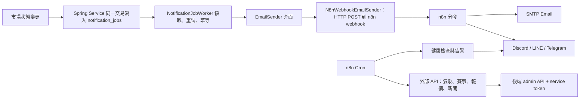

# UcMarket n8n 整合規劃

> 文件定位：n8n 與既有 Java／Spring Boot 自動化的分層整合方案。本文件不推翻《自動化系統規劃》的決策——outbox、重試、冪等仍由 Java 實作且照原計畫執行；n8n 從 `EmailSender` 介面與 admin API 兩個既有接口接入，承擔外部整合與多渠道觸達。

## 1. 決策摘要

- 核心交易、市場狀態、結算與錢包仍由 Spring Boot Service 層負責，不變。
- 通知工作的可靠性保證（不重複建立、重試、失敗與嘗試紀錄）由 Java outbox（`notification_jobs`）負責，不變；寄送為 at-least-once，極端中斷仍可能重寄。WP0–WP4 照《自動化系統規劃》第 13.4 節執行，不受本文件影響。
- 通知的實際送出（Email、Discord、LINE、Telegram 等渠道）由 n8n 負責：`EmailSender` 的正式實作為 HTTP POST 到 n8n webhook。
- 外部資料進出（賽果、報價、新聞、氣象）、系統監控告警、營運報表與社群發布由 n8n 負責。
- n8n 一律透過後端 REST API 與專屬 service token 操作，不直連 PostgreSQL。
- n8n 故障不得影響市場核准、交易或結算；通知工作停留在 `RETRY`，恢復後由 Worker 自動補送。

## 2. 職責分層

| 職責 | 歸屬 | 理由 |
|---|---|---|
| 市場狀態、交易、結算、錢 | Spring Boot Service | 需要資料庫交易，不可妥協 |
| 通知工作的「不重複建立、可重試、可觀測」 | Spring Boot outbox（`notification_jobs`） | webhook 可能失敗；冪等鍵、重試與 attempt 紀錄留在 Java |
| 通知的「實際送出去」 | n8n（Email、Discord、LINE、Telegram） | 多渠道是 n8n 強項，Java 接多套渠道 SDK 維護成本高 |
| 外部資料進出（賽果、報價、新聞、氣象） | n8n | 低程式碼串 API；改資料源不改後端、不重新部署 |
| 監控、告警、報表、社群發布 | n8n | 非交易關鍵，壞了不影響平台 |

## 3. 整體架構

接合點只有兩個，且都是既有設計預留的：

1. **`EmailSender` 介面**：《自動化系統規劃》第 5 節本來就定義成可替換的 Adapter。第一版用 `RecordingEmailSender` 驗收流程，之後新增 `N8nWebhookEmailSender` 即接上，WP0–WP4 零改動。
2. **admin／公開 REST API**：n8n 定時輪詢資料，或將外部證據與建議寫入後端；第一版不得直接呼叫結算入口。

## 4. 可靠性分析

- 工作不重複建立、重試、失敗與 attempt 紀錄由 outbox 保證；n8n 不重做冪等或後端狀態機。外部渠道成功後、Worker 標記 `SENT` 前的中斷縫仍可能導致重寄，不宣稱 exactly-once。
- n8n 掛掉時：Worker 呼叫 webhook 失敗，工作依 1、5、30 分鐘規則進入 `RETRY`，n8n 恢復後自動補送；市場操作完全不受影響。
- webhook 呼叫視同一次寄送嘗試，成功與失敗記入 `notification_job_attempts`，管理員查詢與手動重送（WP4）行為不變。
- webhook 採同步回應。主渠道 Email 實際寄送成功後，n8n 才可回 2xx；Email 失敗、timeout 或 workflow 中斷必須回非 2xx，使 Java Worker 進入 `RETRY`。
- Discord、LINE、Telegram 等次要渠道可在 Email 成功後 fire-and-forget；次要渠道失敗記錄於 n8n 執行紀錄，不得將 Email 未成功的嘗試回報為成功。

## 5. 分階段實作

### 階段一：Java outbox 垂直切片（進行中，不變）

WP0–WP4 照《自動化系統規劃》第 13.4 節執行，使用 `RecordingEmailSender` 驗收。本文件不改變其任何範圍與驗收條件。

### 階段一．五：n8n 監控告警（依賴分流）

部署 n8n，先跑兩條不碰核心的 workflow。n8n 與後端至少使用獨立容器與自動重啟，生產環境優先放在不同主機或故障域，避免監控與被監控系統同時失效。

1. **健康檢查，零功能依賴**：定時打公開的 `GET /api/health`，連續失敗發告警到管理員即時通訊，不需 service token。
2. **FAILED 告警，依賴 WP4**：必須等 WP4 的 `GET /api/admin/notifications?status=FAILED` 與唯讀 service token 合入後才能啟用；數量超過門檻即告警。此即《自動化系統規劃》7.4「外部監控告警另行整合」預留的位子，並解掉「Email 管線壞了但告警也走 Email」的死結。

驗收：後端停機 5 分鐘內收到告警；FAILED 工作出現後 10 分鐘內收到告警；n8n 停機期間平台功能不受任何影響。

### 階段二：n8n 接管實際寄送

- 新增 `N8nWebhookEmailSender` 實作（含 connect/read/write timeout、webhook URL 與 token 設定鍵）。
- n8n 端建立收信 webhook、Email 模板與渠道分發。
- webhook 固定為同步模式；Email 寄送成功才回 2xx，失敗必須回非 2xx。
- 之後 WP5 的每個新事件（核准、駁回、截止提醒、結算）自動獲得多渠道能力，後端只需新增事件與 payload。

驗收：暫停 n8n 後觸發送審，工作進入 `RETRY`；恢復 n8n 後自動補寄；Email 失敗時 webhook 不回 2xx；`notification_job_attempts` 完整記錄每次 webhook 嘗試。同一事件不重複建立工作，但必須透過 attempt 紀錄承認並觀測 at-least-once 的極端重寄。

### 階段三：外部資料整合

第一版不把天氣市場的機器直接結算模式推廣到其他類型。n8n 只負責擷取外部資料、整理證據與提出建議結果；運動、金融與時事市場全部由管理員按下最後確認，再由後端 Service 在交易內結算與派彩：

原因是現行派彩沒有反向沖正機制；狀態檢查可以擋住重複呼叫，但擋不住格式合法但結果錯誤的結算。在尚無可逆補償方案前，人工確認是必要邊界。

| 市場類型 | n8n 工作 | 後端入口 |
|---|---|---|
| 運動 | 抓賽事比分 API，整理賽後結果與來源 | 附給管理員一鍵確認，禁止機器直接執行 |
| 金融 | 抓交易所公開報價，整理門檻判定證據 | 附給管理員一鍵確認，禁止機器直接執行 |
| 時事 | 到期時抓來源 URL 與相關新聞，打包結算證據 | 附給管理員一鍵確認，禁止機器直接執行 |

驗收：n8n 只能寫入證據與建議，不得直接觸發結算；管理員確認後才由後端執行，並留下證據、確認者與 audit log。結算證據寫入 token 與告警／唯讀 token 分離，第一版沒有任何 n8n token 可直接結算。

### 階段四：加值層

- 新市場核准上架後自動發布到 Discord／Telegram 社群頻道。
- 每日／每週熱門市場摘要寄給訂閱使用者（拉公開排行榜與市場 API）。
- 營運日報（待審數、新註冊數、交易量）寫入 Google Sheets 或寄給管理員。
- AI 輔助審核：依團隊 2026-07-15 決策暫緩。未來若恢復，只能對 `NEEDS_REVIEW` 市場產生建議與理由，無 `PASS`、`BLOCKED`、核准或結算權限。

## 6. 前置需求

1. 在 FAILED 告警與階段二前，後端先新增 n8n 專用 service token 機制（目前僅有 ADMIN role）；token 依最小權限分成告警／唯讀、寄送 webhook 與結算證據寫入用途，不共用可直接結算的高權限 token。
2. 部署 n8n：與後端同網段，但至少使用獨立容器、自動重啟與獨立健康檢查；生產環境優先使用不同主機或故障域。webhook 端點不對公網開放或以 token 保護。
3. n8n workflow JSON 匯出檔納入版控，放在 `automation/n8n/workflows/`。
4. 確認生產環境是否 24／7 運行，並確認 SMTP／Email provider 選型後，再定案排程補建策略與 webhook timeout 數值。

## 7. 不該給 n8n 做的事

- 市場狀態變更、交易、結算邏輯——一律走既有 Service 層。
- 通知的冪等與重試——outbox 已負責，n8n 重做會形成兩套可靠性機制。
- 直接讀寫 PostgreSQL——繞過商業規則與 audit log，一律禁止。
- 在資料庫交易內被同步呼叫——webhook 只由 Worker 在交易外觸發。
- 直接觸發市場結算——第一版只能提交證據與建議，必須由管理員確認。

每條新 workflow 上線前，PR 必須逐項核對本節，確認沒有越過上述邊界。

## 8. 與主規劃的同步結果

| # | 原有差異 | 已同步決策 | 原因 |
|---|---|---|---|
| 1 | 主規劃原建議移除 `automation/n8n/` | 保留 `automation/n8n/workflows/`，將 workflow JSON 匯出檔納入版控 | n8n 定位為周邊整合層，workflow 需要版控 |
| 2 | 主規劃原將 `EmailSender` 導向 SMTP 或 Email Provider Adapter | 驗收使用 `RecordingEmailSender`；正式整合使用 `N8nWebhookEmailSender`，SMTP 由 n8n 端負責 | 渠道彈性集中在 n8n，後端無需因換渠道而改動 |
| 3 | AI 輔助審核列為後續加值項目 | 依 2026-07-15 決策標示暫緩；未來也只有建議權 | 避免 AI 結果被誤當成核准、阻擋或結算決定 |

上述決策已同步回《自動化系統規劃》。Java outbox 的核心邊界不變，但 WP2 的 timeout、webhook 成功語意、監控依賴與外部資料結算權限以本次同步後內容為準。
