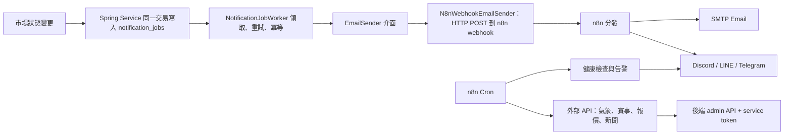

# UcMarket n8n 整合規劃

> 文件定位：n8n 與既有 Java／Spring Boot 自動化的分層整合方案。本文件不推翻《自動化系統規劃》的決策——outbox、重試、冪等仍由 Java 實作且照原計畫執行；n8n 從 `EmailSender` 介面與 admin API 兩個既有接口接入，承擔外部整合與多渠道觸達。

## 1. 決策摘要

- 核心交易、市場狀態、結算與錢包仍由 Spring Boot Service 層負責，不變。
- 通知的可靠性保證（不漏發、不重發、重試、失敗紀錄）由 Java outbox（`notification_jobs`）負責，不變；WP0–WP5 已完成。
- 通知的實際送出（Email、Discord、LINE、Telegram 等渠道）由 n8n 負責：`EmailSender` 的正式實作為 HTTP POST 到 n8n webhook。
- 外部資料進出（賽果、報價、新聞、氣象）、系統監控告警、營運報表與社群發布由 n8n 負責。
- n8n 一律透過後端 REST API 與專屬 service token 操作，不直連 PostgreSQL。
- n8n 故障不得影響市場核准、交易或結算；通知工作停留在 `RETRY`，恢復後由 Worker 自動補送。

## 2. 職責分層

| 職責 | 歸屬 | 理由 |
|---|---|---|
| 市場狀態、交易、結算、錢 | Spring Boot Service | 需要資料庫交易，不可妥協 |
| 通知的「不漏發、不重發」保證 | Spring Boot outbox（V6 `notification_jobs`） | webhook 天生會漏；冪等鍵與重試已完成 |
| 通知的「實際送出去」 | n8n（Email、Discord、LINE、Telegram） | 多渠道是 n8n 強項，Java 接多套渠道 SDK 維護成本高 |
| 外部資料進出（賽果、報價、新聞、氣象） | n8n | 低程式碼串 API；改資料源不改後端、不重新部署 |
| 監控、告警、報表、社群發布 | n8n | 非交易關鍵，壞了不影響平台 |

## 3. 整體架構

接合點只有兩個，且都是既有設計預留的：

1. **`EmailSender` 介面**：《自動化系統規劃》第 5 節本來就定義成可替換的 Adapter。WP0–WP5 先用 `RecordingEmailSender` 驗收，現已由 `N8nWebhookEmailSender` 接通正式寄送；既有 outbox、Worker 與事件不需修改。
2. **admin／公開 REST API**：n8n 定時輪詢或呼叫結算入口，比照 `POST /api/admin/weather/resolve` 的模式。

## 4. 可靠性分析

- 漏發、重發、重試、失敗紀錄全由 outbox 保證，n8n 不承擔任何一致性責任。
- n8n 掛掉時：Worker 呼叫 webhook 失敗，工作依 1、5、30 分鐘規則進入 `RETRY`，n8n 恢復後自動補送；市場操作完全不受影響。
- webhook 呼叫視同一次寄送嘗試，成功與失敗記入 `notification_job_attempts`，管理員查詢與手動重送（WP4）行為不變。
- n8n workflow 內部的渠道失敗（例如 Discord API 掛掉但 Email 成功）第一版不回報後端，僅記錄於 n8n 執行紀錄；後端只認 webhook 回應的成功與失敗。

## 5. 分階段實作

### 階段一：Java outbox 與市場事件通知（已完成）

WP0–WP5 已完成並以 `RecordingEmailSender`、定向測試與 backend 全測試驗收。Java 已涵蓋送審、核准、駁回、要求修改、每日待審摘要、截止提醒及結算通知。

### 階段一．五：n8n 監控告警（已完成）

Docker／Mailpit 環境、`01-health-alert`、`05-failed-alert`、`06-heartbeat`、n8n 查詢專用 service token 與 `automation/n8n/runbook.md` 均已完成；`05` 已在 n8n `2.29.11` 使用正式每 5 分鐘 schedule：

1. **FAILED 告警**：以 service token 輪詢 WP4 `GET /api/admin/notifications?status=FAILED`；每頁 `size=100` 並依 `hasNext` 讀完所有頁面，每輪最多合併一則 Discord。
2. **防重複**：staticData 保存 `jobId → attemptCount`；只有完整查詢且 Discord 成功後才更新快照。相同快照不重複告警，attemptCount 增加會再次告警。
3. **職責邊界**：backend 存活告警由 `01-health-alert` 負責。backend 停止、連線失敗或 HTTP 5xx 時，`05` 不發 Discord、也不提交 staticData；401／403／400 讓 execution 明確失敗且不更新 staticData。Discord 發送失敗同樣不提交，恢復後由下一輪成功發送並只提交一次。

2026-07-20 runtime 驗收：105 筆 FAILED 已完整讀取第二頁；fixture 最終清為 0；backend／n8n 最終健康，`05` active，`02`／`03` 不存在。驗收結果無 findings。

### 階段二：n8n 接管實際寄送（已完成）

- n8n `04-notify-webhook` 已完成 `POST /webhook/notify`：接收 `{recipientEmail, subject, body}`，成功回 200、缺欄回 400、寄送失敗回 500；webhook token 已完成實跑驗證。
- Java 已完成 `N8nWebhookEmailSender`，包含 timeout、webhook URL 與 webhook token 設定鍵。
- WP5 的既有事件會自動共用此寄送路徑，不需修改 event、payload 或 template。
- 不新增 `/api/internal/notifications/digest`、`/closing-markets` 或 n8n `02`／`03` 排程；每日摘要及截止提醒已由 Java WP5 負責，避免重複通知。

2026-07-19 驗收：暫停 n8n 後，測試通知進入 `RETRY` 並留下失敗 attempt；恢復後自動補寄、轉為 `SENT` 並留下成功 attempt；Mailpit 恰好收到一封正確信件。`N8nWebhookEmailSenderTest` 10 項與 backend 全測試 332 項均通過，0 failures、0 errors、15 skipped。

### 階段三：外部資料整合（時事蒐證已完成）

把天氣市場「自動建盤＋自動結算」的既有模式推廣到其他類型，n8n 當觸發者，錢的計算仍在後端交易內：

| 市場類型 | n8n 工作 | 後端入口 |
|---|---|---|
| 運動 | 抓賽事比分 API，賽後判定結果 | 新增 admin 結算端點（比照 weather/resolve） |
| 金融 | 抓交易所公開報價，判定門檻類題目 | 同上 |
| 時事 | `07-resolution-evidence-collector` 每小時讀候選、登記 candidate 既有 `sourceUrl`；不抓取來源內容、不自動結算 | 候選 GET＋證據 POST 使用兩組隔離 token |

`07` 已以 n8n 2.29.11 fixture 驗證分頁快照、200 筆上限、冪等、暫時性 retry、永久錯誤續跑與 credential 交叉 403。workflow 匯出檔保留 `active=false`；實際部署是否啟用必須另查 runtime。成功 execution 不保存、失敗 execution 保留，供維運排錯。

### 階段四：加值層

- 新市場核准上架後自動發布到 Discord／Telegram 社群頻道。
- 每日／每週熱門市場摘要寄給訂閱使用者（拉公開排行榜與市場 API）。
- 營運日報（待審數、新註冊數、交易量）寫入 Google Sheets 或寄給管理員。
- AI 輔助審核：對 `NEEDS_REVIEW` 市場呼叫 LLM API 產生建議與理由，寫回後台當參考意見；只建議、不決定，符合《自動化系統規劃》6.3 的界線。

## 6. 前置需求

1. n8n 呼叫後端 admin／internal API 前使用專用 service token；`05-failed-alert` 的唯讀 FAILED 查詢權限已完成，未來其他外部資料整合若需不同入口，仍須另行設計最小權限。
2. 本機 compose 提供 n8n＋Mailpit；GCP compose 提供 backend、web、Cloud SQL Proxy、n8n，Mailpit 只在 staging profile。`/webhook/notify` 必須用 Header Auth 保護，n8n editor 必須保留 owner login。
3. n8n workflow JSON 匯出檔納入版控，放在 `automation/n8n/workflows/`。

## 7. 不該給 n8n 做的事

- 市場狀態變更、交易、結算邏輯——一律走既有 Service 層。
- 通知的冪等與重試——outbox 已負責，n8n 重做會形成兩套可靠性機制。
- 直接讀寫 PostgreSQL——繞過商業規則與 audit log，一律禁止。
- 在資料庫交易內被同步呼叫——webhook 只由 Worker 在交易外觸發。

## 8. 與既有文件的對齊結果

| # | 文件與原文 | 本規劃調整 | 原因 |
|---|---|---|---|
| 1 | 《自動化系統規劃》第 9 節：「確認不再使用 n8n 後，可移除空目錄並更新原有技術架構文件中的 n8n 說明」；《自動化系統分工計畫》第 1 節收尾工作含「移除 `automation/n8n/`」 | 保留 `automation/n8n/workflows/` 目錄，改放 workflow JSON 匯出檔納入版控 | n8n 重新定位為周邊整合層，workflow 需要版控 |
| 2 | 《自動化系統規劃》第 5 節：`EmailSender` 搭配「SMTP 或 Email Provider Adapter」 | 正式實作方向定為 `N8nWebhookEmailSender`，SMTP 由 n8n 端負責 | 渠道彈性集中在 n8n，後端零改動即可換渠道 |

上述差異已同步回《自動化系統規劃》與《自動化系統分工計畫》。截至 2026-07-21，WP0–WP5、n8n 實際寄送橋接、規則式預審後端第一切片、三組最小權限 service token、`05-failed-alert`、`07-resolution-evidence-collector`、災難復原 runbook 與 GCP compose 均已有實作；workflow JSON 的 active 值不代表任一部署的即時 runtime 狀態。
