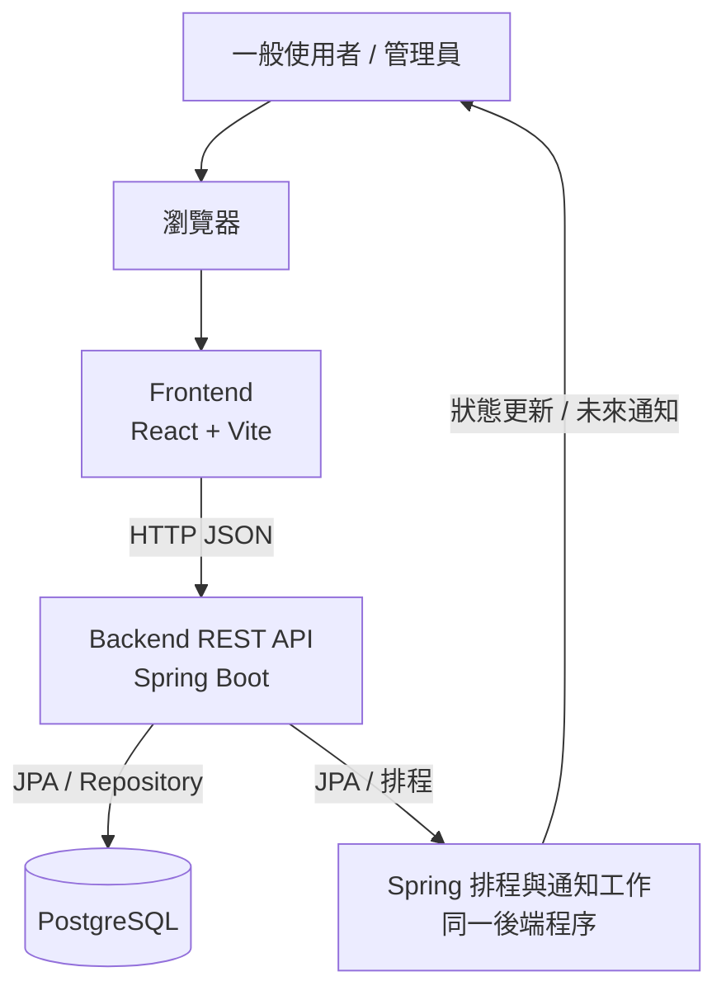
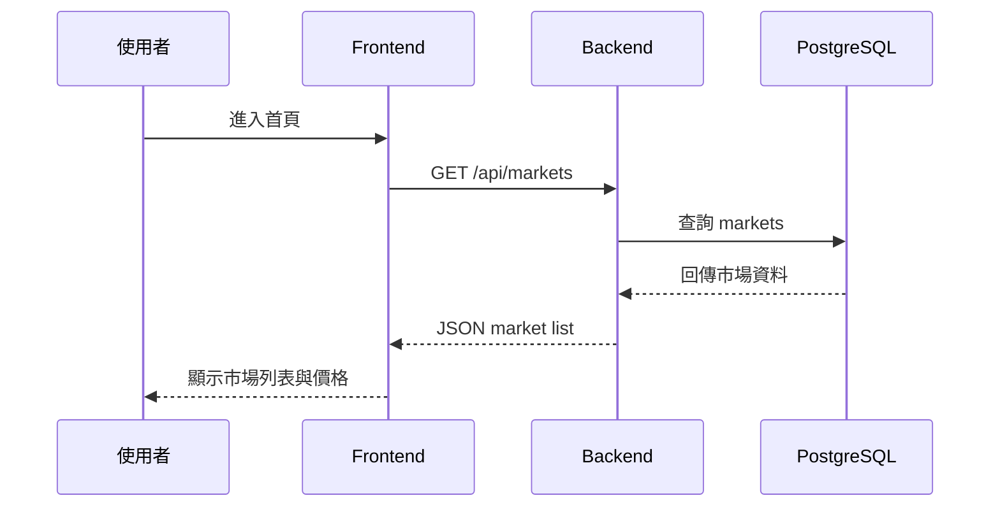
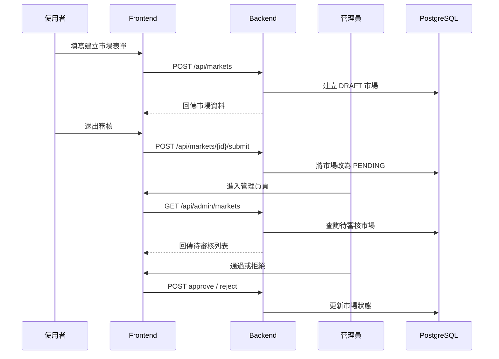
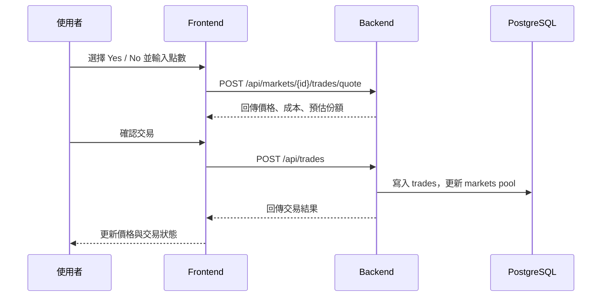
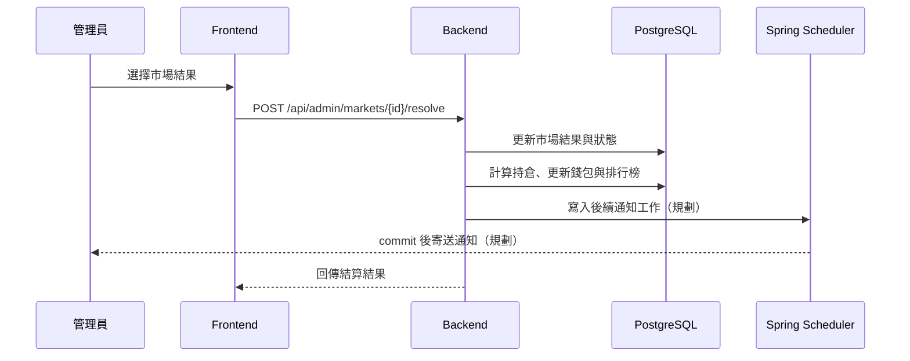

# UcMarket 網站架構

> 更新基準：目前路由與 API 以 `../current-implementation.md` 為準。通知工作與進階市場流程仍是目標架構；第一階段自動化使用 Java／Spring Boot，不導入 n8n。

## 1. 文件目的

本文件說明 UcMarket 網站層的整體架構，重點放在使用者會看到的頁面、前端資料夾分工、前後端 API 串接方式，以及從畫面操作到資料庫更新的資料流。

目前專案有三個重要現況：

- `frontend/` 是正式 React + Vite 實作位置，公開、會員、管理員頁面與主要路由皆已有實作。
- 目前根目錄沒有 `front/` 或 `公版/`；若未來重新加入靜態 prototype，應只作為畫面參考，不直接混入正式前端。
- `backend/` 已有 Spring Boot REST API 與測試，後端現況以 controller、service、repository 與 `./mvnw test` 通過結果為準。

因此本文件同時描述「目前已有基礎」與「正式網站應完成的目標架構」。

## 2. 網站整體架構

網站頁面規劃圖目前保留輸出檔：`docs/系統設計/網站規劃圖.svg` 與 `docs/系統設計/網站規劃圖.png`。

若需要放進簡報、README 或工作計劃書，可優先使用 SVG；需要相容 Word 或一般圖片預覽時使用 PNG。





網站採用前後端分離：

- 前端只負責畫面、互動、表單驗證、狀態呈現與呼叫 API。
- 後端負責商業邏輯、資料驗證、交易計算、錢包/持倉/結算一致性與資料庫存取。
- 資料庫只由後端操作，前端不能直接連資料庫。
- 目前排程與後續通知工作都留在 Spring Boot；核心資料異動仍由 Service transaction 控制。

## 3. 網站頁面架構

正式網站可以依角色拆成「公開頁面」、「會員頁面」與「管理員頁面」。

```text
UcMarket Website
├── 公開頁面
│   ├── 首頁 / 市場列表
│   ├── 市場詳情
│   ├── 政治 / 天氣市場列表
│   ├── 登入
│   └── 註冊
│
├── 會員頁面
│   ├── 建立市場
│   ├── 我的資產
│   ├── 持倉
│   ├── 交易紀錄
│   ├── 個人資料
│   └── 排行榜
│
└── 管理員頁面
    ├── 待審核市場
    ├── 市場審核
    ├── 市場結算
    ├── 使用者管理
    └── 後台操作紀錄
```

## 4. 前端路由規劃

正式前端路由可先對應到目前已建立的 `frontend/src/pages` 資料夾：

| 正式路由 | 前端頁面資料夾 | 用途 |
|---|---|---|
| `/` | `frontend/src/pages/public/landing` | Landing page |
| `/home`、`/markets` | `frontend/src/pages/public/home` | 首頁、市場列表、搜尋、分類、熱門市場 |
| `/auth/login` | `frontend/src/pages/public/login` | 登入 |
| `/auth/register` | `frontend/src/pages/public/register` | 註冊 |
| `/markets/politics` | `frontend/src/pages/public/market-politics` | 政治市場列表 |
| `/markets/weather` | `frontend/src/pages/public/weather-list` | 天氣市場列表 |
| `/markets/{weather\|politics\|sports\|current-affairs\|finance}/{id}` | 對應 `market-detail-*` | 類別市場詳情與交易面板 |
| `/markets/new` | `frontend/src/pages/member/create-market` | 建立市場與規則檢查 |
| `/portfolio` | `frontend/src/pages/member/portfolio` | 我的資產總覽 |
| `/wallet` | `frontend/src/pages/member/wallet` | 使用者錢包頁 |
| `/positions` | `frontend/src/pages/member/positions` | 使用者持倉 |
| `/trades` | `frontend/src/pages/member/trade-history` | 使用者交易紀錄 |
| `/rankings` | `frontend/src/pages/member/rankings` | 使用者排行榜、市場排行榜 |
| `/profile` | `frontend/src/pages/member/profile` | 個人資料與修改密碼 |
| `/admin/dashboard` | `frontend/src/pages/admin/dashboard` | 管理儀表板 |
| `/admin/markets`、`/admin/markets/create` | `frontend/src/pages/admin/markets` | 市場管理與建立 |
| `/admin/users` | `frontend/src/pages/admin/users` | 使用者管理 |
| `/admin/{admins\|transactions\|settings\|logs}` | 對應 `frontend/src/pages/admin/*` | 管理員、交易、設定與操作紀錄 |

正式前端開發時，頁面應放在 `frontend/src/pages`；若有另外建立靜態 prototype，應只擷取版型、互動與資訊架構，不直接當成正式前端來源。

## 5. 前端資料夾分工

```text
frontend
└── src
    ├── pages
    ├── components
    ├── api
    ├── router
    ├── store
    ├── types
    └── assets
```

| 資料夾 | 責任 |
|---|---|
| `pages` | 頁面層，對應路由，例如首頁、市場詳情、我的資產、管理員頁 |
| `components` | 共用元件，例如導覽列、市場卡片、交易面板、表單、表格、彈窗 |
| `api` | 集中管理後端 API 呼叫，例如 `marketApi`、`tradeApi`、`adminApi` |
| `router` | 管理前端路由與登入/權限導頁 |
| `store` | 管理登入狀態、使用者資料、錢包摘要、購買草稿等全域狀態 |
| `types` | 定義前後端資料型別，例如 Market、Trade、Position、User |
| `assets` | 圖片、圖示、樣式資源 |

建議正式前端的元件拆分如下：

```text
components
├── layout
│   ├── Topbar
│   ├── CategoryNav
│   └── PageShell
├── market
│   ├── MarketCard
│   ├── MarketList
│   ├── MarketDetailHeader
│   ├── PriceChart
│   └── TradePanel
├── portfolio
│   ├── WalletSummary
│   ├── PositionTable
│   └── TradeHistoryTable
├── admin
│   ├── ReviewQueue
│   ├── ReviewActionPanel
│   └── ResolveMarketForm
└── shared
    ├── Button
    ├── Modal
    ├── EmptyState
    └── LoadingState
```

## 6. 後端 API 對應

目前後端已存在且測試對齊的 API：

| 功能 | Method | Endpoint | 對應頁面 |
|---|---|---|---|
| 健康檢查 | GET | `/api/health` | 開發檢查 |
| 市場列表 | GET | `/api/markets` | 首頁 / 市場列表 |
| 市場詳情 | GET | `/api/markets/{id}` | 市場詳情 |
| 建立市場 | POST | `/api/markets` | 建立市場 |
| 市場賠率 | GET | `/api/markets/{id}/odds` | 市場詳情 / 交易面板 |
| 交易試算 | POST | `/api/markets/{id}/trades/quote` | 市場詳情 / 交易面板 |
| 建立交易 | POST | `/api/trades` | 市場詳情 / 交易面板 |
| 時事市場分頁 | GET | `/api/current-affairs/markets` | 首頁 / 時事詳情 |
| 管理市場列表 | GET | `/api/admin/markets` | 管理員頁 |
| 通過市場 | POST | `/api/admin/markets/{id}/approve` | 管理員頁 |
| 拒絕市場 | POST | `/api/admin/markets/{id}/reject` | 管理員頁 |
| 結算市場 | POST | `/api/admin/markets/{id}/resolve` | 管理員頁 |
| 註冊 | POST | `/api/auth/register` | 登入 / 註冊 |
| 登入 | POST | `/api/auth/login` | 登入 / 註冊 |
| 目前使用者 | GET | `/api/auth/me` | 前端初始化登入狀態 |
| 登出 | POST | `/api/auth/logout` | 登出 |
| 更新 token | POST | `/api/auth/refresh` | 登入狀態續期 |
| 更新個人資料 | PUT | `/api/auth/profile` | 會員資料 |
| 修改密碼 | POST | `/api/auth/change-password` | 會員資料 |
| 查詢餘額 | GET | `/api/wallets/me/balance` | 錢包頁 |
| 錢包異動紀錄 | GET | `/api/wallets/me/transactions` | 錢包頁 |
| 全部錢包異動 | GET | `/api/wallets/me/transactions/all` | 個人資料 / 錢包頁 |
| 我的持倉 | GET | `/api/positions/me` | 持倉頁 |
| 我的未結算持倉 | GET | `/api/positions/me/open` | 持倉頁 |
| 盈虧排行榜 | GET | `/api/rankings/profit` | 排行榜頁 |
| 勝率排行榜 | GET | `/api/rankings/win-rate` | 排行榜頁 |
| 資產排行榜 | GET | `/api/rankings/assets` | 排行榜頁；OPEN 持倉依 `market_price_history` 最新價格估值 |
| 排行榜 snapshot | GET | `/api/rankings?metric=profit|win-rate|assets` | 排行榜頁 |
| 手動觸發天氣結算 | POST | `/api/admin/weather/resolve` | 管理作業 |

正式網站後續還需要補上的 API：

| 功能 | 建議 Endpoint | 用途 |
|---|---|---|
| 使用者交易紀錄 | `GET /api/trades` 或專用 `/me` 路由 | 我的資產頁；目前後端只有 POST |
| 市場價格歷史 | `GET /api/markets/{id}/price-history` | 前端 client 已宣告，但後端尚無 route |
| 通知列表 | `GET /api/me/notifications` | 使用者通知 |

## 7. 核心資料流

### 7.1 瀏覽市場



### 7.2 建立市場與審核



### 7.3 交易流程



正式版交易流程還應包含：

- 檢查登入狀態。
- 檢查市場是否 ACTIVE。
- 檢查錢包餘額。
- 扣除或鎖定錢包點數。
- 更新持倉。
- 寫入錢包異動紀錄。
- 寫入市場價格歷史。
- 使用 transaction 確保資料一致。

### 7.4 市場結算



## 8. 使用者狀態與權限

前端需要依登入與角色控制可見頁面：

| 狀態 | 可使用功能 |
|---|---|
| 未登入 | 瀏覽市場、查看市場詳情、登入、註冊 |
| 一般使用者 | 建立市場、交易、查看錢包、持倉、交易紀錄 |
| 管理員 | 審核市場、拒絕市場、設定市場結果、查看後台紀錄 |

建議由後端回傳使用者角色，前端只做畫面導引；真正的權限檢查必須在後端執行。

## 9. 前端資料狀態設計

正式前端可以把狀態分成三類：

| 狀態類型 | 例子 | 建議位置 |
|---|---|---|
| Server state | 市場列表、市場詳情、交易紀錄、排行榜 | API query cache 或 page state |
| Client state | 選中的 Yes/No、交易輸入金額、目前 tab | component state |
| Auth state | 使用者資料、角色、登入狀態 | global store |

交易面板應避免自行計算最終成交結果。前端可以做預估顯示，但正式下單前仍要呼叫後端 quote API，並以後端回傳結果為準。

## 10. 資料庫關聯重點

網站主要功能會對應以下資料表：

| 網站功能 | 主要資料表 |
|---|---|
| 登入 / 會員 | `users`, `user_sessions`, `user_oauth_accounts` |
| 錢包 | `wallets`, `wallet_transactions` |
| 市場列表 / 詳情 | `markets`, `trades`（成交量）；資產榜另讀 `market_price_history` |
| 市場審核 | `markets`, `market_reviews`, `admin_logs` |
| 交易 | `trades`, `positions`, `wallets`, `wallet_transactions` |
| 我的資產 | `wallets`, `positions`, `trades`, `wallet_transactions` |
| 排行榜 | `users`, `wallets`, `wallet_transactions`, `trades`, `positions`, `markets`, `market_price_history` |
| 通知 | 尚未實作 notification job 資料表 |

目前 canonical DDL 只保留程式碼實際映射或查詢的表；`market_options`、`notifications` 與 `user_portfolio_snapshots` 未納入。

## 11. Java／Spring Boot 自動化位置

自動化直接位於後端 Service 與未來的 `automation`／`notification` package。排程可以查詢並觸發工作，但交易、錢包、持倉或結算資料仍只能由既有 Service 修改。

目前已有市場自動截止、價格 snapshot、天氣市場建立與天氣結算。下一階段才建立 notification job、寄信器、重試與管理員手動重送；完整順序見 `自動化系統規劃.md`。

```text
Backend transaction 更新核心資料並建立通知工作
        ↓ commit
Spring worker claim 工作
        ↓
Email sender 寄送，失敗則記錄重試
```

## 12. 開發優先順序

依照目前專案狀態，正式網站可以用以下順序推進：

1. 補齊後端 `GET /api/trades` 與價格歷史讀取 route，消除前端已宣告但後端不存在的契約。
2. 關閉 `AdminGuard` 開發模式的未登入例外，完成正式權限驗收。
3. 完成通知工作、寄信重試與管理員重送的第一條垂直切片。
4. 補 OpenAPI、Docker 與可重現的 PostgreSQL／Flyway 啟動流程。
5. 對首頁、各主題詳情、登入、個人資料、錢包、交易與管理後台做端到端驗收。

## 13. 實作狀態摘要

| 區塊 | 目前狀態 | 說明 |
|---|---|---|
| `frontend/src/pages/public` | 已實作並持續整合 | 首頁、市場詳情、登入、註冊、各主題詳情與排行榜已有路由 |
| `frontend/src/pages/member` | 已有受保護頁面 | 建立市場、資產、錢包、持倉與交易紀錄已有路由，資料完整度依頁面而異 |
| `frontend/src/pages/admin` | 已有管理路由與主要 API 串接 | dashboard、市場、使用者、交易與 log 已有實作；部分設定頁仍偏展示 |
| 市場 API | 已接通主要流程 | 列表、分類、詳情、建立、編輯、送審、取消、審核、截止與結算已存在 |
| 交易 API | BUY 已接通 | quote 與下單共用賠率計算；交易歷史 GET 與 SELL 尚未提供 |
| 管理員 API | 已接通主要流程 | dashboard、市場審核／結算、使用者、交易、log 與天氣結算入口已存在 |
| 會員/登入 API | 已接通 | register、login、OAuth、me、logout、refresh、profile、change-password |
| 錢包/持倉 API | 已接通主要查詢 | 餘額、分頁／全部流水、個人與市場持倉已存在 |
| 排行榜 API | 已接通 | 已有 profit、win-rate、assets 與 snapshot 端點；assets 使用 `market_price_history` 最新價格估值 |
| Spring 自動化 | 部分完成 | 已有截止、價格與天氣排程；通知工作與寄信尚未實作，n8n 不在第一階段 |

## 14. 結論

UcMarket 的網站架構應以 `frontend/` 作為正式前端實作位置，並透過 Spring Boot REST API 串接 PostgreSQL。核心交易、錢包、持倉與結算必須留在後端與資料庫交易中處理；前端負責提供清楚、快速、可操作的交易與管理介面。
