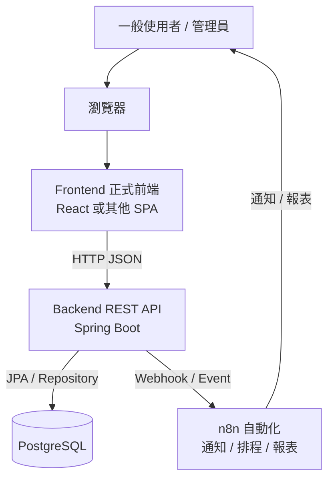
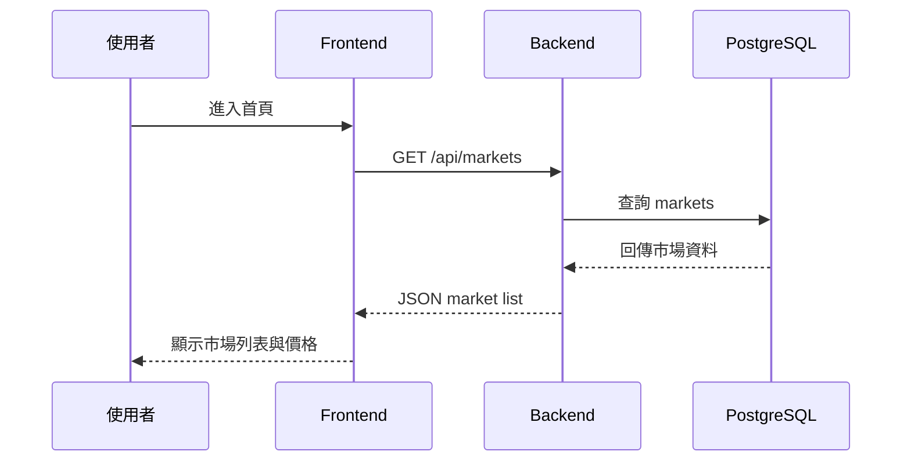
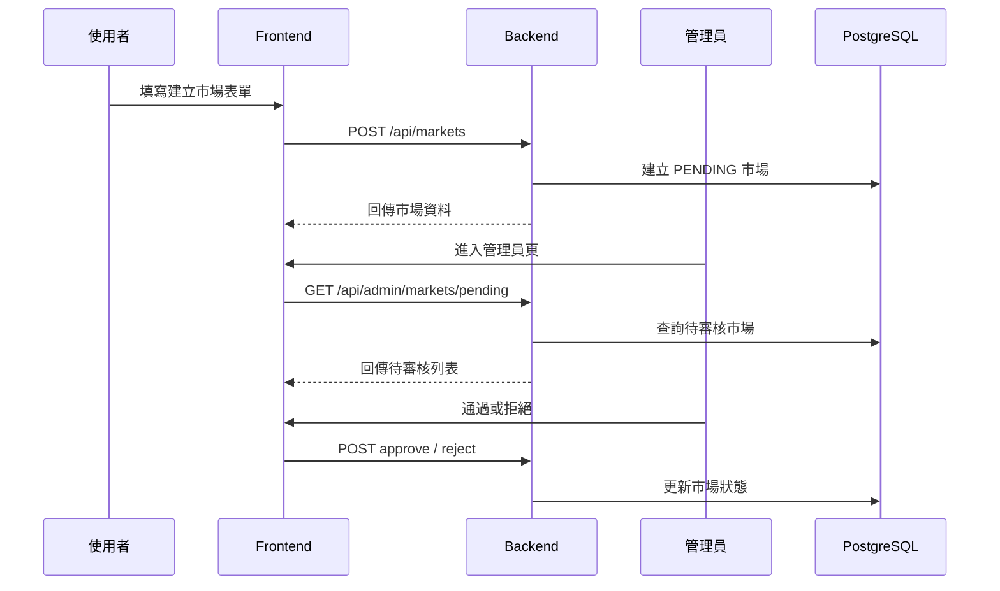
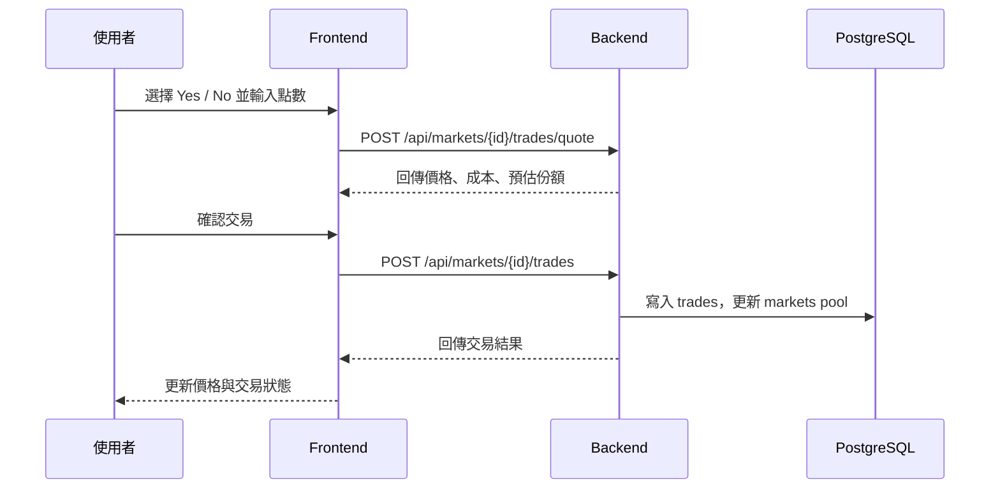
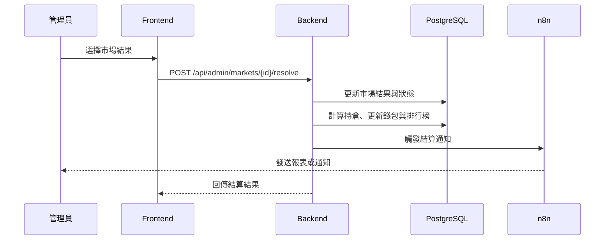

# UcMarket 網站架構

## 1. 文件目的

本文件說明 UcMarket 網站層的整體架構，重點放在使用者會看到的頁面、前端資料夾分工、前後端 API 串接方式，以及從畫面操作到資料庫更新的資料流。

目前專案有三個重要現況：

- `frontend/` 是正式前端預留資料夾，目前仍是骨架。
- `公版/demo/` 是主要獨立靜態 prototype，可作為正式前端開發時的畫面與流程參考。
- `公版/user/` 是另一組使用者端靜態頁，目前包含首頁與 wallet 子頁。
- `backend/` 已有 Spring Boot REST API 雛形，包含市場列表、建立市場、交易試算、交易建立、管理員審核與結算。

因此本文件同時描述「目前已有基礎」與「正式網站應完成的目標架構」。

## 2. 網站整體架構

網站頁面規劃圖目前保留輸出檔：`docs/系統設計/網站規劃圖.svg` 與 `docs/系統設計/網站規劃圖.png`。

若需要放進簡報、README 或工作計劃書，可優先使用 SVG；需要相容 Word 或一般圖片預覽時使用 PNG。




網站採用前後端分離：

- 前端只負責畫面、互動、表單驗證、狀態呈現與呼叫 API。
- 後端負責商業邏輯、資料驗證、交易計算、錢包/持倉/結算一致性與資料庫存取。
- 資料庫只由後端操作，前端不能直接連資料庫。
- n8n 只處理通知、排程、報表等周邊流程，不承擔核心交易邏輯。

## 3. 網站頁面架構

正式網站可以依角色拆成「公開頁面」、「會員頁面」與「管理員頁面」。

```text
UcMarket Website
├── 公開頁面
│   ├── 首頁 / 市場列表
│   ├── 市場詳情
│   ├── 登入
│   └── 註冊
│
├── 會員頁面
│   ├── 建立市場
│   ├── 我的資產
│   ├── 持倉
│   ├── 交易紀錄
│   └── 排行榜
│
└── 管理員頁面
    ├── 待審核市場
    ├── 市場審核
    ├── 市場結算
    ├── 使用者管理
    └── 後台操作紀錄
```

## 4. 前端路由規劃

`公版/demo/` 與 `公版/user/` 目前已提供靜態頁面，可對應成正式前端路由：

| 正式路由 | 參考頁面 | 用途 |
|---|---|---|
| `/` | `公版/demo/index.html`、`公版/user/index.html` | 首頁、市場列表、搜尋、分類、熱門市場 |
| `/auth` | `公版/demo/auth.html` | 登入與註冊 |
| `/markets/{id}` | `公版/demo/market-detail.html` | 市場詳情、價格走勢、交易面板 |
| `/markets/new` | `公版/demo/create-market.html` | 建立市場與規則檢查 |
| `/portfolio` | `公版/demo/portfolio.html` | 錢包、持倉、交易紀錄 |
| `/wallet` | `公版/user/wallet/view/index.html` | 使用者錢包頁 |
| `/rankings` | `公版/demo/rankings.html` | 使用者排行榜、市場排行榜 |
| `/admin/markets` | `公版/demo/admin.html` | 管理員審核與結算 |

正式前端開發時，不建議直接把 `公版/demo/` 或 `公版/user/` 當成正式前端，而是將其中的版型、互動與資訊架構搬進 `frontend/src`。

## 5. 前端資料夾分工

```text
frontend
└── src
    ├── pages
    ├── components
    ├── api
    ├── router
    ├── store
    ├── types
    └── assets
```

| 資料夾 | 責任 |
|---|---|
| `pages` | 頁面層，對應路由，例如首頁、市場詳情、我的資產、管理員頁 |
| `components` | 共用元件，例如導覽列、市場卡片、交易面板、表單、表格、彈窗 |
| `api` | 集中管理後端 API 呼叫，例如 `marketApi`、`tradeApi`、`adminApi` |
| `router` | 管理前端路由與登入/權限導頁 |
| `store` | 管理登入狀態、使用者資料、錢包摘要、購買草稿等全域狀態 |
| `types` | 定義前後端資料型別，例如 Market、Trade、Position、User |
| `assets` | 圖片、圖示、樣式資源 |

建議正式前端的元件拆分如下：

```text
components
├── layout
│   ├── Topbar
│   ├── CategoryNav
│   └── PageShell
├── market
│   ├── MarketCard
│   ├── MarketList
│   ├── MarketDetailHeader
│   ├── PriceChart
│   └── TradePanel
├── portfolio
│   ├── WalletSummary
│   ├── PositionTable
│   └── TradeHistoryTable
├── admin
│   ├── ReviewQueue
│   ├── ReviewActionPanel
│   └── ResolveMarketForm
└── shared
    ├── Button
    ├── Modal
    ├── EmptyState
    └── LoadingState
```

## 6. 後端 API 對應

目前後端已存在的 API：

| 功能 | Method | Endpoint | 對應頁面 |
|---|---|---|---|
| 健康檢查 | GET | `/api/health` | 開發檢查 |
| 市場列表 | GET | `/api/markets` | 首頁 / 市場列表 |
| 市場詳情 | GET | `/api/markets/{id}` | 市場詳情 |
| 建立市場 | POST | `/api/markets` | 建立市場 |
| 交易試算 | POST | `/api/markets/{id}/trades/quote` | 市場詳情 / 交易面板 |
| 建立交易 | POST | `/api/markets/{id}/trades` | 市場詳情 / 交易面板 |
| 待審核市場 | GET | `/api/admin/markets/pending` | 管理員頁 |
| 通過市場 | POST | `/api/admin/markets/{id}/approve` | 管理員頁 |
| 拒絕市場 | POST | `/api/admin/markets/{id}/reject` | 管理員頁 |
| 結算市場 | POST | `/api/admin/markets/{id}/resolve` | 管理員頁 |
| 盈虧排行榜 | GET | `/api/rankings/profit` | 排行榜頁 |
| 勝率排行榜 | GET | `/api/rankings/win-rate` | 排行榜頁 |
| 資產排行榜 | GET | `/api/rankings/assets` | 排行榜頁 |

正式網站後續還需要補上的 API：

| 功能 | 建議 Endpoint | 用途 |
|---|---|---|
| 註冊 | `POST /api/auth/register` | 建立使用者 |
| 登入 | `POST /api/auth/login` | 取得登入狀態或 token |
| 目前使用者 | `GET /api/auth/me` | 前端初始化登入狀態 |
| 錢包摘要 | `GET /api/me/wallet` | 我的資產頁 |
| 使用者持倉 | `GET /api/me/positions` | 我的資產頁 |
| 使用者交易紀錄 | `GET /api/me/trades` | 我的資產頁 |
| 市場價格歷史 | `GET /api/markets/{id}/price-history` | 市場詳情圖表 |
| 通知列表 | `GET /api/me/notifications` | 使用者通知 |

## 7. 核心資料流

### 7.1 瀏覽市場



### 7.2 建立市場與審核



### 7.3 交易流程



正式版交易流程還應包含：

- 檢查登入狀態。
- 檢查市場是否 ACTIVE。
- 檢查錢包餘額。
- 扣除或鎖定錢包點數。
- 更新持倉。
- 寫入錢包異動紀錄。
- 寫入市場價格歷史。
- 使用 transaction 確保資料一致。

### 7.4 市場結算



## 8. 使用者狀態與權限

前端需要依登入與角色控制可見頁面：

| 狀態 | 可使用功能 |
|---|---|
| 未登入 | 瀏覽市場、查看市場詳情、登入、註冊 |
| 一般使用者 | 建立市場、交易、查看錢包、持倉、交易紀錄 |
| 管理員 | 審核市場、拒絕市場、設定市場結果、查看後台紀錄 |

建議由後端回傳使用者角色，前端只做畫面導引；真正的權限檢查必須在後端執行。

## 9. 前端資料狀態設計

正式前端可以把狀態分成三類：

| 狀態類型 | 例子 | 建議位置 |
|---|---|---|
| Server state | 市場列表、市場詳情、交易紀錄、排行榜 | API query cache 或 page state |
| Client state | 選中的 Yes/No、交易輸入金額、目前 tab | component state |
| Auth state | 使用者資料、角色、登入狀態 | global store |

交易面板應避免自行計算最終成交結果。前端可以做預估顯示，但正式下單前仍要呼叫後端 quote API，並以後端回傳結果為準。

## 10. 資料庫關聯重點

網站主要功能會對應以下資料表：

| 網站功能 | 主要資料表 |
|---|---|
| 登入 / 會員 | `users`, `user_sessions` |
| 錢包 | `wallets`, `wallet_transactions` |
| 市場列表 / 詳情 | `markets`, `market_options`, `market_price_history` |
| 市場審核 | `markets`, `market_reviews`, `admin_logs` |
| 交易 | `trades`, `positions`, `wallets`, `wallet_transactions` |
| 我的資產 | `wallets`, `positions`, `trades`, `user_portfolio_snapshots` |
| 排行榜 | `users`, `wallets`, `wallet_transactions`, `trades`, `positions`, `markets`, `market_price_history` |
| 通知 | `notifications` |

目前 `docs/資料庫設計/ucmarket-ddl.sql` 已經規劃這些核心資料表，但 Java 後端尚未完整實作全部資料表對應。

## 11. n8n 在網站架構中的位置

n8n 不應直接改動交易、錢包、持倉或結算資料。它適合接收後端事件後做外圍任務：

- 市場建立後通知管理員審核。
- 市場即將截止時提醒使用者。
- 市場結算後發送結果通知。
- 每日產生熱門市場報表。
- 發送管理員異常通知。

建議流程：

```text
Backend 完成核心資料更新
        ↓
Backend 呼叫 n8n Webhook
        ↓
n8n 發送通知 / 報表
```

## 12. 開發優先順序

依照目前專案狀態，正式網站可以用以下順序推進：

1. 建立正式前端專案基礎：router、api client、layout、基本樣式。
2. 完成市場列表與市場詳情：串接 `GET /api/markets`、`GET /api/markets/{id}`。
3. 完成建立市場與管理員審核：串接 `POST /api/markets` 與 admin endpoints。
4. 完成交易試算與下單：串接 quote/trade endpoints。
5. 補會員登入、權限與錢包 API。
6. 補我的資產、交易紀錄、持倉與排行榜。
7. 補價格歷史、通知、n8n webhook 與報表。

## 13. 實作狀態摘要

| 區塊 | 目前狀態 | 說明 |
|---|---|---|
| `公版/demo/` 靜態頁 | 已建立 | 主要 demo prototype，可作為 UI 與流程參考 |
| `公版/user/` 靜態頁 | 部分建立 | 使用者端首頁與 wallet 子頁參考 |
| `frontend/` 正式前端 | 骨架 | 目前只有預留資料夾 |
| 市場 API | 部分完成 | 市場列表、詳情、建立已存在 |
| 交易 API | 部分完成 | 已有 quote 與 trade 雛形 |
| 管理員 API | 部分完成 | 已有 pending、approve、reject、resolve |
| 會員/登入 API | 尚未完成 | README 與規格書已規劃 |
| 錢包/持倉 API | 尚未完成 | DDL 已規劃，後端需補實作 |
| 排行榜 API | 部分完成 | 已有 profit、win-rate、assets 查詢端點 |
| n8n | 規劃中 | 應作為周邊通知與報表 |

## 14. 結論

UcMarket 的網站架構應以 `公版/demo/` 與 `公版/user/` 作為產品與畫面參考，以 `frontend/` 作為正式前端實作位置，並透過 Spring Boot REST API 串接 PostgreSQL。核心交易、錢包、持倉與結算必須留在後端與資料庫交易中處理；前端負責提供清楚、快速、可操作的交易與管理介面。
