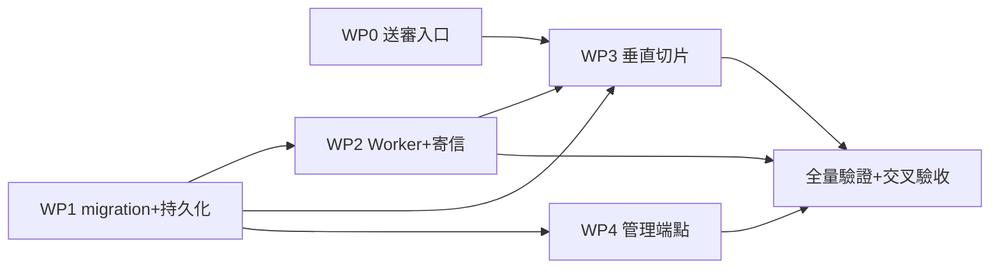

# UcMarket 自動化系統分工計畫

本文件保留 WP0–WP4 當時的多人執行分工紀錄。WP0–WP5 均已完成；現行下一步與驗收條件以《自動化系統規劃》13.5、13.7 及《n8n 整合規劃》為準，以下第 2～8 節不再作為新的開工順序。

## 1. 範圍

- 原分工範圍為「市場送審通知」垂直切片 WP0–WP4；這些工作與後續 WP5 事件擴充皆已完成。
- `automation/n8n/` 不移除，改作 Docker、安裝腳本、workflow JSON 與 runbook 的版控真相源。
- 下一工作包是 `N8nWebhookEmailSender` 實際寄送橋接；規則式預審仍為後續獨立里程碑。

## 2. 依賴關係

- WP0 與 WP1 無共同檔案，可同時開工。
- WP2、WP3、WP4 都依賴 WP1 的 entity 與 repository 介面，必須等契約 PR（見第 4 節）合入。
- WP3 另外依賴 WP2 的 `EmailTemplateService` 存在（但不修改它）。

## 3. 分工

### 3.1 三人版

| 成員 | 負責 | 檔案所有權 | 理由 |
|---|---|---|---|
| 甲：市場流程線 | WP0 → WP3 | `MarketService`、`MarketController`、`UserRepository`、payload DTO、對應測試 | 兩者都動 `MarketService`，同一人做不用交接送審邏輯 |
| 乙：通知核心線 | 契約 PR → WP1 → WP2 | `V6__*.sql`、`notification/` 全部、`automation/NotificationJobWorker`、`application.properties` 設定鍵 | 最重的一條線：schema → entity → worker → 重試，outbox 正確性不斷在交接處 |
| 丙：周邊線 | WP4 ＋ 收尾 ＋ 最終驗收 | `AdminNotificationController` 新檔＋測試、`docs/`、n8n 狀態對齊 | 只依賴契約 PR，可最早開始寫 controller 測試骨架與文件 |

### 3.2 兩人版

| 成員 | 負責 |
|---|---|
| 甲 | WP0 → WP3 → WP4（API／Service 層） |
| 乙 | 契約 PR → WP1 → WP2（outbox 核心） |

收尾誰先閒誰做；最終驗收由沒寫該部分 core 的人執行。

## 4. 契約 PR（第一天先合）

多人平行的同步基礎。由乙開一個只含契約的小 PR，全員 review 後最先合入，其他人基於它開工：

- `V6__add_notification_jobs.sql`（schema 定案：`notification_jobs`、`notification_job_attempts`；`markets.submission_version` 實際由後續 V8 建立，欄位與索引依規劃文件 13.3）
- `NotificationJob`、`NotificationJobAttempt` entity
- `NotificationJobStatus`（PENDING／PROCESSING／RETRY／SENT／FAILED）、`NotificationEventType`（先只有 `MARKET_SUBMITTED`）enum
- `NotificationJobRepository` 完整介面：claim 候選查詢、逾時回收、依狀態分頁查詢、resend 所需方法一次定義完——之後甲丙只消費、不修改此檔
- `EmailSender` 介面（供丙寫測試時 mock）
- 冪等鍵格式常數：`market:{marketId}:submission:{submissionVersion}:{eventType}:user:{recipientUserId}`（禁止時間戳）
- 設定鍵名：`notification.worker.enabled`、`notification.worker.batch-size`、`notification.worker.max-attempts`、`notification.worker.lease-timeout-minutes`

契約合入後三條線完全平行。

## 5. Git 與合併順序

- 從 `eagle` 開整合分支 `feature/notification-slice`；每個 WP 一個 PR 進整合分支，不直接進 `main`。
- 合併順序：契約 PR → WP0（可與契約平行 review）→ WP2／WP4（平行）→ WP3 → 收尾。
- 每個 PR 必附：13.4 對應驗收條件的逐條自查結果＋定向測試指令（`./mvnw test -Dtest=...`）。

## 6. 驗收（依規劃文件 13.7：實作者不自驗）

- 交叉 review：甲的 PR 由乙 review、乙的由甲、丙的由甲或乙。Review 只對照 13.4 驗收條件，不糾結 style。
- 整合分支全部合完後，由沒寫 core 的人（三人版為丙）跑最終驗收：
  1. 全量 `cd backend && ./mvnw test`。
  2. 當時的 migration 雙驗證為空資料庫跑 V1→V6、既有 V5 升級到 V6；現行版本已到 V9，後續工作依規劃文件 13.7 驗證全新資料庫與上一版本升級。
  3. 對照規劃文件 13.4 每個工作包的驗收段落逐條檢查。
  4. `git diff --check` 無格式錯誤。

## 7. 與規劃文件 13.4 的差異

組員拿工作包時，驗收 checklist 直接翻《自動化系統規劃》13.4；只有下列兩處以本文件為準：

| # | 13.4 原文 | 本計畫調整 | 原因 |
|---|---|---|---|
| 1 | WP3 包含「新增 `MARKET_SUBMITTED` 模板與 payload DTO」 | 模板搬給 WP2 負責人（乙），WP3（甲）只留 payload DTO 與 enqueue 呼叫 | 避免甲乙同時修改 `EmailTemplateService` |
| 2 | WP0 包含 `submission_version` 遞增 | 遞增邏輯延到欄位 migration 合入後才補進 `submitMarket` | 該欄位實際由 V8 建立，WP0 先行時欄位還不存在 |

## 8. 風險與瓶頸

- 乙的線最重（約佔整體一半）。進度吃緊時，WP2 可拆兩個 PR：先合基本 claim →寄送→ SENT／RETRY 流程解鎖甲的 WP3，逾時回收與 attempt 紀錄第二個 PR 補上。
- 技術限制先講明：測試環境是 H2（Flyway 關閉、Hibernate DDL），H2 不支援 `FOR UPDATE SKIP LOCKED`，worker 領取一律用等效原子更新（逐筆 `UPDATE ... WHERE id=? AND status IN ('PENDING','RETRY')`，rowcount=1 才算領到）；payload JSONB 沿用既有 `@JdbcTypeCode(SqlTypes.JSON)` ＋ String 寫法（見 `Market.metadata`）。
- WP4 授權不需新註解：`SecurityConfig` 既有 `/api/admin/** hasRole("ADMIN")` 已涵蓋 `/api/admin/notifications`。
