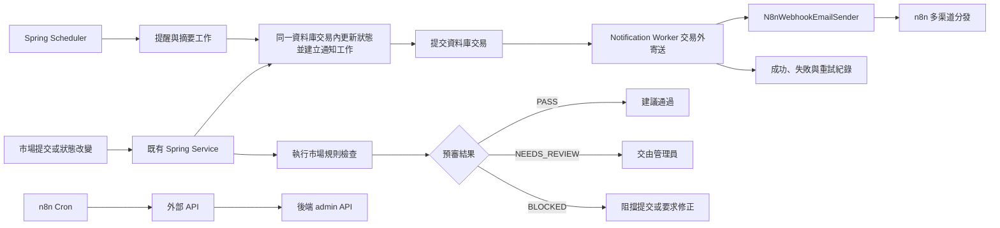

# UcMarket 自動化系統規劃

## 1. 決策摘要

UcMarket 採用 Java／Spring Boot＋n8n 的分層自動化架構。Java 負責核心商業邏輯、資料庫交易與通知可靠性；n8n 負責實際多渠道通知、外部資料整合、監控告警與報表。核心 Java outbox 先行實作，n8n 透過預留的 Adapter 與 REST API 分階段接入。

本次決策如下：

- 核心自動化與通知可靠性以 Java 及 Spring Boot 實作。
- 多渠道通知、外部資料、監控告警、報表與社群發布由 n8n 負責。
- 核心交易、市場狀態與資料一致性仍由既有 Service 層負責。
- 排程只負責找出待處理資料，不直接承擔核心商業邏輯。
- 寄信失敗不得影響市場核准、交易或結算。
- 市場預審採規則式實作，不讓系統直接全面自動核准。
- 暫不引入 Python Worker、自建 Node.js 服務、Kafka、RabbitMQ 或額外核心微服務。
- n8n 不得直連 PostgreSQL，一律透過後端 REST API 與專屬 service token 操作。

## 2. 現況

目前專案已具備以下基礎：

- Spring Boot 已啟用排程功能。
- 後端已有自動關閉過期市場的排程。
- 已有市場提交、核准、駁回、關閉及結算等生命週期。
- 已有 `market_reviews` 與管理操作紀錄。
- 市場資料包含建立者、來源網址、結算規則、截止時間及狀態。
- `automation/n8n/workflows` 目前沒有實際 workflow，只有保留目錄用的 `.gitkeep`；後續用於版控 n8n workflow JSON 匯出檔。
- 後端尚未建立正式的 Email 寄送服務與可靠通知工作機制。

## 3. 目標與非目標

### 3.1 目標

自動化系統預計涵蓋：

1. 市場規則式預審。
2. 市場送審、核准、駁回及結算通知。
3. 市場截止提醒。
4. 管理員每日待審市場摘要。
5. 寄信失敗重試、防重複及執行紀錄。
6. 自動化失敗告警及管理員查詢能力。

### 3.2 第一階段非目標

- 不使用 AI 直接判定市場真偽或全面自動核准。
- 不建立額外的 Python 或 Node.js 服務。
- 不導入複雜的訊息佇列或微服務架構。
- 不讓排程直接繞過既有 Service 修改市場狀態。
- 不在資料庫交易完成前直接呼叫外部 Email 服務。
- 不讓 n8n 負責市場狀態、交易、結算、通知冪等或重試。
- 不讓 n8n 直接讀寫 PostgreSQL。

## 4. 整體架構



架構拆成三個責任明確的模組：

- `review`：市場預審規則與檢查結果。
- `notification`：通知工作、模板、寄信及重試。
- `automation`：定時觸發與待處理工作掃描。

## 5. Java 核心技術選擇

第一版的核心流程與可靠性機制使用 Java 完成：

| 能力 | 建議技術 |
|---|---|
| 定時工作 | Spring `@Scheduled` |
| 商業規則 | Spring Service、一般 Java 類別 |
| 資料存取 | Spring Data JPA |
| Email | `EmailSender` 介面；驗收階段使用 `RecordingEmailSender`，正式整合使用 `N8nWebhookEmailSender` |
| 狀態事件 | Service 在同一資料庫交易內建立通知工作（transactional outbox） |
| 防重複 | 資料庫唯一鍵及 `idempotency_key` |
| 重試 | 通知工作狀態、次數與下次執行時間 |
| 測試 | JUnit、Mockito、Spring Boot Test |

將核心流程與可靠性保留在 Java 後端的優點：

- 可以直接使用既有 Entity、Repository 與 Service。
- n8n 只作為可替換的整合層，不形成第二套核心商業邏輯或可靠性機制。
- 減少跨服務 API 與資料一致性問題。
- 測試、部署、紀錄與權限管理較集中。

只有未來需要自行運行機器學習模型、大量文本分析或特殊資料處理時，才評估把該項工作獨立成 Python Worker。AI 輔助審核依 2026-07-15 團隊決策暫緩；未來若啟用，AI 仍只能提供 `NEEDS_REVIEW` 建議與理由，不得決定 `PASS`、`BLOCKED`、核准或結算。

## 6. 市場自動審查

### 6.1 第一版定位

第一版定位為不擋住送審的「標註型自動預審助手」，不是「完全自動審核者」。系統執行可解釋、可測試的確定性規則，將結果顯示給管理員，但不自動改變市場狀態。後續才可評估引入 `CHECKING` 狀態的管線版流程。

### 6.2 適合自動判斷的規則

- 標題、描述、來源網址及結算規則是否完整。
- 截止時間是否晚於現在並符合最低期限。
- 來源網址格式是否正確。
- 市場類型、類別及選項是否相容。
- 欄位長度及數值是否在允許範圍內。
- 結算規則是否包含明確判定條件。
- 是否包含禁止內容或明顯垃圾內容。
- 是否與既有市場高度重複。

### 6.3 不應直接自動決定的項目

- 新聞或來源內容是否真實。
- 政治、法律及高度爭議性內容。
- 語句完整但實際語意模糊的結算條件。
- 來源可信度不足但沒有明確違規的市場。
- 疑似操縱或其他需要人工背景判斷的市場。

### 6.4 預審結果

| 結果 | 意義 | 後續動作 |
|---|---|---|
| `PASS` | 所有必要規則通過 | 標註為建議通過，仍由管理員決定 |
| `NEEDS_REVIEW` | 存在模糊或高風險條件 | 標註風險與理由，交由管理員審查 |
| `BLOCKED` | 明確違反硬性規則 | 第一版只標註建議阻擋；管線版才可阻擋提交或要求修正 |

每一項檢查應保存：

- 市場 ID
- 規則代碼
- 規則版本
- 檢查結果
- 原因或說明
- 執行時間

建議新增獨立的 `market_review_checks` 保存自動檢查結果，不直接把系統檢查塞進既有 `market_reviews`。既有資料表繼續保存真正的人工核准、駁回與意見。

## 7. 通知與寄信

### 7.1 第一階段通知

| 事件 | 收件人 |
|---|---|
| 市場送審 | 市場建立者、管理員 |
| 市場核准 | 市場建立者 |
| 市場駁回或要求修改 | 市場建立者 |
| 每日待審市場摘要 | 管理員 |
| 自動化連續失敗 | 管理員 |

### 7.2 第二階段通知

| 事件 | 收件人 |
|---|---|
| 市場即將截止 | 有該市場持倉的使用者 |
| 市場已結算 | 有持倉使用者、市場建立者 |
| 每日或每週熱門市場 | 主動訂閱的使用者 |

### 7.3 通知工作資料

建議新增 `notification_jobs`，至少包含：

- `id`
- `event_type`
- `recipient`
- `market_id`
- `payload`
- `status`
- `attempt_count`
- `next_attempt_at`
- `idempotency_key`
- `last_error`
- `created_at`
- `sent_at`

建議狀態：

- `PENDING`
- `PROCESSING`
- `SENT`
- `RETRY`
- `FAILED`

### 7.4 寄送原則

- 市場狀態更新與通知工作必須在同一個資料庫交易內完成，避免狀態已成功但通知工作遺失。
- 資料庫交易內不得呼叫外部 Email；真正寄送只由 Worker 在交易外執行。
- Worker 獨立讀取工作並呼叫 `EmailSender`。
- 同一個事件與收件人只能建立一份通知工作。
- 寄送語意為 at-least-once；若外部渠道已成功、但 Worker 在標記 `SENT` 前中斷，可能重寄。每次嘗試必須留下 attempt 紀錄，並以 lease 參數限制重寄視窗。
- 寄送失敗後依序延遲重試，例如 1、5、30 分鐘。
- 超過最大次數後標記為 `FAILED`，第一版以管理員查詢頁與結構化 error log 呈現。
- `FAILED` 不得再建立同一 Email 管線的告警工作；外部監控告警另行整合。
- 管理員應能查看失敗原因及手動重送。
- Email 模板與市場商業邏輯分離。
- 對一般使用者提供通知偏好與退訂能力。

## 8. 排程規劃

| 頻率 | 工作 |
|---|---|
| 每分鐘 | 處理待寄送通知工作 |
| 每 5 分鐘 | 找出即將截止且尚未提醒的市場 |
| 每 10 分鐘 | 重試暫時失敗的通知 |
| 每日預定時間後的每次 tick | 檢查當日管理員待審摘要工作，尚未建立就補建 |
| 每日固定時間 | 封存或清理過期執行紀錄 |

排程方法應只負責查詢與呼叫 Service，不應直接撰寫核心市場狀態邏輯。

排程不得依賴預設單執行緒；必須明訂 `spring.task.scheduling.pool.size`（建議至少 4），且所有外部呼叫都必須設定 connect、read 與 write timeout，避免通知或外部 API 卡住市場關閉與結算排程。

Worker 領取工作固定採條件原子更新，不依賴 JVM 鎖或 `SKIP LOCKED`：`WHERE` 至少包含 `status IN ('PENDING','RETRY') AND next_attempt_at <= now`，更新為 `PROCESSING`、`locked_at`、`locked_by`，且只有受影響列數為 1 時才取得處理權。領取、寄送、完成回寫分成三段邊界，以 `TransactionTemplate` 或跨 bean proxy 明確切分；不得依賴同一 bean 內的 `this` 呼叫觸發 `@Transactional(REQUIRES_NEW)`。逾時 `PROCESSING` 以 `locked_at`／`locked_by` 回收。

## 9. 建議程式結構

```text
backend/src/main/java/com/ucmarket/
├── automation/
│   ├── MarketAutomationScheduler.java
│   └── NotificationJobWorker.java
├── notification/
│   ├── NotificationService.java
│   ├── EmailSender.java
│   ├── EmailTemplateService.java
│   └── NotificationJobRepository.java
└── review/
    ├── MarketReviewPolicyService.java
    ├── MarketReviewCheckService.java
    └── rules/
```

Java 核心自動化程式放在後端上述目錄；n8n workflow JSON 匯出檔放在頂層 `automation/n8n/workflows/` 納入版控。兩者只透過 `EmailSender` Adapter 與後端 REST API 銜接。

## 10. 分階段實作

### 第一階段：可靠通知基礎

實作內容：

- 建立 `notification_jobs`。
- 建立 `EmailSender` 介面。
- 建立測試用假寄信器。
- 建立通知 Worker、重試與防重複機制。
- 建立管理員失敗工作查詢與手動重送。

驗收標準：

- Email 服務故障不影響市場操作。
- 已登記的工作在 Email 服務恢復後能補寄；尚未建立的排程工作不屬於此保證。
- 同一事件與收件人不會重複建立工作；極端中斷造成的重寄可由 attempt 紀錄觀測。
- 失敗原因可以被查詢。
- 寄送呼叫卡住時，`autoCloseExpiredMarkets` 仍能準時執行。

### 第二階段：市場事件通知

實作內容：

- 市場送審、核准、駁回及要求修改通知。
- 市場截止提醒。
- 市場結算通知。
- 使用者通知偏好。

驗收標準：

- 每個市場狀態轉換只產生一次正確通知。
- 收件人、模板及市場資料正確。
- 退訂或關閉通知後不再寄送非必要信件。

### 第三階段：規則式預審

實作內容：

- 建立 `market_review_checks`。
- 建立硬性規則及風險標記規則。
- 後台顯示檢查項目、結果與原因。
- 保留管理員最終核准權限。

驗收標準：

- 每個結果都有規則代碼、版本與理由。
- 相同輸入會得到相同結果。
- 管理員可以覆核並留下人工審查紀錄。

### 第四階段：有限度自動核准

只有在規則經過足夠人工結果驗證後才考慮開放，且應同時符合：

- 所有硬性規則通過。
- 不屬於高風險類別。
- 來源符合明確允許條件。
- 系統執行身分與紀錄可被完整追蹤。
- 有可以立即停用自動核准的功能開關。
- 自動核准後仍能由管理員撤銷或關閉市場。

## 11. 測試策略

至少需要以下測試：

- 每一條市場預審規則的通過與失敗案例。
- `PASS`、`NEEDS_REVIEW`、`BLOCKED` 彙總判斷。
- 市場狀態轉換是否建立正確通知工作。
- 相同事件是否被冪等鍵擋下。
- Email 暫時失敗後是否依規則重試。
- 超過重試次數後是否標記為 `FAILED`。
- 排程重複執行時不會重複建立工作，且可追蹤極端中斷造成的重寄。
- 多執行緒或多 instance 領取工作時不會重複處理。
- 寄信失敗不會回滾市場核准或交易。
- 寄送連線無回應時，市場關閉與結算排程不被餓死。

## 12. 建議 MVP

第一個可交付版本應縮成一條「市場送審通知」垂直切片：

1. `notification_jobs` 與防重複機制。
2. Java 排程及通知 Worker。
3. 測試用 `EmailSender`，先不接正式 n8n webhook。
4. 市場送審後建立「建立者確認」及「管理員待審」工作。
5. 失敗重試、冪等與失敗工作查詢。

這條切片通過後，再依序加入核准／駁回／要求修改、管理員摘要、截止提醒、結算通知，最後才做規則式預審。預審累積足夠人工結果後，再根據誤判率決定是否開放確定性規則的有限度自動核准；AI 輔助審核仍暫緩且永遠只有建議權。

## 13. 依審查基準程式碼整理的執行計畫

本節程式碼現況以 2026-07-15 審查使用的 `origin/eagle` @ `87f1c42` 為基準；實作前仍須對當前 branch 重新核對。

### 13.1 已確認的現況

- `UcMarketApplication` 已有 `@EnableScheduling`。
- `MarketService.autoCloseExpiredMarkets()` 每分鐘關閉過期的 `ACTIVE` 市場。
- `PriceHistoryService`、`WeatherMarketService` 與 `WeatherMarketResolutionService` 已各自有排程。
- 核准、駁回、要求修改與結算已集中在 `MarketService`；送審目前仍由 `MarketController` 直接改狀態及存檔。
- PostgreSQL、Spring Data JPA 與 Flyway 已啟用；目前 migration 到 `V5`。
- 已有 `market_reviews` 保存人工審查，尚無通知 Entity、Repository、Email dependency 或正式寄送服務。
- 現有 `CreateMarketRequest` 對 `closeAt` 只做非空檢查，未驗證是否晚於現在；其他基本輸入驗證也不能取代規則式預審。

### 13.2 先固定的實作決策

1. 採用 transactional outbox：市場狀態與 `notification_jobs` 同交易寫入，Email 在交易外寄送。
2. 送審邏輯移入 `MarketService.submitMarket(marketId, userId)`；Controller 只處理 HTTP、登入身分解析與呼叫 Service，所有權及狀態規則由 Service 驗證。
3. 第一版直接實作可支援多 instance 的條件原子更新領取語意，不依賴 JVM 記憶體鎖或 `SKIP LOCKED`。
4. 第一個切片使用可記錄寄件內容的假寄信器；`N8nWebhookEmailSender` 在流程驗收後再接，SMTP 由 n8n 端負責。
5. 通知 payload 保存產生通知當下所需的不可變快照；模板不得在寄送時重新推導市場舊狀態。
6. 第一版不新增 Kafka、RabbitMQ、Redis、Python Worker 或額外核心服務；n8n 僅作為周邊整合層，不承擔核心邏輯與通知可靠性。

### 13.3 資料庫設計

新增 `V6__add_notification_jobs.sql`。同一 migration 為 `markets` 加入 `submission_version INTEGER NOT NULL DEFAULT 0`，每次由 `DRAFT` 進入 `PENDING` 時遞增，以區分退回修改後的再次送審。

`notification_jobs` 欄位至少包含：

| 欄位 | 用途 |
|---|---|
| `id` | UUID 主鍵 |
| `event_type` | `MARKET_SUBMITTED` 等穩定事件代碼 |
| `recipient_user_id` | 可為空；有帳號時保留對應使用者 |
| `recipient_email` | 實際寄送位址快照 |
| `market_id` | 可為空的市場關聯 |
| `payload` | `jsonb` 模板資料快照 |
| `status` | `PENDING`、`PROCESSING`、`RETRY`、`SENT`、`FAILED` |
| `attempt_count` | 已嘗試次數，預設 0 |
| `next_attempt_at` | 下次可領取時間 |
| `idempotency_key` | 全表唯一，防止重複建立 |
| `locked_at`、`locked_by` | Worker lease 與逾時回收 |
| `last_error` | 截斷後的最後錯誤，不保存憑證或完整敏感回應 |
| `created_at`、`updated_at`、`sent_at` | 稽核時間 |

必要索引：

- `UNIQUE (idempotency_key)`。
- `(status, next_attempt_at, created_at)`，供 Worker 找待處理工作。
- `(market_id, event_type)`，供管理員查詢市場通知紀錄。

另新增 `notification_job_attempts` 保存每次實際寄送結果，至少包含 `job_id`、`attempt_no`、`status`、`error_message`、`started_at` 與 `finished_at`；`UNIQUE (job_id, attempt_no)` 防止同次嘗試被重複記錄。

第一個切片的冪等鍵格式固定為：

```text
market:{marketId}:submission:{submissionVersion}:{eventType}:user:{recipientUserId}
```

不得用時間戳繞過重複檢查；同一送審版本重試只會得到相同冪等鍵，新一輪送審則由遞增後的 `submission_version` 形成新鍵。

`NotificationService.enqueue()` 必須以 PostgreSQL `INSERT ... ON CONFLICT DO NOTHING` 或等效 upsert 實作，比照 `WalletRepository.insertIfAbsent`。禁止使用 JPA `save()` 後 catch 唯一鍵例外；交易內 flush 衝突會將主交易標記為 rollback-only。

### 13.4 工作包與驗收

在工作包開始前，先以契約 PR 同時定案以下項目：

1. `spring.task.scheduling.pool.size` 與寄送側 connect/read/write timeout 設定鍵。
2. enqueue 必須使用 upsert，禁止 `save()`＋catch 唯一鍵例外。
3. `Market.submissionVersion` Entity 欄位與對應 migration。WP0 與 WP1 都會使用此欄位，由契約 PR 先吸收重疊。
4. claim 方法的條件與更新欄位：`WHERE` 包含 `status IN ('PENDING','RETRY') AND next_attempt_at <= now`，並寫入 `PROCESSING`、`locked_at`、`locked_by`。

合併順序固定為：契約 PR → WP0 與 WP1 可平行 → WP2 與 WP4 可平行 → WP3。

#### WP0：交易邊界與送審入口

修改範圍：

- `MarketService` 新增 `submitMarket(marketId, userId)`，使用 `MarketRepository.findByIdForUpdate` 取得行鎖，再執行所有權、狀態檢查、`submission_version` 遞增及持久化。
- `MarketController.submitMarket()` 改為呼叫 Service。
- 搬移前先補 submit Controller 基準測試，再補 `MarketServiceTest`；非 `DRAFT` 送審對外回應固定為 400，Controller 需將 Service 例外重映射為現行 HTTP contract。

驗收：送審成功、非建立者、非 `DRAFT` 回 400 三類測試通過；並發雙送審不會讓 `submission_version` 遞增兩次；尚不建立通知。

#### WP1：通知工作持久化

新增範圍：

- `V6__add_notification_jobs.sql`。
- `Market.submissionVersion`、`notification/NotificationJob`、`NotificationJobAttempt`、狀態 enum 與對應 Repository，其中 Entity 欄位與 migration 需在同一契約中定案。
- `NotificationService.enqueue()` 使用 `INSERT ... ON CONFLICT DO NOTHING` 或等效 upsert 處理重複建立，禁止 `save()`＋catch 唯一鍵例外。

驗收：migration 可在空資料庫建立，也可從現有 `V1`～`V5` 升級；相同冪等鍵只留下 1 筆工作。

#### WP2：Worker、假寄信器與重試

新增範圍：

- `notification/EmailSender` 與測試用 `RecordingEmailSender`。
- `notification/EmailTemplateService`。
- `automation/NotificationJobWorker` 與工作 claim query。
- 設定：batch size、最大嘗試次數、lease timeout、worker enable flag、`spring.task.scheduling.pool.size`、寄送側 connect/read/write timeout。
- claim 方法固定使用條件原子更新：僅領取已到 `next_attempt_at` 的 `PENDING`／`RETRY`，並同時寫入 `PROCESSING`、`locked_at`、`locked_by`。
- 領取、交易外寄送、完成回寫以 `TransactionTemplate` 或跨 bean proxy 分成三段，避免同 bean self-invocation 使 `REQUIRES_NEW` 失效。

驗收：成功轉為 `SENT`；每次寄送都有 attempt 紀錄；暫時失敗依 1、5、30 分鐘進入 `RETRY`；超過次數轉為 `FAILED`；兩個 Worker 不會同寄一筆；逾時 `PROCESSING` 可被回收；`FAILED` 不會遞迴建立 Email 告警工作；寄送卡死時 `autoCloseExpiredMarkets` 仍能準時執行。

#### WP3：第一條市場送審垂直切片

修改範圍：

- `MarketService.submitMarket()` 在同一交易建立建立者與有效管理員的通知工作。
- `UserRepository` 增加查詢有效管理員的複合條件方法：`role=ADMIN AND status=ACTIVE`；不得使用單獨 `findByRole(ADMIN)`，且需排除系統帳號與不可寄送的 `.local` 信箱。
- 新增 `MARKET_SUBMITTED` 模板與 payload DTO。

驗收：狀態更新與通知工作一起 commit／rollback；enqueue 撞到相同冪等鍵時送審仍正常成功、不回 500，且只留下 1 筆工作；收件管理員全部同時符合 `ADMIN`、`ACTIVE` 且非系統帳號。

#### WP4：管理員查詢與手動重送

新增唯讀列表及單筆重送端點，只允許 `ADMIN`；重送只能把 `FAILED` 工作轉回 `RETRY`，並清除 lease，不得直接寄信。

驗收：一般使用者得到 403；管理員可依狀態查詢；重送後由 Worker 處理且保留原始嘗試紀錄。

#### WP5：事件擴充

每次只增加一種事件，順序如下：

1. `MARKET_APPROVED`。
2. `MARKET_REJECTED`／`MARKET_CHANGES_REQUESTED`。
3. 每日待審摘要：冪等鍵固定為 `admin-review-digest:{date}:user:{adminId}`。排程改為條件觸發；每次 tick 在當日預定時間後檢查當日鍵，不存在就補建，使應用在原觸發時點停機後仍可補登記。
4. 截止提醒：收件人由 `PositionRepository` 取持倉使用者並去重，冪等鍵固定為 `market:{marketId}:close-at:{closeAt}:event:MARKET_CLOSING_SOON:user:{recipientUserId}`。
5. `MARKET_RESOLVED`：涵蓋管理員結算與天氣自動結算入口；收件人必須為 `ACTIVE` 使用者，市場建立者若為系統帳號、`DISABLED` 或 `.local` 信箱則排除。

每增加一種事件，都必須先寫「建立正確工作」與「重複執行不重複建立工作」測試，再接模板。

### 13.5 規則式預審的獨立里程碑

通知垂直切片穩定後才新增 `V7__add_market_review_checks.sql`。第一版是旁路標註版：只涵蓋使用者送審路徑，天氣市場由系統直接以 `ACTIVE` 建立，不經預審。第一批只做可完全確定的規則：必填欄位、截止時間、HTTP(S) 來源、欄位長度與 market type／選項相容性。重複市場、來源可信度、政治／法律風險先標 `NEEDS_REVIEW`。`BLOCKED` 在標註版也只是建議，不直接修改市場狀態。

預審與通知事件契約固定如下：

| 預審結果 | 第一版狀態動作 | 通知事件 |
|---|---|---|
| `PASS` | 保存標註，不自動改狀態 | 無獨立事件 |
| `NEEDS_REVIEW` | 保存風險與理由，不自動改狀態 | 無獨立事件，由既有待審流程呈現 |
| `BLOCKED` | 保存建議阻擋理由，不自動改狀態 | 無獨立事件 |

未來升級為管線版時，狀態機預留 `CHECKING`，用於表示預審處理中；該升級需另行審查狀態轉換與通知契約，不在第一版範圍。

預審的驗收資料集至少包含：

- 每條規則一個通過、一個失敗邊界案例。
- 同一輸入重跑結果完全一致。
- 每筆結果可追溯 `rule_code`、`rule_version`、理由及執行時間。
- 預審例外不得自動修改市場狀態或阻擋既有送審流程；不得留下半套檢查紀錄。

### 13.6 每個工作包的共同完成條件

1. 先跑該工作包的定向測試。
2. 再於 `backend/` 執行 `./mvnw test`。
3. migration 同時驗證「全新資料庫」與「既有 V5 資料庫升級」。
4. 寫入檔案後 read-back，並以 `git diff --check` 確認無格式錯誤。
5. 實作者不做最終驗收；完成後交由 fresh Codex session 或 Claude Code，只帶驗收條件、branch／diff 與測試指令進行交叉審查。

## 14. 實作前待人工確認

1. 部署環境是否 24／7 運行，以確定 n8n 排程類 workflow 的運行前提。
2. 生產環境 JVM 與 PostgreSQL 時區；目前時間型別使用 `LocalDateTime` 與無時區 `TIMESTAMP`。
3. `pgtest` profile 的團隊慣例與實際設定檔來源。
4. SMTP／Email provider 選型，以決定階段二 timeout 數值與可能的重寄風險。
5. 前端是否依賴送審失敗回 400；在確認前，WP0 不得默默改為 409。
6. 生產環境 `weather.resolution.enabled` 的預期值，以評估天氣市場結算通知與系統帳號過濾的實際量級。
