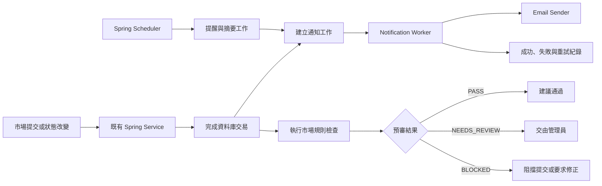

# UcMarket 自動化系統規劃

## 1. 決策摘要

UcMarket 原先規劃使用 n8n 處理通知、排程、報表與外部服務整合。經重新評估後，第一階段不導入 n8n，改由現有 Java／Spring Boot 後端直接實作自動化。

本次決策如下：

- 自動化以 Java 及 Spring Boot 為主要技術。
- 核心交易、市場狀態與資料一致性仍由既有 Service 層負責。
- 排程只負責找出待處理資料，不直接承擔核心商業邏輯。
- 寄信失敗不得影響市場核准、交易或結算。
- 第一版先做規則式市場預審，不讓系統直接全面自動核准。
- 暫不引入 Python、Node.js、Kafka、RabbitMQ 或額外微服務。

## 2. 現況

目前專案已具備以下基礎：

- Spring Boot 已啟用排程功能。
- 後端已有自動關閉過期市場的排程。
- 已有市場提交、核准、駁回、關閉及結算等生命週期。
- 已有 `market_reviews` 與管理操作紀錄。
- 市場資料包含建立者、來源網址、結算規則、截止時間及狀態。
- `automation/n8n/workflows` 目前沒有實際 workflow，只有保留目錄用的 `.gitkeep`。
- 後端尚未建立正式的 Email 寄送服務與可靠通知工作機制。

## 3. 目標與非目標

### 3.1 目標

自動化系統預計涵蓋：

1. 市場規則式預審。
2. 市場送審、核准、駁回及結算通知。
3. 市場截止提醒。
4. 管理員每日待審市場摘要。
5. 寄信失敗重試、防重複及執行紀錄。
6. 自動化失敗告警及管理員查詢能力。

### 3.2 第一階段非目標

- 不使用 AI 直接判定市場真偽或全面自動核准。
- 不建立額外的 Python 或 Node.js 服務。
- 不導入複雜的訊息佇列或微服務架構。
- 不讓排程直接繞過既有 Service 修改市場狀態。
- 不在資料庫交易完成前直接呼叫外部 Email 服務。

## 4. 整體架構



架構拆成三個責任明確的模組：

- `review`：市場預審規則與檢查結果。
- `notification`：通知工作、模板、寄信及重試。
- `automation`：定時觸發與待處理工作掃描。

## 5. Java 技術選擇

第一版全部使用 Java 即可完成：

| 能力 | 建議技術 |
|---|---|
| 定時工作 | Spring `@Scheduled` |
| 商業規則 | Spring Service、一般 Java 類別 |
| 資料存取 | Spring Data JPA |
| Email | `EmailSender` 介面搭配 SMTP 或 Email Provider Adapter |
| 狀態事件 | Spring Application Event 或 Service 交易完成後建立工作 |
| 防重複 | 資料庫唯一鍵及 `idempotency_key` |
| 重試 | 通知工作狀態、次數與下次執行時間 |
| 測試 | JUnit、Mockito、Spring Boot Test |

使用單一 Java 後端的優點：

- 可以直接使用既有 Entity、Repository 與 Service。
- 不需要維護第二套執行環境。
- 減少跨服務 API 與資料一致性問題。
- 測試、部署、紀錄與權限管理較集中。

只有未來需要自行運行機器學習模型、大量文本分析或特殊資料處理時，才評估把該項工作獨立成 Python Worker。在此之前，若需要 AI，可先由 Java 呼叫外部 API。

## 6. 市場自動審查

### 6.1 第一版定位

第一版定位為「自動預審助手」，不是「完全自動審核者」。系統先執行可解釋、可測試的確定性規則，再把結果交給管理員。

### 6.2 適合自動判斷的規則

- 標題、描述、來源網址及結算規則是否完整。
- 截止時間是否晚於現在並符合最低期限。
- 來源網址格式是否正確。
- 市場類型、類別及選項是否相容。
- 欄位長度及數值是否在允許範圍內。
- 結算規則是否包含明確判定條件。
- 是否包含禁止內容或明顯垃圾內容。
- 是否與既有市場高度重複。

### 6.3 不應直接自動決定的項目

- 新聞或來源內容是否真實。
- 政治、法律及高度爭議性內容。
- 語句完整但實際語意模糊的結算條件。
- 來源可信度不足但沒有明確違規的市場。
- 疑似操縱或其他需要人工背景判斷的市場。

### 6.4 預審結果

| 結果 | 意義 | 後續動作 |
|---|---|---|
| `PASS` | 所有必要規則通過 | 建議管理員核准 |
| `NEEDS_REVIEW` | 存在模糊或高風險條件 | 交由管理員審查 |
| `BLOCKED` | 明確違反硬性規則 | 阻擋提交或要求修正 |

每一項檢查應保存：

- 市場 ID
- 規則代碼
- 規則版本
- 檢查結果
- 原因或說明
- 執行時間

建議新增獨立的 `market_review_checks` 保存自動檢查結果，不直接把系統檢查塞進既有 `market_reviews`。既有資料表繼續保存真正的人工核准、駁回與意見。

## 7. 通知與寄信

### 7.1 第一階段通知

| 事件 | 收件人 |
|---|---|
| 市場送審 | 市場建立者、管理員 |
| 市場核准 | 市場建立者 |
| 市場駁回或要求修改 | 市場建立者 |
| 每日待審市場摘要 | 管理員 |
| 自動化連續失敗 | 管理員 |

### 7.2 第二階段通知

| 事件 | 收件人 |
|---|---|
| 市場即將截止 | 有該市場持倉的使用者 |
| 市場已結算 | 有持倉使用者、市場建立者 |
| 每日或每週熱門市場 | 主動訂閱的使用者 |

### 7.3 通知工作資料

建議新增 `notification_jobs`，至少包含：

- `id`
- `event_type`
- `recipient`
- `market_id`
- `payload`
- `status`
- `attempt_count`
- `next_attempt_at`
- `idempotency_key`
- `last_error`
- `created_at`
- `sent_at`

建議狀態：

- `PENDING`
- `PROCESSING`
- `SENT`
- `RETRY`
- `FAILED`

### 7.4 寄送原則

- 市場交易完成後只建立通知工作，不同步寄信。
- Worker 獨立讀取工作並呼叫 `EmailSender`。
- 同一個事件與收件人只能建立一份通知。
- 寄送失敗後依序延遲重試，例如 1、5、30 分鐘。
- 超過最大次數後標記為 `FAILED` 並通知管理員。
- 管理員應能查看失敗原因及手動重送。
- Email 模板與市場商業邏輯分離。
- 對一般使用者提供通知偏好與退訂能力。

## 8. 排程規劃

| 頻率 | 工作 |
|---|---|
| 每分鐘 | 處理待寄送通知工作 |
| 每 5 分鐘 | 找出即將截止且尚未提醒的市場 |
| 每 10 分鐘 | 重試暫時失敗的通知 |
| 每日固定時間 | 寄送管理員待審市場摘要 |
| 每日固定時間 | 封存或清理過期執行紀錄 |

排程方法應只負責查詢與呼叫 Service，不應直接撰寫核心市場狀態邏輯。

如果正式環境只有一個後端 instance，可以先使用資料庫狀態原子更新領取工作。未來擴展成多個 instance 時，再加入資料庫搶鎖或分散式排程鎖，避免重複執行。

## 9. 建議程式結構

```text
backend/src/main/java/com/ucmarket/
├── automation/
│   ├── MarketAutomationScheduler.java
│   └── NotificationJobWorker.java
├── notification/
│   ├── NotificationService.java
│   ├── EmailSender.java
│   ├── EmailTemplateService.java
│   └── NotificationJobRepository.java
└── review/
    ├── MarketReviewPolicyService.java
    ├── MarketReviewCheckService.java
    └── rules/
```

實際自動化程式放在後端，不再放在頂層 `automation/n8n`。確認不再使用 n8n 後，可移除空目錄並更新原有技術架構文件中的 n8n 說明。

## 10. 分階段實作

### 第一階段：可靠通知基礎

實作內容：

- 建立 `notification_jobs`。
- 建立 `EmailSender` 介面。
- 建立測試用假寄信器。
- 建立通知 Worker、重試與防重複機制。
- 建立管理員每日待審摘要。

驗收標準：

- Email 服務故障不影響市場操作。
- Email 服務恢復後能補寄。
- 同一事件不會重複寄送。
- 失敗原因可以被查詢。

### 第二階段：市場事件通知

實作內容：

- 市場送審、核准、駁回及要求修改通知。
- 市場截止提醒。
- 市場結算通知。
- 使用者通知偏好。

驗收標準：

- 每個市場狀態轉換只產生一次正確通知。
- 收件人、模板及市場資料正確。
- 退訂或關閉通知後不再寄送非必要信件。

### 第三階段：規則式預審

實作內容：

- 建立 `market_review_checks`。
- 建立硬性規則及風險標記規則。
- 後台顯示檢查項目、結果與原因。
- 保留管理員最終核准權限。

驗收標準：

- 每個結果都有規則代碼、版本與理由。
- 相同輸入會得到相同結果。
- 管理員可以覆核並留下人工審查紀錄。

### 第四階段：有限度自動核准

只有在規則經過足夠人工結果驗證後才考慮開放，且應同時符合：

- 所有硬性規則通過。
- 不屬於高風險類別。
- 來源符合明確允許條件。
- 系統執行身分與紀錄可被完整追蹤。
- 有可以立即停用自動核准的功能開關。
- 自動核准後仍能由管理員撤銷或關閉市場。

## 11. 測試策略

至少需要以下測試：

- 每一條市場預審規則的通過與失敗案例。
- `PASS`、`NEEDS_REVIEW`、`BLOCKED` 彙總判斷。
- 市場狀態轉換是否建立正確通知工作。
- 相同事件是否被冪等鍵擋下。
- Email 暫時失敗後是否依規則重試。
- 超過重試次數後是否標記為 `FAILED`。
- 排程重複執行時不會重複寄送。
- 多執行緒或多 instance 領取工作時不會重複處理。
- 寄信失敗不會回滾市場核准或交易。

## 12. 建議 MVP

第一個可交付版本只包含：

1. `notification_jobs` 與防重複機制。
2. Java 排程及通知 Worker。
3. 市場送審、核准、駁回 Email。
4. 管理員每日待審摘要。
5. 規則式市場預審，但不自動核准。
6. 失敗重試與管理員可查詢紀錄。

完成 MVP 並累積人工審查結果後，再根據實際誤判率決定是否加入 AI 或有限度自動核准。這樣可以先取代 n8n 最有價值的功能，同時控制技術複雜度與市場審查風險。
