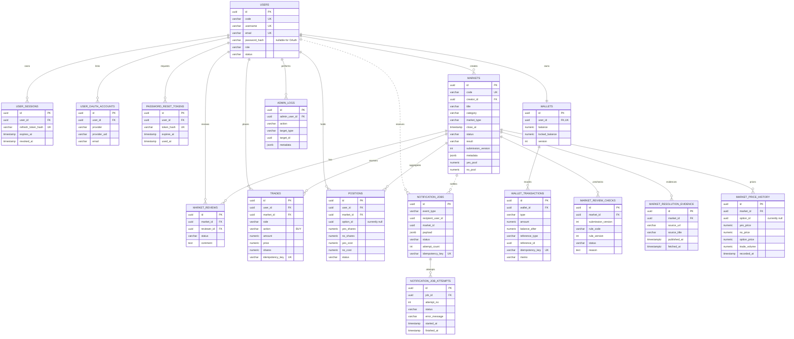

# UcMarket 目前 ER 圖

本文件依 `backend/src/main/resources/db/migration/` 的 Flyway `V1`～`V13` 整理。正式 schema 以 migration 鏈為準；`ucmarket-ddl.sql` 尚未納入 V6～V13，只能當舊版閱讀快照。

## 範圍決策

- 目前正式 schema 共 16 張表，只支援二元 Yes／No 市場與 BUY 交易。
- 一位使用者在同一 binary 市場只有一筆 `positions`，由 partial unique index 保證。
- 排行榜由 `RankingRepository` 即時計算，不建立 ranking table 或 view。
- 通知可靠性由 `notification_jobs` 與 `notification_job_attempts` 保存；n8n 不直連資料庫。
- `notification_jobs.recipient_user_id`／`market_id` 是邏輯關聯欄位，目前 migration 沒有建立資料庫 FK；ERD 以虛線表示。
- `market_review_checks` 保存每次送審的確定性規則結果；`market_reviews` 只保存人工審核。
- `market_resolution_evidence` 以 `(market_id, source_url)` 冪等保存時事市場結算證據。
- `market_options`、`notifications`、`user_portfolio_snapshots` 仍屬未來規劃，不在正式 schema。

## Mermaid ERD

## Schema 維護

- 新資料庫：由應用程式啟動時的 Flyway 依序套用 V1～V13；不要直接執行歷史修補腳本。
- 舊資料庫首次納管：先備份，再依 Flyway 操作手冊確認 baseline 或升級路徑。
- 修改 entity、native SQL 或 API 時，同步新增 migration、更新本文件與相關測試。
- Hibernate 正式設定為 `ddl-auto=none`，不會自動修正 schema。
