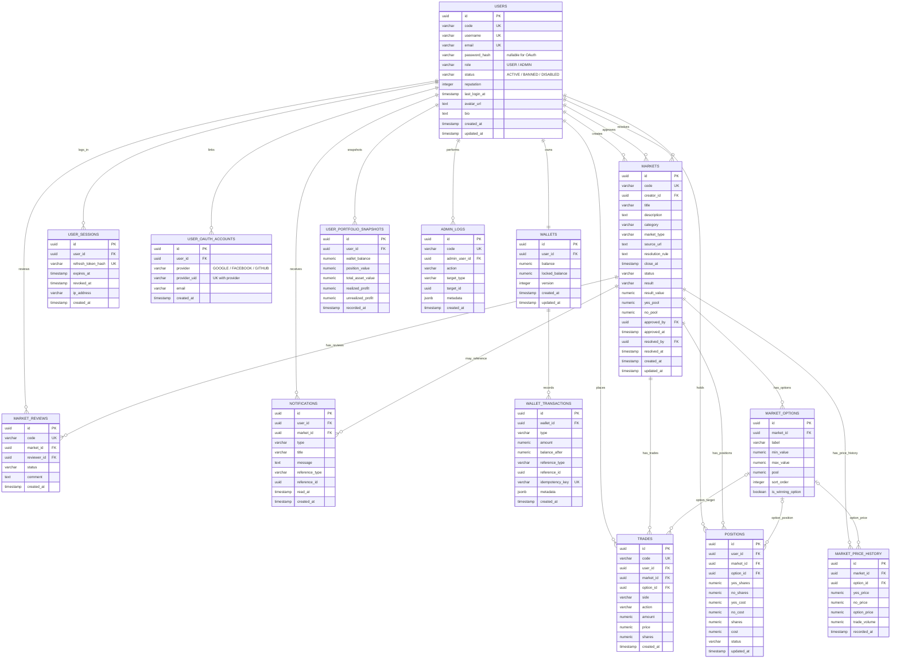

# UcMarket 整合 ER 圖

整理來源：`docs/project-spec.md`、`docs/資料庫設計/ucmarket-ddl.sql`、`docs/資料庫設計/erd/ucmarket-er-diagram.mmd`、`docs/系統設計/技術架構.md`、`backend/src/main/java/com/ucmarket/entity/*`。

## 整併決策

- 不重複建立排行榜資料表；Ranking 由 `users`、`wallets`、`wallet_transactions`、`trades`、`positions`、`markets`、`market_price_history` 計算，DDL 另外提供 view。
- 不建立 `resolution_payouts`；MVP 以 `wallet_transactions.type = RESOLUTION_PAYOUT` 記錄結算派彩。若未來需要逐人派彩明細審計，再新增獨立表。
- `wallet_transactions` 整併錢包需求表與既有 DDL：刪除重複的 `user_id`、`market_id`；使用者由 `wallet_id -> wallets.user_id` 取得，市場或交易來源由 `reference_type` / `reference_id` 追蹤。
- `RESOLVE_PAYOUT` 統一命名為 `RESOLUTION_PAYOUT`。
- `roles` 不獨立成表，先沿用 `users.role` enum-like 欄位，避免和現有使用者設計重複。
- OAuth 帳號與原生帳密共用 `users`：`users.password_hash` 允許 `NULL`，第三方身分放在 `user_oauth_accounts`。
- `user_oauth_accounts` 以 `(provider, provider_uid)` 保證第三方帳號唯一，provider 限制為 `GOOGLE`、`FACEBOOK`、`GITHUB`；刪除使用者時連動刪除綁定，並為 `user_id`、`email` 建立索引。
- `user_portfolio_snapshots`、`notifications`、`admin_logs` 是非交易核心但有文件提到的延伸表，已納入並和主表關聯。

## Mermaid ERD

## 核心模組對應

| 模組 | 主要資料表 |
| --- | --- |
| 會員 / Auth | `users`, `user_sessions`, `user_oauth_accounts` |
| 市場 | `markets`, `market_options`, `market_reviews`, `market_price_history` |
| 交易 | `trades`, `positions`, `wallets`, `wallet_transactions` |
| Resolution 結算 | `markets`, `positions`, `wallets`, `wallet_transactions`, `users` |
| Ranking 排行榜 | `users`, `wallets`, `wallet_transactions`, `trades`, `positions`, `markets`, `market_price_history` |
| 個人績效 | `users`, `wallets`, `positions`, `trades`, `market_price_history`, `user_portfolio_snapshots` |
| 自動化 / 通知 / 後台稽核 | `notifications`, `admin_logs` |
