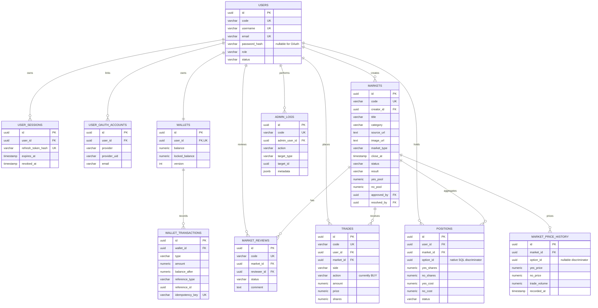

# UcMarket 目前 ER 圖

本文件與 `ucmarket-ddl.sql`、後端 JPA entity 及 `RankingRepository` native SQL 對齊。更新基準請見 `../current-implementation.md`。

## 範圍決策

- 目前只支援二元 Yes/No 市場；`trades` 與 `positions` 不含多選項欄位。
- 一位使用者在同一 binary 市場只有一筆 `positions`，由 `(user_id, market_id) WHERE option_id IS NULL` partial unique index 保證。
- `wallet_transactions` 透過 `wallet_id` 找到使用者，以 `reference_type/reference_id` 記錄交易或市場來源。
- 排行榜由 repository 查詢即時計算，不建立 ranking table 或 ranking view。
- `market_price_history` 是資產榜估值使用的 read model，暫無 JPA entity；`positions.option_id` 與 `market_price_history.option_id` 都由 native SQL 用來判定 binary row，尚無多選項寫入流程。
- `market_options`、`notifications`、`user_portfolio_snapshots` 屬未來規劃，未納入目前 schema。

## Mermaid ERD

## Schema 維護

- 新資料庫：執行 `ucmarket-ddl.sql`，需要展示資料時再執行 `seed/mock.sql`。
- 舊資料庫：先備份，再檢視並執行 `migrations/sync-current-db-to-ddl.sql`；該腳本會移除目前程式碼未使用的規劃表與欄位。
- 正式環境不會由 Hibernate 自動建表；修改 entity 或 native SQL 時必須同步 DDL、migration、本文件與測試。
