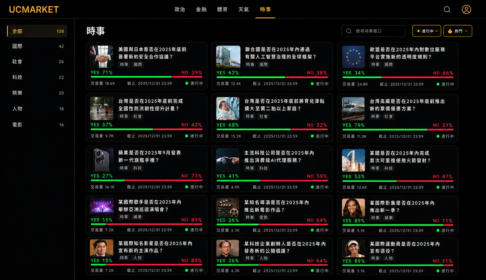
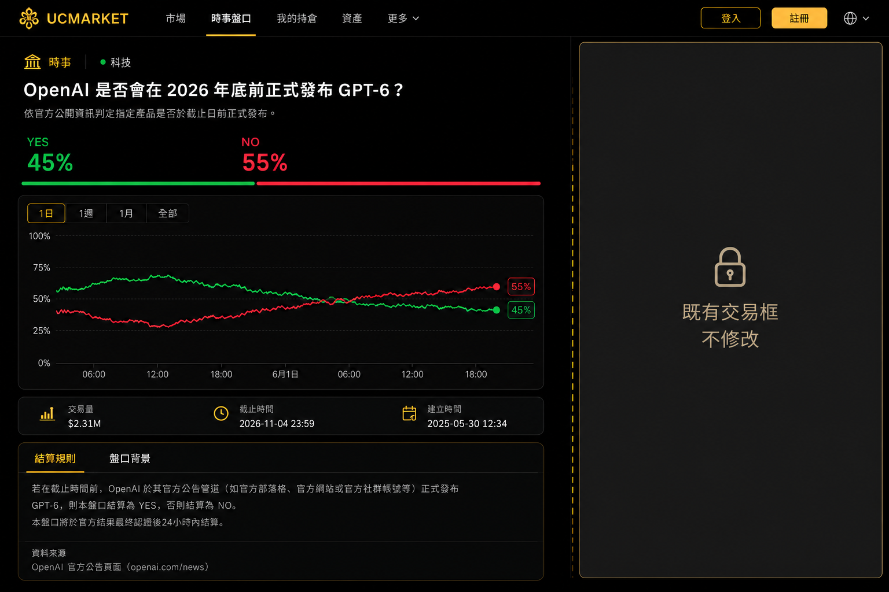

# UcMarket 時事盤口設計規格

本文件只規範 UcMarket 五大主題之一的「時事」前端。五大主題為政治、金融、體育、天氣與時事；本文件不設計其餘四個主題，也不包含建立盤口。

後續實作應以本文件為準，沿用正式前端的黑金設計系統。參考畫面只用來對齊資訊架構，不直接複製 Polymarket 的白色視覺。

## 1. 範圍

### 本次設計

- 時事主題頁：只顯示 `category = 時事` 的盤口。
- 時事子分類篩選：全部、國際、社會、科技、名人、電影、娛樂、八卦。
- 子分類只存在於前端篩選設定，不新增資料表、DTO 或 `subCategory` 欄位。
- 時事盤口卡片與列表狀態。
- 單一時事盤口詳情的左側資訊。
- 桌面、平板與手機版配置。
- Loading、empty、error、closed 與 resolved 狀態。

### 不在本次設計

- 政治、金融、體育、天氣主題頁。
- 全站所有盤口的總覽頁。
- 建立、編輯或送審盤口。
- 右側既有交易框。
- 交易、錢包、持倉與結算邏輯。
- 新聞文章、新聞爬蟲、評論、收藏與分享功能。

## 2. 頁面定位

時事頁不是新聞網站，而是「時事預測盤口的探索頁」。使用者應能：

1. 確認自己正在瀏覽時事主題。
2. 用左側子分類篩選快速縮小範圍。
3. 掃描盤口問題、YES／NO 機率、交易量與截止時間。
4. 點擊卡片進入單一盤口，查看背景與結算規則。

建議路由：

- 時事列表：`/markets/current-affairs`
- 單一盤口：沿用 `/markets/:id`

## 3. 黑金視覺語言

### 色彩

| 用途 | 色碼 | 規則 |
|---|---|---|
| 頁面背景 | `#040404` | 全頁背景 |
| 主要卡片 | `#090909` | 盤口卡片、圖表、規則區 |
| 次級表面 | `#111111` | 搜尋、篩選、未選取項目 |
| 品牌金 | `#d9aa43` | 主題焦點、active、主要操作 |
| YES 綠 | `#00d66f` | YES 機率與比例 |
| NO 紅 | `#ff476d` | NO 機率與比例 |
| 主文字 | `#ffffff` | 標題與主要數據 |
| 次文字 | `#8f8f8f` | 日期、說明、輔助資訊 |
| 邊框 | `rgba(255,255,255,.06)` | 卡片與區塊分隔 |

金色只負責品牌與焦點。YES／NO 必須固定使用綠／紅，且不能只靠顏色傳達方向。

### 排版與表面

- 字體沿用 `Inter, system-ui, sans-serif`。
- 頁面標題：40–48px、800。
- 盤口標題：18–22px、700。
- 核心機率：28–48px、800–900。
- 卡片圓角：22px；大型內容區：28px。
- Hover 最多上浮 4px，配合低透明金色邊框或 glow。
- 不使用大面積金底、白色卡片或強烈漸層。

## 4. 時事主題頁



> 示意圖只定義資訊層級與黑金視覺；左側名稱以本文件 4.2 的最新順序為準。內容、數量與機率在實作時必須來自 API。

### 4.1 桌面結構

1. 共用導覽列，五大主題入口位於主導航。
2. 頁面內容採左側子分類、右側盤口列表。
3. 左側子分類寬度約 220–240px。
4. 右側上方顯示標題、搜尋、篩選與排序。
5. 右側下方使用三欄等高盤口卡片。

此頁不使用大型 Hero、平台統計卡或裝飾性跑馬燈。

### 4.2 左側子分類篩選

固定順序：

1. 全部
2. 國際
3. 社會
4. 科技
5. 名人
6. 電影
7. 娛樂
8. 八卦

規則：

- active 項目使用淡金底、金色文字與細金邊。
- 未選取項目維持深色背景與次文字色。
- 分類右側數量由目前已取得的盤口資料即時計算；無法取得完整資料時不要顯示數量。
- 桌面側欄可 sticky，但不得遮住導覽列。
- 子分類只控制前端關鍵字篩選，不寫入盤口資料。
- 篩選狀態應同步至 URL query，例如 `?filter=international`。
- 一個盤口可以同時符合多個子分類；完全沒有命中關鍵字時仍會出現在「全部」。

### 4.3 右側頁首與控制列

- 主標題：`時事`。
- 副標：`追蹤國際、社會、科技、名人、電影、娛樂與八卦事件的市場共識。`
- 搜尋欄搜尋盤口標題。
- 狀態篩選：進行中、已截止、已結算。
- 排序：熱門、最新、即將截止。
- 所有控制維持緊湊，不佔用超過一列桌面高度。

### 4.4 時事盤口卡片

每張卡片固定包含：

1. 小型事件圖示或一致的時事 fallback icon。
2. 盤口標題，最多三行。
3. `時事` 主題標籤，以及由前端篩選規則推導的子分類標籤（選填）。
4. YES／NO 機率。
5. YES／NO 比例條。
6. 交易量與截止時間。
7. 盤口狀態。

互動：

- 整張卡片可點擊並前往 `/markets/:id`。
- 卡片只展示機率，不直接執行交易。
- 列表不放金額輸入或買入按鈕；交易集中在詳情頁既有交易框。
- 不使用隨機數製造即時價格變動。
- 不顯示後端沒有提供的假交易量、假交易人數或假圖片。

### 4.5 卡片範例題型

- 國際：某國是否會在指定日期前完成公開協議？
- 社會：指定公共政策是否會在期限前正式上路？
- 科技：指定科技產品、AI 服務或軟體是否會在期限前正式發布？
- 名人：公開人物是否會在期限前宣布某項可驗證決定？
- 電影：指定電影是否會在期限前上映或達到公開票房門檻？
- 娛樂：指定歌手是否會在期限前公開新專輯或舉辦演唱會？
- 八卦：指定公開人物是否會在期限前確認戀情、婚姻或分手消息？

所有題目仍需符合單一事件、明確時限與可客觀驗證原則。

### 4.6 網格

- 內容區 `>= 1200px`：三欄。
- `768–1199px`：兩欄，子分類改為上方橫向列。
- `< 768px`：單欄，子分類可水平捲動。
- 桌面卡片間距 20–22px，手機 14px。
- 卡片高度保持一致，不使用瀑布流。

## 5. 單一時事盤口詳情



> 右側灰色區塊只標示既有交易框邊界；實作時保留目前 `TradePanel`，不得依示意圖重做。

### 5.1 桌面骨架

- 最大內容寬度沿用 `1500px`。
- 使用 `minmax(0, 1fr) 420px` 兩欄。
- 欄距 24px。
- 左側由本文件規範。
- 右側保留既有交易框，不修改內部結構、交易流程或狀態。

### 5.2 左側內容順序

1. `時事` 主題、前端推導的篩選標籤、狀態與盤口代碼。
2. 盤口標題。
3. 中性事件背景摘要。
4. YES／NO 機率摘要。
5. 機率歷史走勢圖。
6. 時間範圍：1日、1週、1月、全部。
7. 交易量、截止時間與建立時間。
8. `結算規則／盤口背景` tabs。
9. 資料來源連結。

### 5.3 左側禁止事項

- 不放買入 YES／NO 按鈕。
- 不放金額輸入。
- 不顯示 OPTION、多選項或自訂合約。
- 不複製右側交易框的選取狀態。
- 不顯示假交易紀錄、假餘額或假價格曲線。

### 5.4 機率與圖表

- YES 使用綠色，NO 使用紅色。
- 機率為主要資訊，價格為次要資訊。
- Y 軸固定 0–100%。
- Tooltip 顯示時間、YES 與 NO 機率。
- 尚未取得資料時使用 skeleton，不先顯示 `0%`。
- 沒有價格歷史時顯示 `尚無價格歷史`，不生成假曲線。

### 5.5 結算規則與盤口背景

`結算規則` 預設開啟，必須顯示：

- 判定 YES 與 NO 的明確條件。
- 截止時間與時區。
- 結算資料來源。
- 特殊情況或無法取得結果時的處理方式。

`盤口背景` 只提供理解事件所需的中性摘要，不表達平台立場，也不取代結算規則。

### 5.6 狀態

| 狀態 | 左側顯示 | 右側交易 |
|---|---|---|
| `ACTIVE` | 進行中、正常機率與圖表 | 可交易 |
| `CLOSED` | 已截止、等待結算 | 禁止下單 |
| `RESOLVED` | 已結算、標示結果 | 禁止下單 |
| `CANCELED` | 已取消與原因 | 禁止下單 |

公開詳情不應正常展示 `DRAFT`、`PENDING` 或 `REJECTED`。

## 6. 共用元件

### `CurrentEventMarketCard`

負責時事列表卡片，至少需要：

- `id`
- `title`
- `category`
- `status`
- `yesProbability`
- `noProbability`
- `volume`
- `closeAt`
- `imageUrl`（選填）

### `CurrentEventFilterNav`

負責「全部」與七個子分類篩選、數量及 URL query 同步。名稱與關鍵字集中定義，不散落在各頁。

### `MarketStatusBadge`

所有盤口頁共用同一套狀態與中文文案。

### `MarketProbability`

統一 YES／NO 機率格式、顏色與 skeleton。

## 7. API 與資料前置條件

目前正式前端仍使用金融、加密、政治、體育、科技與娛樂的舊分類選項，與最新的五大主題定義不同。實作前必須先對齊契約，不能只在畫面上改文字。

建議列表請求：

```text
GET /api/markets?category=時事&status=ACTIVE&keyword=&sort=popular&page=0&size=20
```

需要確認或新增：

- `category = 時事`。
- 公開列表預設只回傳 `ACTIVE`。
- `keyword`、`sort`、`page`、`size`。
- 真實 YES／NO 機率。
- 真實歷史價格 API。
- `volume` 若沒有正式資料就先隱藏。
- `imageUrl` 為選填；沒有圖片時使用一致的 icon fallback。

### 7.1 前端資料介面

設計階段可以先使用 Mock，但 Mock 欄位必須直接採用未來 API 的資料形狀：

```js
{
  id: "uuid",
  code: "MKT000001",
  title: "某部電影是否會在 2026 年底前突破指定票房？",
  category: "時事",
  description: "依公開票房資料判定指定電影是否於截止日前達到門檻。",
  sourceUrl: "https://example.com/source",
  resolutionRule: "截止日前公開票房達到指定門檻則結算為 YES，否則為 NO。",
  closeAt: "2026-12-31T23:59:00",
  createdAt: "2026-06-30T10:00:00",
  status: "ACTIVE",
  result: null,
  yesProbability: 45,
  noProbability: 55,
  volume: 2310000,
  imageUrl: null
}
```

規則：

- `category` 在本頁固定為 `時事`。
- 盤口資料不包含 `subCategory`；子分類由前端依文字內容推導。
- YES 與 NO 機率由資料層提供，顯示元件不自行產生隨機值。
- 日期統一使用可解析的 ISO 8601 格式。
- `imageUrl` 與 `volume` 沒有資料時可為 `null`，元件必須有 fallback。

### 7.2 前端關鍵字篩選規則

左側子分類是前端篩選器，不是後端市場分類。設定集中放在單一檔案：

```js
const currentEventFilters = [
  { id: "all", label: "全部", keywords: [] },
  { id: "international", label: "國際", keywords: ["國際", "外交", "聯合國", "跨國", "峰會", "協議"] },
  { id: "society", label: "社會", keywords: ["社會", "政策", "交通", "教育", "醫療", "人口", "住宅"] },
  { id: "technology", label: "科技", keywords: ["科技", "AI", "人工智慧", "晶片", "軟體", "機器人", "新產品"] },
  { id: "celebrity", label: "名人", keywords: ["名人", "藝人", "歌手", "演員", "網紅", "公開人物"] },
  { id: "movie", label: "電影", keywords: ["電影", "票房", "上映", "導演", "影展"] },
  { id: "entertainment", label: "娛樂", keywords: ["娛樂", "音樂", "演唱會", "專輯", "節目", "綜藝"] },
  { id: "gossip", label: "八卦", keywords: ["戀情", "分手", "結婚", "離婚", "懷孕", "緋聞"] },
];
```

比對時只讀取盤口既有文字欄位：

```js
function matchesCurrentEventFilter(market, filter) {
  if (filter.id === "all") return true;

  const searchableText = [
    market.title,
    market.description,
    market.resolutionRule,
  ]
    .filter(Boolean)
    .join(" ")
    .toLowerCase();

  return filter.keywords.some((keyword) =>
    searchableText.includes(keyword.toLowerCase())
  );
}
```

規則：

- 不在盤口物件寫回篩選結果，也不新增 `subCategory`。
- 一個盤口可以命中多個篩選器。
- `filterId` 只供前端使用，不傳送給後端 API。
- 使用者搜尋文字與左側篩選可以同時套用。
- 關鍵字規則必須集中維護，不能散落在卡片或頁面 JSX。
- 若 API 使用分頁，前端只能篩選已載入資料；要顯示完整數量與結果，必須先取得完整時事盤口資料，不能只篩選單一頁。

### 7.3 預留 API 函式

頁面只透過以下函式取得資料，不直接 import Mock：

```js
getCurrentEventMarkets(filters)
getCurrentEventMarketDetail(id)
```

建議參數：

```js
{
  filterId: "international",
  status: "ACTIVE",
  keyword: "",
  sort: "popular",
  page: 0,
  size: 20
}
```

回傳規則：

- `getCurrentEventMarkets` 回傳盤口陣列與分頁資訊。
- `getCurrentEventMarketDetail` 回傳單一完整盤口。
- `getCurrentEventMarkets` 在資料取得後套用 `filterId`；呼叫真實 API 時不得把 `filterId` 放進 query。
- 兩個函式都回傳 Promise，讓 Mock 階段也能完成 loading、empty 與 error 狀態。
- 頁面元件不得知道目前資料來自 Mock 或真實 API。

### 7.4 Mock 階段

在後端尚未支援時，API 模組可以暫時回傳 Mock：

```js
export async function getCurrentEventMarkets(filters) {
  return filterMockCurrentEventMarkets(filters);
}

export async function getCurrentEventMarketDetail(id) {
  return mockCurrentEventMarkets.find((market) => market.id === id);
}
```

Mock 必須遵守：

- 只放時事盤口。
- 盤口標題、描述與結算規則應能覆蓋國際、社會、科技、名人、電影、娛樂與八卦七種關鍵字篩選。
- Mock 盤口不包含 `subCategory`。
- 至少準備 ACTIVE、CLOSED 與 RESOLVED 狀態。
- 不使用計時器隨機修改機率。
- 卡片與詳情必須使用同一份盤口物件，避免內容不一致。

### 7.5 切換真實 API

後端完成後，只替換 API 模組內部，不修改頁面與顯示元件：

```js
export function getCurrentEventMarkets(filters) {
  const { filterId, ...apiFilters } = filters;
  const query = new URLSearchParams({
    category: "時事",
    ...apiFilters,
  });

  return getApi(`/api/markets?${query}`).then((response) =>
    filterCurrentEventMarkets(response, filterId)
  );
}

export function getCurrentEventMarketDetail(id) {
  return getApi(`/api/markets/${id}`);
}
```

若真實 API 欄位名稱和前端介面不同，應在 API 模組內轉換，不讓差異散落到卡片與詳情元件。

### 7.6 使用者開盤的銜接規則

建立盤口頁不屬於本次設計，但它送出的時事盤口必須符合相同介面：

- 大主題送出 `category = 時事`。
- 建立者不需要選擇或送出 `subCategory`。
- 上架後由標題、描述與結算規則中的關鍵字決定會出現在哪些左側篩選結果。
- 沒有命中任何關鍵字的時事盤口仍會出現在「全部」。
- 上架後使用 `CurrentEventMarketCard` 顯示。
- 點擊後使用同一個單一盤口詳情模板。
- 建立者只能提供內容，不能自訂顏色、排版、HTML 或交易元件。

因此不論盤口由管理員或一般使用者建立，上架後都會套用相同的黑金版型。

## 8. Loading、Empty 與 Error

### Loading

- 列表使用與卡片相同尺寸的 skeleton。
- 詳情維持兩欄骨架，避免交易框跳位。
- 切換子分類時保留控制列位置。

### Empty

- 子分類沒有盤口：顯示 `此分類目前沒有時事盤口`。
- 搜尋無結果：顯示 `找不到符合條件的盤口` 與清除篩選。
- 圖表無資料：顯示 `尚無價格歷史`。

### Error

- 列表與詳情讀取失敗提供重試。
- 404 顯示 `找不到此盤口` 並返回時事頁。
- 無權限時不洩漏非公開盤口內容。

## 9. RWD

### 桌面 `>= 1200px`

- 左側子分類、右側三欄盤口。
- 詳情左側自適應、右側交易框固定 420px。

### 平板 `768–1199px`

- 子分類改為內容上方橫向列。
- 盤口兩欄。
- 詳情可維持兩欄，但右側不得壓縮到破壞既有交易框。

### 手機 `< 768px`

- 子分類水平捲動。
- 控制列分成搜尋與篩選兩列。
- 盤口單欄。
- 詳情改為左側資訊在上、既有交易框在下。
- 所有互動目標至少 44px 高。

## 10. 文案與無障礙

- 使用 `機率` 或 `價格`，不要使用真實金流語境的 `賠率`。
- 平台使用虛擬點數，不使用下注、獎金或現金獲利文案。
- 截止時間必須標示時區。
- YES／NO 同時保留文字與顏色。
- 卡片、子分類、tabs 與篩選可用鍵盤操作。
- 圖表提供文字摘要或可讀數據替代。

## 11. 驗收條件

1. 時事頁只顯示 `category = 時事` 的盤口。
2. 政治、金融、體育與天氣不出現在時事頁卡片中。
3. 左側「全部」與七個子分類篩選能切換，並以 `filter` 同步 URL query。
4. 搜尋、狀態與排序能和左側關鍵字篩選組合。
5. 桌面三欄、平板兩欄、手機單欄且沒有水平溢位。
6. 卡片以真實資料顯示機率、交易量與截止時間。
7. 卡片不直接下單，點擊後進入詳情頁。
8. 詳情左側不重複任何交易操作。
9. 右側既有交易框的結構與流程保持不變。
10. 沒有歷史資料時不顯示假圖表。
11. Loading、empty、error、closed 與 resolved 都有明確畫面。
12. `npm run build` 通過，且實際畫面符合本文件與兩張示意圖。
13. Mock 與真實 API 使用相同欄位介面。
14. 頁面與顯示元件不直接 import Mock 資料。
15. 切換真實 API 時只需替換 API 模組，不需重寫版面。
16. 盤口資料、後端 DTO 與資料庫都不新增 `subCategory`。
17. 國際、社會、科技、名人、電影、娛樂與八卦由集中式前端關鍵字設定篩選。

## 12. 實作順序

1. 定義前端資料介面、集中式關鍵字篩選設定、預留 API 函式與 Mock。

   驗證：Mock 不含 `subCategory`，列表與詳情使用同一份物件，七種篩選皆有可命中的盤口，並能呈現 loading、empty 與 error。
2. 建立時事頁的子分類、控制列與卡片網格。

   驗證：Mock 時事盤口能搜尋、篩選並進入詳情。
3. 整理單一時事盤口左側資訊。

   驗證：右側交易框沒有修改，左側沒有交易按鈕。
4. 完成 RWD 與狀態畫面。

   驗證：三種斷點沒有溢位，build 通過。
5. 後端完成後替換 API 模組並移除 Mock 資料來源。

   驗證：不修改頁面元件即可顯示真實時事盤口。
